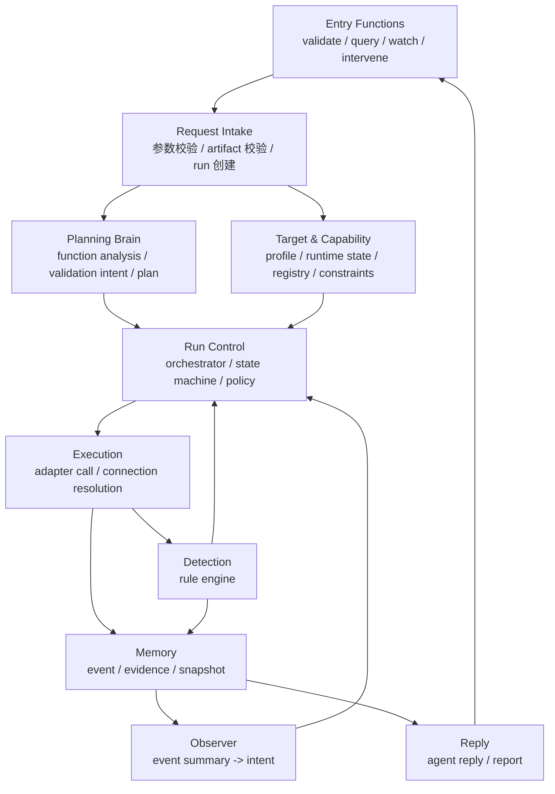

# Artifact Validation Agent 功能拆解重整版

> 状态：Draft  
> 日期：2026-04-28  
> 目的：把功能清单按架构实现边界重新拆解，便于后续写架构文档和第一版实现计划。  
> 关系：这是 [ARTIFACT-VALIDATION-AGENT-FUNCTION-LIST.md](ARTIFACT-VALIDATION-AGENT-FUNCTION-LIST.md) 的重整版，不替代接口契约。

## 1. 拆解原则

第一版不是“设备平台”，也不是“LLM 自动测试平台”。

第一版只证明一条闭环：

```text
artifact + validation context
-> create run
-> plan
-> validate plan
-> execute on target
-> detect events
-> observe and adjust
-> preserve evidence
-> generate reply
```

功能拆解按 4 条硬边界来做：

| 边界 | 原则 |
|---|---|
| LLM 边界 | LLM 只输出 `Validation Intent`、`Plan`、`Observer Intent`、`Agent Reply`，不直接执行工具。 |
| 执行边界 | 所有工具动作必须经过 Run Orchestrator 校验。 |
| 事实边界 | Event / Evidence 是事实源，LLM 摘要不能替代原始证据。 |
| 接口边界 | MCP / CLI / Console 共用同一套语义，不能各自保存状态。 |

## 2. 功能总图



## 3. P0 功能分组

### 3.1 Entry Functions

这一组是外部入口，不保存自己的状态。

| 功能 | P0 做什么 | 不做什么 |
|---|---|---|
| `validate_artifact` | 创建一次 validation run，返回 `run_id` 或拒绝原因。 | 不同步等待真机验证结束。 |
| `get_run_status` | 查询 run 当前状态、当前 step、target state、最后事件序号。 | 不返回完整日志。 |
| `watch_run` | 按 `after_seq` 轮询新事件。 | P0 不要求真正 streaming。 |
| `get_run_events` | 查询历史事件。 | 不做复杂搜索。 |
| `get_evidence` | 返回 Evidence Index 或 ref metadata。 | 不直接返回大日志内容。 |
| `get_run_result` | 返回最终 Agent Reply / Validation Report 摘要。 | 不做代码根因定位。 |
| `intervene_run` | 支持 pause、resume、cancel、add_instruction、request_partial_evidence。 | 不允许注入任意 shell 命令。 |
| `cancel_run` | 取消 run，保留 partial evidence。 | 不删除 evidence。 |
| `get_target_capabilities` | 查询 target runtime state 和可用能力。 | 不修改 target 配置。 |

P0 入口形态：

```text
MCP tools 是正式语义。
CLI 是 wrapper。
Console 是只读 view。
```

### 3.2 Request Intake

这一组负责把外部请求变成内部 run。

| 功能 | 输入 | 输出 |
|---|---|---|
| Request schema validation | context、artifact、target、constraints | `accepted` 或结构化错误 |
| Artifact validation | path、type、sha256 可选 | artifact metadata |
| Target lookup | target id | Target Profile |
| Initial run creation | request + target id | Run record，状态 `queued` 或 `planning` |
| Busy check | Target Runtime State | `accepted` 或 `busy` |

关键规则：

```text
artifact 不存在、不匹配、不可读，直接拒绝。
target busy，P0 默认拒绝，不排队。
缺少关键验证信息，返回 clarification_needed，不硬编 Plan。
```

Run Manager 边界：

```text
Run Manager 负责创建 run、持久化 run state、响应查询、聚合状态视图。
Run Manager 可以启动 Planner 和 Reply Generator 调用。
Run Manager 不执行 step，不校验 Plan / Intent，不直接调用 Tool Adapter。
```

Run Manager 是入口门面，不是执行大脑。执行控制权在 Orchestrator。

### 3.3 Target & Capability

这一组描述“设备事实”和“系统能做什么”。

| 功能 | P0 内容 |
|---|---|
| Target Profile | serial、ADB、flash method、target hints、safety。 |
| Target Runtime State | idle、busy、flashing、booting、adb_ready、offline、unknown。 |
| Capability Inference | 从 Target Profile 推断能力是否可用。 |
| Capability Registry | 定义能力 input/output、requires、limits、risk。 |
| Constraint Merge | 系统默认、Target safety、request constraints 取更严格者。 |

P0 capability：

```text
flash
push
watch_serial
wait_adb
shell_exec
check_process
collect_logs
save_snapshot
```

设计边界：

```text
Capability input 只描述动作参数。
连接参数只能来自 Target Profile。
Task Planner 不能看到或拼接真实串口/ADB 参数。
```

Target Runtime State 更新时机：

| 时机 | 更新方 | 示例 |
|---|---|---|
| run accepted | Run Manager | `idle -> busy`，写入 `current_run_id`。 |
| step started | Orchestrator | 当前 step 写入 run state。 |
| flash started / finished | Tool Adapter | `busy -> flashing -> booting`。 |
| serial active / disconnected | Tool Adapter / Rule Engine | `serial=active` 或 `serial=disconnected`。 |
| ADB online / offline | Tool Adapter / Rule Engine | `adb=online`、`state=adb_ready` 或 `adb=offline`。 |
| run completed / failed / cancelled | Run Manager | 释放 `current_run_id`，`busy -> idle/unknown/offline`。 |

P0 心跳定义：

```text
P0 不做独立连接池心跳线程。
Tool Adapter 在长时间动作中定期写 heartbeat。
Run Manager / get_run_status 读取最后 heartbeat 判断状态是否 stale。
```

### 3.4 Planning Brain

这一组是任务开始时的 LLM 能力。

| 功能 | 输入 | 输出 |
|---|---|---|
| Function Analysis | context、artifact metadata、target capabilities、scenario references | Validation Intent |
| Scenario matching | task / concerns / expected | 1-3 个参考场景 |
| Threshold inference | expected、scenario、constraints | 默认阈值和 assumptions |
| Dependency analysis | feature area、test_hint、target capabilities | 前置条件和 missing_info |
| Intent to Plan translation | Validation Intent + Capability Registry | capability-level Plan |

Planning Brain 不做：

```text
不执行工具。
不绕过 constraints。
不编造 target 没有的能力。
不直接把 scenario 当固定模板。
```

P0 失败路径：

```text
confidence < 0.6
或 missing_info 包含关键缺口
或 suggested_actions 缺必要 capability
=> clarification_needed / plan_rejected
```

LLM 调用管理：

| LLM 能力 | 触发方 | 调用时机 | 失败降级 |
|---|---|---|---|
| Task Planner | Run Manager | run 创建后异步调用。 | 返回 `clarification_needed` 或使用手写 Plan 测试路径。 |
| Observer | Orchestrator | 关键事件、长等待低频检查、阶段完成后调用。 | 使用 Rule Engine 默认降级规则继续、暂停或失败。 |
| Reply Generator | Run Manager | run 结束前调用。 | 用规则摘要生成最小 Agent Reply。 |

P0 要求每次 LLM 调用都有 timeout。LLM timeout 不能阻塞 Tool Adapter 进程，也不能导致 evidence 丢失。

### 3.5 Run Control

这一组是第一版的执行核心。

| 功能 | P0 内容 |
|---|---|
| Run Orchestrator | 校验 Plan / Intent，推进 step，触发 Observer，执行降级规则。 |
| State Machine | queued、planning、running、collecting_evidence、completed、failed、paused、cancelled。 |
| Policy Checker | 校验 constraints、risk、target safety、duration。 |
| Capability Matcher | 把 capability request 匹配到 adapter。 |
| Degradation Rules | step timeout、flash failed、ADB offline、serial disconnected、Observer Intent 执行失败。 |

Run Control 的核心约束：

```text
Orchestrator 是唯一执行控制中心。
Rule Engine 不能直接调工具。
Observer 不能直接调工具。
Tool Adapter 不能自己决定下一步。
```

Orchestrator 边界：

```text
Orchestrator 负责执行控制。
Orchestrator 读取 Run State、Target Runtime State、Plan、Event。
Orchestrator 写 step 状态、state_changed event、observer trigger decision。
Orchestrator 不负责创建 run，不负责对外接口返回，不负责生成最终报告。
```

### 3.6 Execution

这一组负责真实动作。

| 功能 | Adapter | P0 行为 |
|---|---|---|
| flash | FlashAdapter | 调 fastboot 或自定义 flash command。 |
| watch_serial | SerialAdapter | 读取串口输出，写 serial.log。 |
| wait_adb | AdbAdapter | 等 ADB online。 |
| shell_exec | AdbAdapter | 执行 smoke command，记录 stdout/stderr/exit code。 |
| check_process | AdbAdapter | 检查进程。 |
| collect_logs | AdbAdapter / SerialAdapter | 采 dmesg、logcat、serial window。 |
| save_snapshot | EvidenceStore | 保存现场快照。 |

执行规则：

```text
Adapter 只接收 Orchestrator 解析后的参数。
Adapter 输出必须同时进入 Event Stream 和 Evidence Store。
Adapter 不理解验证目标，只报告执行结果。
```

### 3.7 Detection

这一组是快反射。

| 功能 | P0 内容 |
|---|---|
| Pattern match | panic、oops、crash、boot marker、custom patterns。 |
| Timeout detect | run timeout、step timeout、wait_adb timeout、shell timeout。 |
| Silence detect | serial silence、command no output。 |
| Exit code detect | shell command expected exit code。 |
| Connectivity detect | ADB offline、serial disconnected。 |

Rule Engine 只做：

```text
读输出流。
写 Event。
标记 evidence window。
通知 Orchestrator 有关键事件。
```

Rule Engine 写 Event 字段：

| 字段 | Rule Engine 负责 |
|---|---|
| `type` | `rule_matched`、`step_timeout`、`target_state_changed` 等。 |
| `severity` | 根据规则等级写 `info`、`warning`、`error`。 |
| `source` | 固定为 `rule_engine`。 |
| `summary` | 规则命中的短描述。 |
| `payload` | pattern、timeout、exit_code、silence_sec 等结构化细节。 |
| `evidence_refs` | 指向刚保存的日志窗口或 snapshot。 |

Rule Engine 不做：

```text
不直接 stop run。
不直接 collect logs。
不直接调用 Observer。
```

### 3.8 Observation Brain

这一组是运行中的 LLM 判断。

| 功能 | 输入 | 输出 |
|---|---|---|
| Event interpretation | event summary、target state、evidence window、current phase | Observer Intent |
| Active reporting | 阶段进展、异常信号、不确定状态 | intermediate_observation event |
| Follow-up suggestion | 当前证据不足或异常明显 | collect_more / extend_wait / pause / stop |

Observer 允许输出：

```text
continue
extend_wait
collect_more
pause
stop
intermediate_observation
```

Observer 触发时机：

```text
Rule Engine 关键事件触发。
长等待阶段低频触发。
Plan 阶段性完成触发。
```

### 3.9 Memory & Evidence

这一组是事实源。

| 功能 | P0 内容 |
|---|---|
| Run State Store | run.json，状态、当前 step、耗时。 |
| Event Stream | events.jsonl，seq、type、severity、source、evidence_refs。 |
| Evidence Store | 原始日志、命令输出、snapshot、report。 |
| Evidence Index | refs、key_events、partial、root_path。 |
| Failure Snapshot | 当前 step、target state、last windows、events ref。 |
| Observer Notes | Observer 输入摘要和输出 Intent 历史。 |

目录结构：

```text
runs/{run_id}/
  request.json
  target-profile.json
  inferred-capabilities.json
  run.json
  intent.json
  plan.json
  events.jsonl
  observer-notes.jsonl
  evidence-index.json
  flash.log
  serial.log
  adb-smoke_test.json
  dmesg.log
  logcat.log
  snapshots/
  reply.json
```

硬规则：

```text
Rule Engine 标记事件必须保留。
事件前后窗口必须保留。
LLM summary 只能引用 evidence ref。
大日志可以分片，但不能静默丢关键事件。
```

Evidence Index 更新时机：

```text
每次 Evidence Store 写入新文件后更新 evidence-index.json。
每次 Rule Engine 标记关键事件后，把对应 evidence ref 写入 key_events。
get_evidence 永远读取当前 evidence-index.json。
如果 Index 更新失败，必须写 event，不能静默失败。
```

### 3.10 Reply & Report

这一组是对外结果。

| 功能 | P0 内容 |
|---|---|
| Agent Reply | 给 Coding Agent 的短结果：status、summary、key_evidence、suggested_next。 |
| Validation Report | 给 Human 的完整一点的报告入口。 |
| Evidence reference | 所有关键判断必须带 evidence_refs。 |
| Boundary guard | 不声明代码根因，不生成 patch。 |

Reply Generator 可以：

```text
总结发生了什么。
判断目标是否达成。
指出关键证据。
建议下一步验证或排查方向。
```

Reply Generator 不可以：

```text
声称根因一定是哪一行代码。
删除或覆盖原始 evidence。
把推测写成事实。
```

Agent Reply 最小字段：

```json
{
  "run_id": "run-001",
  "status": "failed",
  "summary": "启动 42 秒后 serial 出现 kernel panic。",
  "confidence": 0.86,
  "key_evidence": [
    {
      "summary": "kernel panic matched on serial",
      "evidence_refs": ["serial:last-200-lines"]
    }
  ],
  "suggested_next": "优先检查 init service 启动顺序和 timeout 设置。",
  "evidence_path": "/var/artifact-validation/runs/run-001",
  "report_path": "/var/artifact-validation/runs/run-001/reply.json"
}
```

## 4. P0 实现顺序

建议按这个顺序落地，避免一开始被 LLM 和设备复杂性拖住。

| 顺序 | 功能切片 | 验收标准 |
|---:|---|---|
| 1 | Run State + Event Stream + Evidence 目录 | 能创建 run，写状态，写事件，写 evidence 文件。 |
| 2 | Target Profile + Capability Registry | 能推断 `watch_serial`、`wait_adb`、`shell_exec` 等能力。 |
| 3 | 接口层最小实现 | `validate_artifact`、`get_run_status`、`watch_run` 可用。 |
| 4 | Tool Adapter 最小链 | flash / watch_serial / wait_adb / shell_exec / collect_logs 可被手写 Plan 调通。 |
| 5 | Orchestrator + Plan 校验 | 能执行能力级 Plan，拒绝非法 capability / constraints。 |
| 6 | Rule Engine | 能识别 panic、timeout、silence、exit code，并写 Event。 |
| 7 | Evidence Index + Failure Snapshot | 失败时能回溯到原始证据。 |
| 8 | Task Planner | 从 context 生成 Validation Intent + Plan。 |
| 9 | Observer | 关键事件触发后输出 Intent，Orchestrator 校验并执行。 |
| 10 | Reply Generator | 生成 Agent Reply / Validation Report。 |

关键点：

```text
前 7 步不依赖 LLM 也应该能跑通一条手写 Plan。
LLM 是增强，不是 Runtime 能跑起来的前提。
```

## 5. 功能边界对照

| 模块 | 可以做 | 不能做 |
|---|---|---|
| Entry | 参数校验、调用服务、返回结果 | 保存状态、绕过 Runtime |
| Run Manager | 创建 run、查询聚合 | 执行 step、解释 evidence |
| Task Planner | 生成 Plan | 直接调用工具 |
| Orchestrator | 校验和调度 | 读代码、判断根因 |
| Rule Engine | 检测确定性事件 | 决定业务是否通过 |
| Observer | 语义判断和 Intent | 直接执行 adapter |
| Tool Adapter | 执行动作 | 自己规划下一步 |
| Evidence Store | 保存事实 | 用摘要替代原始日志 |
| Reply Generator | 总结证据 | 删除证据、给代码 patch |

## 6. 与架构文档的关系

后续架构文档应该从这份功能拆解反推模块：

```text
Entry Functions -> Interface Layer
Request Intake -> Application Layer
Target & Capability -> Target / Capability Services
Planning Brain -> Brain Layer
Run Control -> Control Layer
Execution -> Execution Layer
Detection -> Detection Layer
Memory & Evidence -> Memory Layer
Reply & Report -> Output Layer
```

架构文档不要重新发明功能名。  
功能名、接口名、数据结构，以 `FUNCTION-LIST` 和这份重整版为准。

## 7. 收口

第一版功能不是越多越好。

P0 的最低完成定义是：

```text
给 artifact + context + target，
系统创建 run，
生成或接收 Plan，
安全执行到真实设备，
运行中可查询事件，
失败时 evidence 不丢，
结束后给出 Agent Reply。
```

只要这条链没跑稳，不进入多 target、远端存储、定时任务、HTTP API、完整 Console。
