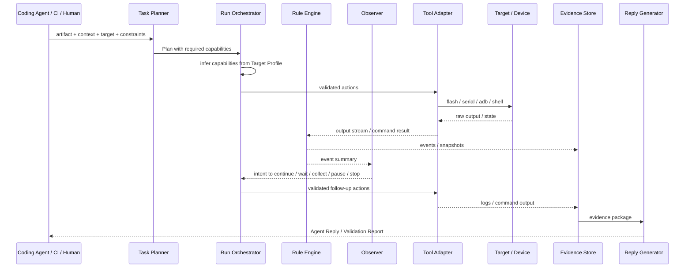

# Artifact Validation Agent 功能清单

> 状态：Draft  
> 日期：2026-04-28  
> 目的：按“不改代码，只验证产物”的定位，梳理第一版要实现的功能。  
> 关系：Runtime-only 具体执行契约见 [ARTIFACT-VALIDATION-AGENT-RUNTIME-CONTRACTS.md](ARTIFACT-VALIDATION-AGENT-RUNTIME-CONTRACTS.md)；LLM 接入契约见 [ARTIFACT-VALIDATION-AGENT-LLM-INTEGRATION.md](ARTIFACT-VALIDATION-AGENT-LLM-INTEGRATION.md)。

## 1. 当前口径

第一版不是设备平台，也不是 coding agent。

第一版只做：

```text
validation request
-> target capability inference
-> task planning
-> controlled run
-> fast rule detection
-> slow semantic observation
-> evidence package
-> agent reply / validation report
```

它的差异点不是“能跑命令”，而是：

```text
运行中主动观察，
发现异常及时补采集，
把真实设备验证结果压缩回 Coding Agent / Human。
```

## 2. 主故事



## 3. P0 功能

P0 不是只列模块名。每个核心对象必须有最小结构，否则 Orchestrator 无法校验，Tool Adapter 无法执行，Evidence 也无法复盘。

### 3.1 Target Profile

| 项 | 内容 |
|---|---|
| 要做什么 | 描述一块真实设备怎么连、怎么刷、哪些动作允许、有哪些目标特定提示。 |
| 为什么要做 | Agent 不能猜板子协议和连接参数，这些事实由 Human 配置。 |
| 缺了会怎样 | Agent 会退化成现场猜命令，风险高且不可复现。 |
| 第一版范围 | 单 target，支持 serial、ADB、fastboot 或自定义 flash method。 |

最小示例：

```json
{
  "target_id": "board-01",
  "connections": {
    "serial": { "port": "/dev/ttyUSB0", "baud": 115200 },
    "adb": { "device_id": "ABC123" }
  },
  "flash": {
    "method": "fastboot",
    "artifact_type": "firmware_img"
  },
  "target_hints": {
    "boot_markers": ["Booting Linux", "init started", "boot completed"],
    "fail_patterns": ["kernel panic", "kernel oops"]
  },
  "safety": {
    "allow_flash": true,
    "allow_reboot": true,
    "allow_power_cycle": false
  }
}
```

### 3.2 Capability Inference

| 项 | 内容 |
|---|---|
| 要做什么 | 系统从 Target Profile 推断可用能力。 |
| 为什么要做 | 用户只配置设备事实，不配置复杂 capabilities 列表。 |
| 缺了会怎样 | 配置会变复杂，Agent 也不知道哪些动作可用。 |
| 第一版范围 | 固定能力集合：`flash`、`push`、`watch_serial`、`wait_adb`、`shell_exec`、`check_process`、`collect_logs`、`save_snapshot`。 |

推断规则：

| 配置 | 推断能力 |
|---|---|
| 有 `flash.method` 且允许 flash | `flash` |
| 有 `connections.serial` | `watch_serial`、`collect_logs` |
| 有 `connections.adb` | `wait_adb`、`shell_exec`、`check_process`、`collect_logs` |
| 有 evidence store | `save_snapshot` |

### 3.3 Capability Registry

| 项 | 内容 |
|---|---|
| 要做什么 | 定义每个能力的输入、输出、风险、前置条件和默认 timeout。 |
| 为什么要做 | Capability Inference 只说明“有没有能力”，Capability Registry 才说明“这个能力怎么校验和调用”。 |
| 缺了会怎样 | Planner 生成了能力名，但 Orchestrator 不知道参数是否合法，也不知道风险等级。 |
| 第一版范围 | 固定定义 `flash`、`push`、`watch_serial`、`wait_adb`、`shell_exec`、`check_process`、`collect_logs`、`save_snapshot`。 |

能力定义最小结构：

```json
{
  "name": "watch_serial",
  "description": "观察串口输出，并把关键 pattern 转成事件",
  "input_schema": {
    "duration_sec": "integer",
    "patterns": "array<string>"
  },
  "output_schema": {
    "log_ref": "string",
    "events": "array<object>",
    "patterns_matched": "array<string>"
  },
  "requires": {
    "connection": "serial"
  },
  "limits": {
    "max_duration_sec": 600,
    "default_timeout_sec": 180
  },
  "risk": "low"
}
```

P0 能力风险等级：

| 风险 | 能力 |
|---|---|
| low | `watch_serial`、`wait_adb`、`check_process`、`collect_logs`、`save_snapshot` |
| medium | `flash`、`push`、`shell_exec` |
| high | P0 不做；例如 `power_cycle`、外设断电、危险故障注入 |

P0 能力契约：

| Capability | 输入 | 输出 | 前置条件 | 默认 timeout | 风险 |
|---|---|---|---|---|---|
| `flash` | `artifact_ref`、`artifact_type` | `flash_log_ref`、`success`、`duration_sec` | `flash.method` 存在，且 `allow_flash=true` | 300s | medium |
| `push` | `src_ref`、`dst_path` | `stdout_ref`、`stderr_ref`、`exit_code` | ADB 可用，且 `allow_shell_exec=true` | 60s | medium |
| `watch_serial` | `duration_sec`、`patterns` | `log_ref`、`events`、`patterns_matched` | serial 连接存在 | 180s | low |
| `wait_adb` | `timeout_sec` | `adb_state`、`device_id`、`duration_sec` | ADB 连接配置存在 | 180s | low |
| `shell_exec` | `command`、`timeout_sec`、`expected_exit_code` | `stdout_ref`、`stderr_ref`、`exit_code`、`duration_sec` | ADB 可用，且 `allow_shell_exec=true` | 60s | medium |
| `check_process` | `process_name` | `exists`、`pid`、`state` | ADB 可用 | 30s | low |
| `collect_logs` | `items` | `log_refs`、`missing_items` | 对应连接可用；例如 `logcat` 需要 ADB | 120s | low |
| `save_snapshot` | `reason`、`include` | `snapshot_ref`、`included_refs` | evidence store 可写 | 30s | low |

能力输入只写目标动作参数，不写串口端口、ADB device id 等连接事实。连接事实只能来自 Target Profile。

### 3.4 validate_artifact

| 项 | 内容 |
|---|---|
| 要做什么 | 接收 artifact、验证背景、target 和约束，创建一次 validation run。 |
| 为什么要做 | Coding Agent / CI 需要一个稳定入口请求真机验证。 |
| 缺了会怎样 | 只能靠人手动拼流程，无法形成 agent 闭环。 |
| 第一版范围 | 支持本地 artifact path，返回 `run_id` 和初始状态。 |

输入示例：

```json
{
  "context": {
    "task": "验证 boot crash 是否修复",
    "what_changed": "调整 init service 启动顺序",
    "expected": "设备能启动完成，ADB 能回来",
    "concerns": ["kernel panic", "init timeout", "adb offline"],
    "test_hint": {
      "kind": "adb_shell",
      "command": "/vendor/bin/smoke_test",
      "timeout_sec": 60,
      "expected_exit_code": 0
    }
  },
  "artifact": {
    "path": "/builds/firmware.img",
    "type": "firmware_img"
  },
  "target": "board-01",
  "constraints": {
    "max_duration_sec": 600,
    "allow_flash": true
  }
}
```

请求结构最小定义：

| 字段 | 必填 | 说明 |
|---|---|---|
| `context.task` | 是 | 这次要验证什么。 |
| `context.what_changed` | 建议 | 改了什么功能或模块。 |
| `context.expected` | 是 | 期望看到什么结果。 |
| `context.concerns` | 否 | 调用方担心的风险。 |
| `context.test_hint` | 否 | 已知测试命令、接口或脚本。 |
| `context.test_hint.kind` | 否 | P0 支持 `adb_shell`。 |
| `context.test_hint.command` | 条件必填 | `kind=adb_shell` 时必填。 |
| `context.test_hint.timeout_sec` | 否 | 测试命令超时，不传用 `shell_exec` 默认值。 |
| `context.test_hint.expected_exit_code` | 否 | 不传默认 0。 |
| `artifact.path` | 是 | 本地 artifact 路径。 |
| `artifact.type` | 是 | artifact 类型。 |
| `target` | 是 | target id。 |
| `constraints` | 是 | 时间和危险动作约束。 |

`test_hint` 不是调用方传入完整 Plan。它只是给 Task Planner 一个可用测试入口。Task Planner 仍然要根据 target capabilities 和 constraints 决定是否生成 `shell_exec` step；如果缺少必要测试入口且无法从场景推断，返回 `clarification_needed`。

`test_hint.kind` 取值：

| kind | P0/P1 | 含义 |
|---|---|---|
| `adb_shell` | P0 | 通过 ADB 执行一条 smoke 命令。 |
| `script_ref` | P1 | 调用已登记脚本。 |
| `http_request` | P1 | 对设备或服务发 HTTP 请求。 |
| `process_check` | P1 | 只检查进程状态，不执行业务命令。 |

P0 只实现 `adb_shell`。如果调用方传入其他 kind，返回 `clarification_needed` 或 `plan_rejected`，不能强行猜执行方式。

Artifact 校验：

| 校验 | P0 行为 |
|---|---|
| 文件存在 | 不存在直接拒绝。 |
| 类型匹配 | artifact.type 必须能被 target 支持。 |
| 基本 metadata | 保存 path、type、size、mtime；sha256 可选。 |
| 权限 | 文件不可读直接拒绝。 |

同步返回契约：

```json
{
  "status": "accepted",
  "run_id": "run-001",
  "target": "board-01",
  "state": "planning",
  "estimated_duration_sec": 360,
  "evidence_path": "/var/artifact-validation/runs/run-001"
}
```

允许的同步返回状态：

| status | 含义 | 是否创建 run |
|---|---|---|
| `accepted` | 请求已接收，进入 planning 或 running。 | 是 |
| `busy` | target 正在被其他 run 占用。 | 否 |
| `artifact_invalid` | artifact 不存在、不可读或类型不匹配。 | 否 |
| `clarification_needed` | 缺少关键验证信息，无法安全规划。 | 否 |
| `plan_rejected` | Planner 生成了 Plan，但 Orchestrator 校验失败。 | 可选；如果已保存规划过程则创建 |
| `target_not_found` | 找不到 target profile。 | 否 |

拒绝类返回必须包含：

```json
{
  "status": "clarification_needed",
  "reasons": ["missing test entry"],
  "missing_info": ["context.test_hint.command"],
  "suggested_next": "provide an adb shell smoke command or explicit expected observable"
}
```

### 3.5 Constraints

| 项 | 内容 |
|---|---|
| 要做什么 | 定义本次 run 允许做什么、不允许做什么。 |
| 为什么要做 | LLM 只能提出计划，危险动作必须被硬约束拦住。 |
| 缺了会怎样 | 计划可能越权执行，例如断电、kill 进程、长时间占用设备。 |
| 第一版范围 | 时间、flash、reboot、shell、日志大小、危险动作默认禁止。 |

P0 约束结构：

```json
{
  "max_duration_sec": 600,
  "allow_flash": false,
  "allow_reboot": false,
  "allow_shell_exec": true,
  "allow_power_cycle": false,
  "allow_kill_process": false,
  "allow_inject_fault": false,
  "max_log_bytes": 52428800
}
```

合并规则：

```text
系统默认值最保守。
调用方只能在系统允许范围内放开。
Target Profile safety 和 request constraints 冲突时，取更严格的一方。
```

### 3.6 Task Planner

| 项 | 内容 |
|---|---|
| 要做什么 | LLM 在任务开始时先做 Function Analysis，生成 Validation Intent，再把 Intent 翻译成能力级 Plan。 |
| 为什么要做 | 不同改动需要关注不同现象，不能只跑固定脚本。 |
| 缺了会怎样 | 系统只是 Runner，无法把验证意图转成合适观察策略。 |
| 第一版范围 | 调用 1 次，输出 Validation Intent、能力级步骤、关注点和建议观察窗口。 |

输出必须是结构化计划，不是自由文本。

Task Planner 内部必须完成 `Intent -> Plan` 的翻译：

```text
Validation Intent 说“建议断网恢复”
-> Task Planner 查 target capabilities
-> 如果有 network control 能力，生成断网、恢复、观察和验证 step
-> 如果没有能力，Plan 标记能力缺失并返回给调用方
```

这不是独立模块，是 Task Planner 的 P0 内部逻辑。

Validation Intent 最小结构见 [ARTIFACT-VALIDATION-AGENT-FUNCTION-ANALYSIS.md](ARTIFACT-VALIDATION-AGENT-FUNCTION-ANALYSIS.md)。

P0 至少要包含：

```text
feature_area
confidence
expected_behavior
risk_focus
suggested_actions
observe
evidence_need
pass_fail
assumptions
missing_info
inferred_values
```

功能分析能力必须包含：

| 能力 | P0 要求 |
|---|---|
| 场景匹配 | 从场景库找 1-3 个参考场景，不照抄模板。 |
| 阈值推断 | 缺阈值时用保守默认值，并标记建议确认。 |
| 依赖分析 | 找出服务、网络、外设、数据等前置条件。 |
| 轻量影响面分析 | 根据模块名、文件路径、issue 提示相邻风险。 |

### 3.7 Plan 结构

| 项 | 内容 |
|---|---|
| 要做什么 | 定义 Task Planner 输出的能力级计划。 |
| 为什么要做 | 没有 Plan 结构，Orchestrator 无法校验，Tool Adapter 无法执行。 |
| 缺了会怎样 | 只剩自由文本，无法稳定落地。 |
| 第一版范围 | 顺序 step、条件 step、成功条件、失败信号、观察策略、证据策略。 |

Plan 最小结构：

```json
{
  "plan_id": "plan-001",
  "intent_ref": "intent-001",
  "estimated_duration_sec": 360,
  "steps": [
    {
      "id": "step-1",
      "capability": "watch_serial",
      "condition": "always",
      "input": {
        "duration_sec": 180,
        "patterns": ["kernel panic", "boot completed"]
      },
      "timeout_sec": 180,
      "on_failure": "collect_and_fail"
    }
  ],
  "success_criteria": ["boot completed", "adb online", "no kernel panic"],
  "failure_signals": ["kernel panic", "adb offline after timeout"],
  "evidence_policy": {
    "always": ["timeline", "events"],
    "on_failure": ["serial_last_window", "dmesg", "logcat"]
  }
}
```

Step 字段：

| 字段 | 必填 | 说明 |
|---|---|---|
| `id` | 是 | step id。 |
| `capability` | 是 | 能力名，必须存在于 Capability Registry。 |
| `condition` | 是 | `always`、`on_failure`、`on_success`。 |
| `input` | 是 | 能力级参数，不包含具体端口和设备 id。 |
| `timeout_sec` | 是 | 单步超时。 |
| `on_failure` | 否 | 失败时动作策略。 |

`condition` 含义：

| condition | 何时执行 | 说明 |
|---|---|---|
| `always` | 按 steps 顺序正常执行。 | 主路径步骤。 |
| `on_failure` | 前面任一步失败、timeout、被 Rule Engine 判定异常后执行。 | 用于补采集和保存现场。 |
| `on_success` | 前面主路径全部成功后执行。 | 用于成功后的确认检查或收尾采集。 |

执行规则：

```text
Orchestrator 按 steps 顺序扫描。
`always` step 构成主路径。
主路径失败后，不再执行后续 `always` step，只执行后续匹配的 `on_failure` step。
主路径成功后，执行后续匹配的 `on_success` step。
`on_failure` 和 `on_success` 不改变已经完成 step 的结果，只补 evidence 或做收尾检查。
```

### 3.8 Observer Intent 结构

| 项 | 内容 |
|---|---|
| 要做什么 | 定义 Observer 运行中能输出什么。 |
| 为什么要做 | Observer 不能自由文本控制执行，必须输出受限 Intent。 |
| 缺了会怎样 | Orchestrator 不知道如何校验和执行 Observer 的判断。 |
| 第一版范围 | `continue`、`extend_wait`、`collect_more`、`pause`、`stop`、`intermediate_observation`。 |

Intent 最小结构：

```json
{
  "intent": "collect_more",
  "reason": "serial shows init timeout and adb is still offline",
  "confidence": 0.82,
  "requested_actions": [
    {
      "capability": "collect_logs",
      "input": {
        "items": ["serial_last_window"]
      }
    }
  ],
  "report_to_caller": false
}
```

允许的 Intent：

| Intent | 含义 |
|---|---|
| `continue` | 当前状态正常，继续执行。 |
| `extend_wait` | 延长等待，但必须受 max_duration 限制。 |
| `collect_more` | 补采集证据。 |
| `pause` | 暂停 run，等待调用方或 Human。 |
| `stop` | 结束 run，标记 success/failure/timeout。 |
| `intermediate_observation` | 阶段性汇报，不改变执行计划。 |

### 3.9 Run Orchestrator

| 项 | 内容 |
|---|---|
| 要做什么 | 校验 Plan / Intent，调度工具，管理执行边界。 |
| 为什么要做 | LLM 不能直接执行工具，所有动作必须被系统校验。 |
| 缺了会怎样 | 安全边界和状态一致性会失控。 |
| 第一版范围 | 支持 step 顺序执行、约束校验、能力匹配、内置降级规则。 |

Orchestrator 降级规则：

| 情况 | P0 默认处理 |
|---|---|
| Plan 校验失败 | 不执行，返回明确 rejection reason。 |
| capability 缺失 | 不执行，返回缺失能力。 |
| step timeout | 保存 failure snapshot，触发 Observer。 |
| flash 失败 | 停止 run，保存 flash log。 |
| ADB 不回来 | 记录事件，触发 Observer 判断是否继续等待或失败。 |
| serial 断连 | 保存已有 evidence，暂停或失败。 |
| Intent 执行失败 | 记录 `observer_intent` 处理结果和失败原因，必要时暂停。 |

Run Manager 和 Orchestrator 边界：

| 模块 | 负责 | 不负责 |
|---|---|---|
| Run Manager | 创建 run、持久化 run state、响应查询、聚合状态视图、启动 Planner / Reply Generator。 | 执行 step、校验 Plan / Intent、直接调用 Tool Adapter。 |
| Orchestrator | 校验 Plan / Intent、推进 step、触发 Observer、执行降级规则、写 state_changed event。 | 创建 run、处理外部接口、生成最终报告。 |

### 3.10 Target Runtime State

| 项 | 内容 |
|---|---|
| 要做什么 | 记录 target 当前运行状态。 |
| 为什么要做 | Target Profile 是静态配置，但 run 需要知道板子此刻是否空闲、在线、被占用。 |
| 缺了会怎样 | 多个 run 会抢同一块板，或者对离线设备强行执行。 |
| 第一版范围 | 单 target 下也要记录 `idle`、`busy`、`flashing`、`booting`、`adb_ready`、`offline`、`unknown`。 |

最小结构：

```json
{
  "target_id": "board-01",
  "state": "busy",
  "current_run_id": "run-001",
  "serial": "active",
  "adb": "offline",
  "last_heartbeat_at": "2026-04-28T10:00:00+08:00",
  "updated_at": "2026-04-28T10:01:00+08:00"
}
```

多 Run 隔离：

```text
P0 单 target 不做复杂排队。
如果 target 正在 running，新的 validate_artifact 默认拒绝或返回 busy。
P1 再做 queue / lease / target pool。
```

更新时机：

| 时机 | 更新方 | 示例 |
|---|---|---|
| run accepted | Run Manager | `idle -> busy`，写入 `current_run_id`。 |
| step started | Orchestrator | 更新当前 step。 |
| flash started / finished | Tool Adapter | `busy -> flashing -> booting`。 |
| serial active / disconnected | Tool Adapter / Rule Engine | 更新 `serial`。 |
| ADB online / offline | Tool Adapter / Rule Engine | 更新 `adb` 和 `state`。 |
| run completed / failed / cancelled | Run Manager | 释放 `current_run_id`。 |

P0 不做独立连接池心跳线程。长时间运行的 Tool Adapter 必须定期写 heartbeat，`get_run_status` 读取最后 heartbeat 判断状态是否 stale。

### 3.11 State Machine

| 项 | 内容 |
|---|---|
| 要做什么 | 管理一次 run 的生命周期。 |
| 为什么要做 | 长任务必须能查询当前阶段、耗时、结果和暂停状态。 |
| 缺了会怎样 | 无法稳定实现 `get_run_status`、`watch_run`、`intervene_run`。 |
| 第一版范围 | `queued`、`planning`、`running`、`collecting_evidence`、`completed`、`failed`、`paused`、`cancelled`。 |

### 3.12 Tool Adapter

| 项 | 内容 |
|---|---|
| 要做什么 | 执行 Runtime 已校验的真实动作。 |
| 为什么要做 | 设备操作必须隔离在可测试、可替换的 adapter 里。 |
| 缺了会怎样 | Orchestrator 会和 adb / fastboot / serial 细节耦合。 |
| 第一版范围 | `flash`、`serial watch`、`adb wait`、`adb shell`、`collect dmesg/logcat`。 |

Capability 到 Tool Adapter 的映射：

| Capability | Adapter | Target Profile 读取内容 | Adapter 输入来源 |
|---|---|---|---|
| `flash` | `FlashAdapter` | `flash.method`、`flash.artifact_type` | Plan step `input.artifact_ref`、`artifact.type` |
| `push` | `AdbAdapter` | `connections.adb.device_id` | Plan step `input.src_ref`、`input.dst_path` |
| `watch_serial` | `SerialAdapter` | `connections.serial.port`、`connections.serial.baud` | Plan step `input.duration_sec`、`input.patterns` |
| `wait_adb` | `AdbAdapter` | `connections.adb.device_id` | Plan step `input.timeout_sec` |
| `shell_exec` | `AdbAdapter` | `connections.adb.device_id` | Plan step `input.command`、`input.timeout_sec` |
| `check_process` | `AdbAdapter` | `connections.adb.device_id` | Plan step `input.process_name` |
| `collect_logs` | `AdbAdapter` / `SerialAdapter` | `connections.adb`、`connections.serial` | Plan step `input.items` |
| `save_snapshot` | `EvidenceStore` | evidence root path | Plan step `input.reason`、`input.include` |

映射规则：

```text
Task Planner 只能输出 capability + input。
Orchestrator 校验 capability、constraints、target runtime state。
Orchestrator 从 Target Profile 解析连接参数，并生成 adapter call。
Tool Adapter 只接收 Runtime 已解析的执行参数，不读取 LLM 原始输出。
Tool Adapter 输出必须写入 Event Stream / Evidence Store。
```

### 3.13 Rule Engine

| 项 | 内容 |
|---|---|
| 要做什么 | 实时检测确定性事件：pattern、timeout、silence、exit code、connectivity。 |
| 为什么要做 | 快反射不能依赖 LLM 延迟。 |
| 缺了会怎样 | 关键日志可能丢，hang / 断连 / panic 不能及时保存现场。 |
| 第一版范围 | 正则匹配、step timeout、serial silence、command exit code、ADB offline。 |

Rule Engine 默认动作：

| 情况 | 默认动作 |
|---|---|
| flash 失败 | 停止 run，保存 flash log |
| serial 断连 | 保存已有 evidence，暂停或失败 |
| panic / oops pattern | 保存最后窗口，通知 Observer |
| ADB 长时间 offline | 记录事件，触发 Observer 判断是否继续等待 |
| shell command hang | timeout 后保存现场并交给 Orchestrator 决策 |

Rule Engine 和 Observer 的触发关系：

```text
Rule Engine 检测到关键事件
-> 生成 Event
-> 关键窗口进入 Evidence
-> Orchestrator 触发 Observer
-> Observer 读取 event summary + evidence window
-> 输出受限 Intent
-> Orchestrator 校验后执行
```

普通事件只记录，不一定触发 Observer。  
P0 触发 Observer 的事件包括：panic/oops、关键 timeout、ADB 长时间 offline、serial silence、命令 hang、异常重启、Plan 阶段性完成。

P0 默认阈值：

| 阈值 | 默认值 | 覆盖规则 |
|---|---:|---|
| run 总时长 | 600s | 可由 `constraints.max_duration_sec` 收紧。 |
| `flash` step timeout | 300s | 可由 Plan step 设置，但不能超过 capability 上限。 |
| `watch_serial` duration | 180s | 可由 Plan step 设置，最大 600s。 |
| `wait_adb` timeout | 180s | 可由 Plan step 设置，受 run 总时长限制。 |
| `shell_exec` timeout | 60s | 可由 `test_hint.timeout_sec` 或 Plan step 设置。 |
| serial silence | 60s | 超过则记录事件；是否停止交给 Observer / Orchestrator。 |
| command no output | 60s | 超过则记录 `command_silence`。 |
| Observer 定期检查 | 30s | 只用于长任务低频观察，不读取全量日志。 |

覆盖原则：

```text
request constraints 只能收紧系统默认值。
Plan step 可以设置更短 timeout。
Plan step 设置更长 timeout 时，必须同时不超过 capability limit 和 run max_duration。
```

### 3.14 Observer

| 项 | 内容 |
|---|---|
| 要做什么 | LLM 在运行中根据事件摘要、状态和 evidence window 做语义判断。 |
| 为什么要做 | “无输出”“ADB offline”“init timeout”是否严重，要结合阶段和上下文判断。 |
| 缺了会怎样 | 系统只能按固定规则跑，无法主动补采集和动态等待。 |
| 第一版范围 | 事件触发和低频定期调用，输出 `continue`、`extend_wait`、`collect_more`、`pause`、`stop` 等意图。 |

Observer 不直接执行动作，意图必须经过 Run Orchestrator 校验。

Observer 还负责长任务中的主动汇报。

当 Observer 判断“值得告诉调用方”时，输出 intermediate observation：

```text
阶段性进展：flash completed / boot completed / reconnect succeeded
异常信号：panic detected / adb offline too long / service crash
不确定状态：可能卡住，需要继续观察或补信息
```

Orchestrator 把它写入 Event Stream，`watch_run` 可以推给 Coding Agent / Human。  
这不需要新接口，但 P0 必须有事件输出规则。

### 3.15 Event Stream / Timeline

| 项 | 内容 |
|---|---|
| 要做什么 | 记录运行中的事件和按时间排序的过程。 |
| 为什么要做 | 长任务不能只看最终结果，失败复盘必须有时间线。 |
| 缺了会怎样 | Coding Agent / Human 不知道任务卡在哪一步。 |
| 第一版范围 | step started/completed/failed、rule matched、target state changed、observer intent、state changed。 |

Event 最小结构：

```json
{
  "seq": 42,
  "run_id": "run-001",
  "time": "2026-04-28T10:01:42+08:00",
  "elapsed_sec": 42,
  "type": "rule_matched",
  "severity": "error",
  "source": "rule_engine",
  "step_id": "step-2",
  "summary": "kernel panic matched on serial",
  "payload": {
    "pattern": "kernel panic"
  },
  "evidence_refs": ["serial:last-200-lines"]
}
```

字段要求：

| 字段 | 必填 | 说明 |
|---|---|---|
| `seq` | 是 | run 内递增序号，`watch_run` 用它做 cursor。 |
| `time` | 是 | 绝对时间。 |
| `elapsed_sec` | 是 | run 开始后的相对时间。 |
| `type` | 是 | 事件类型。 |
| `severity` | 是 | `debug`、`info`、`warning`、`error`。 |
| `source` | 是 | `orchestrator`、`rule_engine`、`observer`、`tool_adapter`。 |
| `summary` | 是 | 给调用方看的短描述。 |
| `payload` | 否 | 结构化细节。 |
| `evidence_refs` | 否 | 可回溯到原始 evidence 的引用。 |

P0 事件类型：

| type | 产生方 | 含义 |
|---|---|---|
| `run_created` | orchestrator | run 已创建。 |
| `state_changed` | orchestrator | run 状态变化。 |
| `step_started` | orchestrator | step 开始。 |
| `step_completed` | orchestrator / tool_adapter | step 成功完成。 |
| `step_failed` | orchestrator / tool_adapter | step 失败。 |
| `step_timeout` | rule_engine | step 超时。 |
| `rule_matched` | rule_engine | pattern、exit code、silence 等规则命中。 |
| `target_state_changed` | orchestrator / tool_adapter | target runtime state 变化。 |
| `observer_intent` | observer | Observer 输出受限 Intent。 |
| `intermediate_observation` | observer | 阶段性主动汇报。 |
| `evidence_collected` | evidence_store | 新 evidence 可用。 |
| `intervention_requested` | orchestrator | 调用方发起干预。 |
| `run_completed` | orchestrator | run 完成。 |
| `run_failed` | orchestrator | run 失败。 |
| `run_cancelled` | orchestrator | run 被取消。 |

Rule Engine 写 Event 字段责任：

| 字段 | Rule Engine 填写规则 |
|---|---|
| `type` | `rule_matched`、`step_timeout`、`target_state_changed` 等。 |
| `severity` | 根据规则等级写 `info`、`warning`、`error`。 |
| `source` | 固定为 `rule_engine`。 |
| `summary` | 规则命中的短描述。 |
| `payload` | pattern、timeout、exit_code、silence_sec 等结构化细节。 |
| `evidence_refs` | 指向刚保存的日志窗口或 snapshot。 |

`watch_run` 第一版可以用轮询实现，返回 `after_seq` 之后的新事件，不要求真正 streaming。

### 3.16 Evidence Package

| 项 | 内容 |
|---|---|
| 要做什么 | 保存原始事实：artifact metadata、target snapshot、timeline、flash log、serial log、ADB 输出、snapshots。 |
| 为什么要做 | 真机验证最重要的价值是失败现场不丢。 |
| 缺了会怎样 | 失败后只剩一句 failed，无法复盘。 |
| 第一版范围 | 本地目录结构即可，不做远端存储。 |

Evidence 保障规则：

```text
Rule Engine 标记过的事件和对应原始窗口，必须完整进入 Evidence Package。
LLM 可以摘要 evidence，但不能删除或覆盖这些原始证据。
Reply Generator 引用关键证据时，必须能回到原始 evidence ref。
```

这条规则防止 LLM 压缩日志时丢掉关键现场。

Failure Snapshot 最小结构：

```json
{
  "run_id": "run-001",
  "step_id": "step-2",
  "reason": "kernel panic detected",
  "time": "+42s",
  "target_state": {
    "serial": "active",
    "adb": "offline"
  },
  "last_serial_window_ref": "serial-last-200-lines.log",
  "events_ref": "events.jsonl",
  "available_logs": ["flash.log", "serial.log"],
  "observer_note_ref": "observer-notes.jsonl"
}
```

Partial Evidence：

```text
P0 必须允许调用方在 run 进行中查看已产生的 evidence 索引。
不要求下载全部原始日志，但需要知道已经采到什么、路径是什么、当前关键事件是什么。
```

Evidence Index 最小结构：

```json
{
  "run_id": "run-001",
  "partial": true,
  "updated_at": "2026-04-28T10:01:42+08:00",
  "root_path": "/var/artifact-validation/runs/run-001",
  "refs": [
    {
      "ref": "serial:full",
      "kind": "log",
      "path": "serial.log",
      "available": true,
      "bytes": 120034
    },
    {
      "ref": "serial:last-200-lines",
      "kind": "window",
      "path": "snapshots/serial-last-200-lines.log",
      "available": true,
      "source_ref": "serial:full"
    }
  ],
  "key_events": [
    {
      "seq": 42,
      "summary": "kernel panic matched on serial",
      "evidence_refs": ["serial:last-200-lines"]
    }
  ]
}
```

`get_evidence(run_id)` 默认返回 Evidence Index。调用方再用 `evidence_refs` 找原始日志路径；P0 不要求提供远端下载 API。

Evidence Index 更新时机：

```text
每次 Evidence Store 写入新文件后更新 evidence-index.json。
每次 Rule Engine 标记关键事件后，把对应 evidence ref 写入 key_events。
get_evidence 永远读取当前 evidence-index.json。
如果 Index 更新失败，必须写 event，不能静默失败。
```

Evidence Filtering 规则：

| 证据 | 处理 |
|---|---|
| Rule Engine 标记事件 | 必须保留。 |
| 事件前后窗口 | 必须保留。 |
| 原始 serial / command output | P0 本地保留。 |
| LLM summary | 可以生成，但不能替代原始 evidence。 |
| 过大日志 | 可以分片或索引，但不能静默丢弃关键事件。 |

### 3.17 Reply Generator / Validation Report

| 项 | 内容 |
|---|---|
| 要做什么 | LLM 或规则把 evidence 压缩成给 Coding Agent / Human 的结果。 |
| 为什么要做 | Coding Agent 不应该翻完整串口日志才能知道下一步。 |
| 缺了会怎样 | 有 evidence 但不可用，agent 闭环断掉。 |
| 第一版范围 | 输出 summary、status、key_evidence、evidence_path、suggested_next。 |

Agent Reply 最小结构：

```json
{
  "run_id": "run-001",
  "status": "failed",
  "summary": "启动 42 秒后 serial 出现 kernel panic。",
  "confidence": 0.86,
  "key_evidence": [
    {
      "summary": "kernel panic matched on serial",
      "evidence_refs": ["serial:last-200-lines"]
    }
  ],
  "suggested_next": "优先检查 init service 启动顺序和 timeout 设置。",
  "evidence_path": "/var/artifact-validation/runs/run-001",
  "report_path": "/var/artifact-validation/runs/run-001/reply.json"
}
```

注意边界：

- 可以判断“panic 出现在 init timeout 之后”。
- 可以建议“检查 init service 启动顺序或 timeout”。
- 不可以声称“代码根因一定是某一行”。

### 3.18 Run Status / Watch / Intervene

| 项 | 内容 |
|---|---|
| 要做什么 | 让调用方查询状态、低频观察 run、必要时干预。 |
| 为什么要做 | 真机验证是长任务，不能只同步等待最终结果。 |
| 缺了会怎样 | Coding Agent / Human 无法知道是否卡住，也无法暂停或继续。 |
| 第一版范围 | `get_run_status`、`watch_run`、`intervene_run`、`cancel_run`。 |

接口边界：

| 接口 | P0 行为 |
|---|---|
| `get_run_status` | 返回 run 状态、当前 step、target runtime state、耗时和最后事件序号。 |
| `watch_run` | 按 `after_seq` 返回新事件；可以轮询，不要求 streaming。 |
| `get_run_events` | 返回事件列表，支持 `after_seq` 和 `limit`。 |
| `get_evidence` | 返回 Evidence Index，运行中允许 `partial=true`。 |
| `get_run_result` | run 结束后返回 Agent Reply / Validation Report 摘要。 |
| `cancel_run` | 请求取消；已产生 evidence 必须保留。 |

`intervene_run` 允许动作：

| action | 含义 | 限制 |
|---|---|---|
| `pause` | 暂停后续 step。 | 当前不可中断工具执行完或超时后生效。 |
| `resume` | 从 paused 恢复。 | 不重新执行已完成 step。 |
| `cancel` | 取消 run。 | 等同 `cancel_run`。 |
| `add_instruction` | 给 Observer / Reply Generator 增加人类说明。 | 只能影响后续判断和汇报，不能直接变成工具动作。 |
| `request_partial_evidence` | 要求立即刷新 Evidence Index。 | 不改变 Plan。 |

`intervene_run` 禁止动作：

```text
不能直接注入 shell command。
不能绕过 constraints。
不能修改 Target Profile。
不能把 low risk run 升级成危险动作。
不能删除或覆盖已有 evidence。
```

缺信息处理：

```text
如果 Validation Intent confidence 太低，或 missing_info 包含关键缺口，
Task Planner 不应硬编 Plan。
P0 可以直接返回 clarification_needed，
说明缺什么、为什么缺、补充后能继续规划。
```

第一版建议阈值：

```text
confidence < 0.6
或缺少 expected / test entry / required threshold / required capability
```

这种情况下 run 不进入执行阶段。

### 3.19 Agent Entry / TUI Console View

| 项 | 内容 |
|---|---|
| 要做什么 | 明确 Coding Agent 和 Human 怎么进入系统。 |
| 为什么要做 | 如果入口形态不清，系统会分裂成 MCP、CLI、Console 各一套状态。 |
| 缺了会怎样 | Coding Agent 不知道怎么调用，Human 也只能通过 Coding Agent 问状态。 |
| 第一版范围 | MCP tool 语义为主，CLI 可以作为同语义 wrapper；Human Console 采用纯 TUI，只读最小视图。 |

Agent Entry：

```text
P0 对外语义以 MCP tools 为准。
MCP tool 名称和第 6 节接口名保持一致。
CLI 如果实现，只能是这些接口的 wrapper，不能另存 run 状态。
```

Coding Agent 调用模型：

```text
validate_artifact -> 拿 run_id
watch_run / get_run_status -> 观察进展
get_evidence -> 必要时读取 partial evidence
get_run_result -> 结束后拿 Agent Reply
intervene_run / cancel_run -> 必要时干预
```

Minimal TUI Console View：

```text
P0 不单独做完整 Console。
Human 可用同一组接口读取只读状态视图。
TUI Console 不保存自己的状态，只展示 Runtime 状态、事件和 evidence index。
```

最小 Console 字段：

| 字段 | 来源 |
|---|---|
| run id / status / current step | `get_run_status` |
| target runtime state | `get_run_status` |
| recent events | `watch_run` 或 `get_run_events` |
| key evidence refs | `get_evidence` |
| final result / report path | `get_run_result` |

## 4. P1 功能

| 功能 | 为什么后做 |
|---|---|
| Recurring validation task | P0 先跑通单次 `validate_artifact`，再做定时任务。 |
| CI artifact source | 需要对接不同 CI 和认证。 |
| URL / registry artifact source | 需要下载、缓存、校验。 |
| Target pool | 先单 target，后面再做多设备调度。 |
| Reservation / lease | 多人多设备时才需要。 |
| Retry policy | 需要先有稳定失败分类。 |
| Baseline comparison | 需要历史数据和指标 schema。 |
| Remote evidence storage | 需要存储后端。 |
| Slack / 飞书 / 邮件通知 | P0 先本地 report / console。 |
| labgrid / LAVA adapter | 先证明产品价值，再接成熟后端。 |

## 5. 不做

第一版不做：

- 代码修改。
- 代码分析。
- 代码根因定位。
- 完整 CI。
- 完整 board farm。
- 复杂权限系统。
- 更好的终端工具。
- 自研 flash/debug 工具。
- 让 LLM 直接执行设备命令。

## 6. 最小接口契约

P0 接口按 MCP tool 语义定义。CLI / Console 可以复用这些接口，但不能另定义一套状态模型。

公共错误返回：

```json
{
  "status": "error",
  "error_code": "run_not_found",
  "message": "run run-001 does not exist"
}
```

公共错误码：

| error_code | 含义 |
|---|---|
| `invalid_request` | 参数缺失或格式错误。 |
| `target_not_found` | target 不存在。 |
| `target_busy` | target 已被其他 run 占用。 |
| `run_not_found` | run 不存在。 |
| `artifact_invalid` | artifact 不存在、不可读或类型不匹配。 |
| `plan_rejected` | Plan 未通过 Orchestrator 校验。 |
| `unsupported_action` | `intervene_run.action` 不支持。 |

### 6.1 validate_artifact

创建一次 validation run。

输入：

```json
{
  "context": {
    "task": "验证 boot crash 是否修复",
    "what_changed": "调整 init service 启动顺序",
    "expected": "设备能启动完成，ADB 能回来",
    "concerns": ["kernel panic", "init timeout", "adb offline"],
    "test_hint": {
      "kind": "adb_shell",
      "command": "/vendor/bin/smoke_test",
      "timeout_sec": 60,
      "expected_exit_code": 0
    }
  },
  "artifact": {
    "path": "/builds/firmware.img",
    "type": "firmware_img",
    "sha256": "optional"
  },
  "target": "board-01",
  "constraints": {
    "max_duration_sec": 600,
    "allow_flash": true,
    "allow_reboot": false,
    "allow_shell_exec": true,
    "allow_power_cycle": false,
    "allow_kill_process": false,
    "allow_inject_fault": false,
    "max_log_bytes": 52428800
  }
}
```

输出：

```json
{
  "status": "accepted",
  "run_id": "run-001",
  "target": "board-01",
  "state": "planning",
  "estimated_duration_sec": 360,
  "evidence_path": "/var/artifact-validation/runs/run-001"
}
```

拒绝时返回 `busy`、`artifact_invalid`、`clarification_needed`、`plan_rejected` 或公共错误结构。

### 6.2 get_run_status

查询 run 当前状态。

输入：

```json
{
  "run_id": "run-001"
}
```

输出：

```json
{
  "run_id": "run-001",
  "status": "running",
  "phase": "watch_serial",
  "current_step": {
    "id": "step-2",
    "capability": "watch_serial",
    "started_at": "2026-04-28T10:01:00+08:00",
    "timeout_sec": 180
  },
  "target": {
    "target_id": "board-01",
    "state": "booting",
    "serial": "active",
    "adb": "offline"
  },
  "elapsed_sec": 42,
  "last_event_seq": 42,
  "evidence_path": "/var/artifact-validation/runs/run-001"
}
```

### 6.3 watch_run

低频观察 run 事件。P0 可以轮询，不要求 streaming。

输入：

```json
{
  "run_id": "run-001",
  "after_seq": 0,
  "limit": 50,
  "wait_sec": 0
}
```

输出：

```json
{
  "run_id": "run-001",
  "status": "running",
  "events": [
    {
      "seq": 42,
      "time": "2026-04-28T10:01:42+08:00",
      "elapsed_sec": 42,
      "type": "rule_matched",
      "severity": "error",
      "source": "rule_engine",
      "summary": "kernel panic matched on serial",
      "evidence_refs": ["serial:last-200-lines"]
    }
  ],
  "next_after_seq": 42
}
```

### 6.4 get_run_events

读取历史事件列表。

输入：

```json
{
  "run_id": "run-001",
  "after_seq": 0,
  "limit": 100,
  "types": ["rule_matched", "observer_intent"]
}
```

输出：

```json
{
  "run_id": "run-001",
  "events": [],
  "next_after_seq": 0,
  "has_more": false
}
```

`types` 可选。不传时返回所有事件类型。

### 6.5 get_evidence

读取 Evidence Index 或某个 evidence ref 的本地路径信息。

输入：

```json
{
  "run_id": "run-001",
  "ref": null
}
```

输出：

```json
{
  "run_id": "run-001",
  "partial": true,
  "root_path": "/var/artifact-validation/runs/run-001",
  "refs": [
    {
      "ref": "serial:last-200-lines",
      "kind": "window",
      "path": "snapshots/serial-last-200-lines.log",
      "available": true
    }
  ],
  "key_events": [
    {
      "seq": 42,
      "summary": "kernel panic matched on serial",
      "evidence_refs": ["serial:last-200-lines"]
    }
  ]
}
```

如果传入 `ref`，P0 返回该 ref 的 metadata 和本地 path，不要求直接返回大日志内容。

### 6.6 get_run_result

读取最终 Agent Reply / Validation Report 摘要。

输入：

```json
{
  "run_id": "run-001"
}
```

输出：

```json
{
  "run_id": "run-001",
  "status": "failed",
  "summary": "刷机成功，启动 42 秒后 serial 出现 kernel panic。",
  "key_evidence": [
    {
      "summary": "kernel panic",
      "evidence_refs": ["serial:last-200-lines"]
    }
  ],
  "suggested_next": "优先检查 init service 启动顺序和 timeout 设置。",
  "evidence_path": "/var/artifact-validation/runs/run-001",
  "report_path": "/var/artifact-validation/runs/run-001/report.json"
}
```

如果 run 未结束，返回：

```json
{
  "run_id": "run-001",
  "status": "running",
  "result_available": false
}
```

### 6.7 intervene_run

对运行中的 run 做受限干预。

输入：

```json
{
  "run_id": "run-001",
  "action": "add_instruction",
  "instruction": "如果 ADB 仍然不回来，请优先保留 serial last window",
  "reason": "human debugging hint"
}
```

允许的 `action`：`pause`、`resume`、`cancel`、`add_instruction`、`request_partial_evidence`。

输出：

```json
{
  "run_id": "run-001",
  "accepted": true,
  "action": "add_instruction",
  "status": "running",
  "event_seq": 43
}
```

### 6.8 cancel_run

取消运行中的 run。

输入：

```json
{
  "run_id": "run-001",
  "reason": "caller requested stop"
}
```

输出：

```json
{
  "run_id": "run-001",
  "status": "cancelled",
  "evidence_path": "/var/artifact-validation/runs/run-001"
}
```

取消不删除已产生 evidence。

### 6.9 get_target_capabilities

查询 target 当前可用能力和运行态。

输入：

```json
{
  "target": "board-01"
}
```

输出：

```json
{
  "target": "board-01",
  "runtime_state": {
    "state": "idle",
    "serial": "active",
    "adb": "online",
    "current_run_id": null
  },
  "capabilities": [
    {
      "name": "watch_serial",
      "risk": "low",
      "available": true,
      "requires": {
        "connection": "serial"
      },
      "limits": {
        "default_timeout_sec": 180,
        "max_duration_sec": 600
      }
    }
  ]
}
```

P1 再加：

```text
create_validation_task
list_validation_tasks
pause_validation_task
resume_validation_task
run_now
```

## 7. 收口

第一版只证明：

```text
Coding Agent / CI 给一个 artifact 和验证背景，
系统能在 Human 配置好的 target 上安全验证，
运行中能主动观察和补采集，
失败时 evidence 不丢，
结果能回到 Coding Agent / Human。
```

如果这个都不能比手工刷机加脚本稳定，就不继续扩大。
