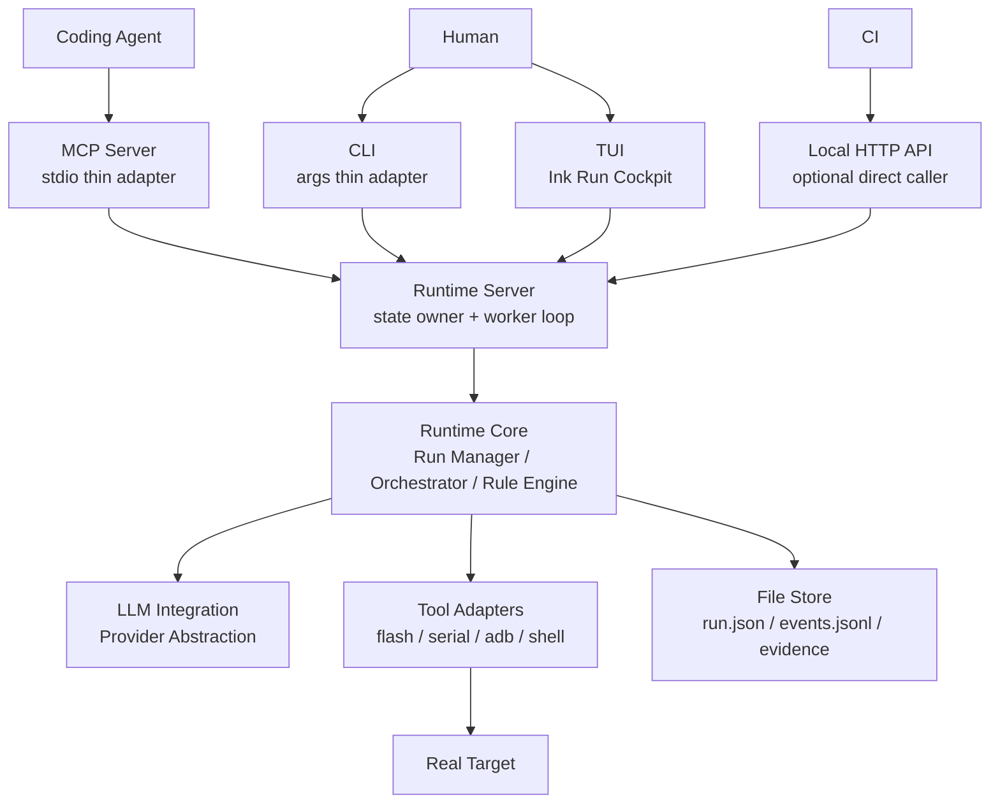

# Artifact Validation Agent 技术选型与端侧实现

> 状态：Draft  
> 日期：2026-04-28  
> 目的：确定第一版使用什么语言、如何组织各端实现、哪些技术暂不引入。  
> 关系：架构边界见 [ARTIFACT-VALIDATION-AGENT-ARCHITECTURE.md](ARTIFACT-VALIDATION-AGENT-ARCHITECTURE.md)；Runtime 执行契约见 [ARTIFACT-VALIDATION-AGENT-RUNTIME-CONTRACTS.md](ARTIFACT-VALIDATION-AGENT-RUNTIME-CONTRACTS.md)；TUI/UE 形态见 [ARTIFACT-VALIDATION-AGENT-UI-UX.md](ARTIFACT-VALIDATION-AGENT-UI-UX.md)。

## 1. 核心决定

P0 采用：

```text
TypeScript-first monorepo
+ Node.js 22 LTS+ 本地 Runtime 进程
+ TypeScript MCP Server
+ TypeScript CLI
+ Ink TUI
+ Provider-based LLM Integration
+ 文件系统持久化
+ subprocess / serial adapter 控制真实设备
```

已确定：

```text
UI 方案：纯 TUI，不做 Web。
LLM SDK：Anthropic + OpenAI + 自定义 Gateway 都要支持。
```

第一版不做多语言核心。

```text
Runtime、MCP、CLI、TUI、LLM Integration、contracts 全部先用 TypeScript。
Python / Go / Rust 只允许作为外部工具或后续 adapter 插件，不进入 P0 核心控制流。
```

## 2. 技术选型总览

| 模块 | 推荐方案 | 核心理由 |
|---|---|---|
| Runtime 语言 | TypeScript / Node.js 22 LTS+ | MCP SDK 支持、contracts 类型共享、TUI 同语言、开发速度快；满足当前 Ink runtime 要求。 |
| MCP Server | 官方 TypeScript SDK | stdio transport 适合 Coding Agent 接入，server 只做 thin adapter。 |
| TUI 框架 | Ink | React-like 组件模型，适合 Run Cockpit，能共享 contracts 类型。 |
| LLM 集成 | Provider Abstraction + 多 SDK Adapter | Runtime core 不绑定单一供应商，支持 mock 和自定义 gateway。 |
| Contracts | Zod + TypeScript types | 外部输入统一校验，MCP / CLI / TUI / HTTP 复用。 |
| 存储 | 本地文件系统 | events append-only、evidence 可审计、P0 不引入数据库。 |
| 设备控制 | Node wrapper + subprocess / serialport | adb / fastboot 用 subprocess；serial 用 Node stream。 |

## 3. Runtime 语言

选择：

```text
TypeScript / Node.js 22 LTS+
```

理由：

| 维度 | 判断 |
|---|---|
| MCP | 官方 TypeScript SDK 可直接暴露 MCP tools。 |
| 类型共享 | Run / Event / Evidence / Intent / Tool response 可以在 Runtime、MCP、CLI、TUI 间共享。 |
| 设备 I/O | Node.js 适合串口 stream、文件 stream、subprocess stdout/stderr 事件处理。 |
| 并发模型 | 单 Runtime 进程 + worker loop 与 Node.js event loop 匹配。 |
| LLM | Anthropic / OpenAI 都有 TypeScript SDK，自定义 Gateway 可用 fetch 封装。 |
| TUI | Ink 本身是 React renderer，同语言减少 glue code。 |

不选：

| 选项 | P0 不选原因 | 后续用途 |
|---|---|---|
| Python 主 Runtime | 硬件生态强，但 contracts / MCP / TUI 会跨语言同步。 | labgrid、pyOCD、pytest 作为 adapter plugin。 |
| Go / Rust 主 Runtime | 长期 daemon 和强隔离有优势，但 P0 开发速度慢，TUI / LLM / MCP 仍要 TypeScript 胶水。 | 远端 worker、强隔离 adapter、单二进制发行时再评估。 |

## 4. MCP Server

选择：

```text
官方 TypeScript SDK
```

P0 MCP Server 是 thin adapter。

职责：

```text
暴露 MCP tools。
校验 tool input。
调用 Runtime Server local HTTP API。
把 Runtime response 映射成 MCP tool response。
```

不做：

```text
不保存 run state。
不读取 evidence 文件。
不执行 adb / serial / fastboot。
不调用 LLM。
不实现状态机。
```

P0 MCP tools：

```text
validate_artifact
get_run_status
watch_run
get_run_events
get_evidence
get_run_result
intervene_run
cancel_run
get_target_capabilities
```

版本规则：

```text
实现时必须按官方当前稳定线锁定具体 major/minor。
不要在文档里承诺泛化的 ^1.0.0。
MCP SDK v1 / v2 package name 和 schema 机制可能不同，落代码前以官方 README 为准。
```

## 5. TUI 端

选择：

```text
Ink
```

P0 不做 Web UI。

```text
不使用 React / Vite / Next.js。
不做浏览器页面。
不做 Electron / Tauri。
```

TUI 职责：

```text
Human 本地 Run Cockpit。
展示 Runtime facts。
提供受限 intervention 控件。
```

P0 视图：

| 视图 | 作用 |
|---|---|
| New Validation | 填 artifact / context / target / constraints，发起 run。 |
| Run Cockpit | 展示 run header、plan steps、event timeline、target facts、evidence strip。 |
| Evidence View | 展示 evidence index、key events、refs、path、bounded window。 |
| Result View | 展示 Agent Reply / report / suggested_next。 |
| Target View | 展示 target runtime state、capabilities、lock。 |

TUI 不做：

```text
不提供任意 shell 输入框。
不直接打开 serial session。
不保存自己的 run 状态。
不自己推断 run 是否成功。
不做多 target dashboard。
```

状态刷新：

```text
轮询 Runtime HTTP API。
记录 last_event_seq。
明确展示 stale / partial / unknown。
```

## 6. LLM Integration

选择：

```text
Provider Abstraction + 多 SDK Adapter
```

Runtime core 只依赖抽象接口：

```ts
export interface LlmProvider {
  providerId: string;
  completeJson(input: LlmCallInput): Promise<LlmCallResult>;
}
```

P0 Provider：

| Provider | 实现方式 | 用途 |
|---|---|---|
| `AnthropicProvider` | `@anthropic-ai/sdk` | Claude 系模型。 |
| `OpenAIProvider` | `openai` | OpenAI Responses / Chat Completions 兼容。 |
| `GatewayProvider` | 自定义 HTTP API | 企业代理、私有模型网关、统一鉴权。 |
| `MockProvider` | 本地 fixture | 测试、Runtime-only、无 key 环境。 |

配置文件：

```yaml
default_provider: anthropic

providers:
  anthropic:
    type: anthropic
    api_key_env: ANTHROPIC_API_KEY
    model: "<configured-anthropic-model>"
    timeout_sec: 60

  openai:
    type: openai
    api_key_env: OPENAI_API_KEY
    model: "<configured-openai-model>"
    timeout_sec: 60

  gateway:
    type: gateway
    base_url: https://llm-gateway.example.com/v1/complete-json
    api_key_env: LLM_GATEWAY_API_KEY
    model: "<configured-gateway-model>"
    timeout_sec: 60
    headers:
      x-project: artifact-validation-agent
```

规则：

```text
Prompt Assembler / Output Parser / Output Validator 不感知具体 provider。
LLM 输出必须先落 Brain Output Store。
LLM 输出必须过 schema 和 Runtime policy 校验。
Provider timeout 不阻塞 Tool Adapter 写 events / evidence。
```

## 7. 模块间通信

P0 固定为一个真正拥有状态的 Runtime 进程。



边界：

```text
只有 Runtime Server 写 run state、events、evidence index。
MCP Server、CLI、TUI 都是 thin adapter，不保存自己的 run 状态。
TUI 不直接读写 .artifact-agent 文件。
MCP Server 不直接调用 Tool Adapter。
```

## 8. Local HTTP API

HTTP API 只做本地 adapter，不是 P0 对外产品 API。

| HTTP | 对应语义 |
|---|---|
| `POST /api/validate-artifact` | `validate_artifact` |
| `GET /api/runs/:run_id/status` | `get_run_status` |
| `GET /api/runs/:run_id/events?after_seq=0&limit=100` | `watch_run` / `get_run_events` |
| `GET /api/runs/:run_id/evidence` | `get_evidence` |
| `GET /api/runs/:run_id/result` | `get_run_result` |
| `POST /api/runs/:run_id/interventions` | `intervene_run` |
| `POST /api/runs/:run_id/cancel` | `cancel_run` |
| `GET /api/targets/:target_id/capabilities` | `get_target_capabilities` |

P0 `watch_run` 使用轮询。

```text
SSE / WebSocket 不进第一版。
如果轮询在 TUI 中体验不足，再把 Event Stream 暴露为 SSE。
```

## 9. 代码组织

P0 使用 pnpm workspace。

```text
apps/
  runtime-server/
    src/
      http/
      worker/
      main.ts
  mcp-server/
    src/
      tools/
      main.ts
  cli/
    src/
      commands/
      main.ts
  tui/
    src/
      views/
      components/
      api/
      main.tsx

packages/
  contracts/
    src/
      run.ts
      event.ts
      evidence.ts
      plan.ts
      mcp-tools.ts
      http.ts
  runtime-core/
    src/
      run-manager/
      orchestrator/
      target-service/
      rule-engine/
  file-store/
    src/
      run-store.ts
      event-stream.ts
      evidence-store.ts
  adapters/
    src/
      flash-adapter.ts
      serial-adapter.ts
      adb-adapter.ts
      shell-adapter.ts
  llm-integration/
    src/
      prompt-registry/
      prompt-assembler/
      output-parser/
      output-validator/
      providers/
  test-kit/
    src/
      fake-target/
      fixtures/
      mock-llm/
  shared-utils/
    src/
      subprocess.ts
      time.ts
      logging.ts

configs/
  targets/
  llm.yaml
  rules/

prompts/
  task_planner.v1.md
  observer.v1.md
  reply_generator.v1.md
```

依赖方向：

```text
contracts
-> file-store
-> runtime-core
-> runtime-server
-> mcp-server / cli / tui
```

`runtime-core` 不能依赖 `mcp-server`、`cli`、`tui`。

## 10. 核心依赖

版本号只在实现时锁定到 `package.json`。文档只记录依赖边界。

| package | 核心依赖 |
|---|---|
| `runtime-server` | `fastify`、`zod`、`yaml`、`uuid` |
| `mcp-server` | MCP TypeScript SDK、`zod` |
| `cli` | `commander`、`chalk`、`cli-table3` |
| `tui` | `ink`、`react`、`ink-text-input`、`ink-spinner` |
| `adapters` | `serialport` |
| `llm-integration` | `@anthropic-ai/sdk`、`openai` |
| `contracts` | `zod`、JSON schema exporter |
| root dev | `typescript`、`vitest`、`@types/node` |

## 11. Device Adapter

P0 adapter：

| Adapter | 实现方式 | 注意 |
|---|---|---|
| FlashAdapter | `fastboot` subprocess 或 Target Profile 中的 allowlisted custom command。 | 必须用 argv 数组，不用 shell 拼接。 |
| SerialAdapter | Node SerialPort stream，写 `serial.log`，按行喂给 Rule Engine。 | 连接参数只来自 Target Profile。 |
| AdbAdapter | `adb -s <device_id>` subprocess。 | device id 只来自 Target Profile。 |
| ShellAdapter | 只封装 `adb shell`。 | P0 不支持任意本机 shell。 |
| EvidenceAdapter | 文件复制、snapshot、window 保存。 | 不删除原始日志。 |

subprocess 规则：

```text
默认使用 spawn(file, args)，禁止 shell=true。
所有 stdout / stderr 必须写 evidence。
exit code 必须写 Event。
timeout 由 Orchestrator / Adapter 双层保护。
```

custom command 规则：

```text
只能来自 Target Profile。
只能由 Human 配置。
Plan / LLM / TUI 都不能动态生成 custom command。
```

## 12. File Store

P0 存储：

```text
.artifact-agent/
  runs/
    <run_id>/
      run.json
      intent.json
      plan.json
      events.jsonl
      evidence-index.json
      reply.json
      brain/
      logs/
      snapshots/
  targets/
    <target_id>/
      profile.json
      runtime-state.json
```

写入规则：

| 文件 | 写入方式 |
|---|---|
| `events.jsonl` | append-only，seq 单调递增。 |
| `run.json` | atomic write。 |
| `evidence-index.json` | atomic write，引用原始文件路径。 |
| 原始日志 | append-only 或 immutable snapshot。 |
| brain outputs | 每次 LLM 调用独立记录。 |

P0 单 Runtime 进程，所以不做复杂分布式锁。  
Target lock 只在 Runtime 内部生效。

## 13. 测试

测试分层：

| 层 | 工具 | 验收 |
|---|---|---|
| contracts | Vitest | schema 能接受/拒绝固定 fixtures。 |
| runtime-core | Vitest | 状态转换、Plan 校验、Intent 校验、Rule Engine。 |
| file-store | Vitest | event seq、atomic write、evidence index。 |
| adapters | Vitest + fake subprocess | 不需要真设备也能测超时、exit code、stdout/stderr。 |
| runtime-server | API integration tests | HTTP response 和 MCP 语义一致。 |
| mcp-server | tool contract tests | MCP tool 输入输出和 contracts 一致。 |
| tui | Ink render tests + fixture | TUI 能展示 run 状态、timeline、evidence refs、受限干预。 |
| llm-integration | MockProvider tests | parser / validator / fallback 可测，不调用真实 LLM。 |
| real target | gated integration | 需要显式环境变量和目标设备，不进默认 CI。 |

必须先做 fake target：

```text
fake target 能模拟 flash success、serial panic、adb offline、smoke failure。
```

没有 fake target，P0 会被真实硬件阻塞。

## 14. 第一阶段实现顺序

| 顺序 | 内容 | 验收 |
|---:|---|---|
| 1 | pnpm workspace + TypeScript 基础配置。 | `typecheck`、`test` 空跑通过。 |
| 2 | `packages/contracts`。 | 核心对象 schema + fixtures 通过。 |
| 3 | `packages/file-store`。 | 能写 run.json、events.jsonl、evidence-index.json。 |
| 4 | `runtime-core` 状态机 + Orchestrator skeleton。 | 手写 Plan 能被校验并推进 fake step。 |
| 5 | `test-kit` fake target。 | 不接真机能跑完 success / failure run。 |
| 6 | `runtime-server` local HTTP API。 | CLI / TUI / MCP 都可调用。 |
| 7 | `mcp-server` thin adapter。 | Coding Agent 能 `validate_artifact` 和 `watch_run`。 |
| 8 | `cli` thin adapter。 | Human 能本地发起、watch、看 result。 |
| 9 | `tui` Run Cockpit。 | Human 30 秒内看懂 run 状态。 |
| 10 | real adapters：fastboot / serial / adb。 | 第一条真机 demo 链跑通。 |
| 11 | `llm-integration` Provider Abstraction + MockProvider。 | Runtime-only 不需要真实 LLM。 |
| 12 | Anthropic / OpenAI / Gateway providers。 | Planner / Observer / Reply 可切换 provider。 |
| 13 | Observer / Reply Generator 接入。 | 事件触发补采集，结束生成 reply。 |

顺序不能反过来。

```text
先 Runtime-only。
再 TUI 观察。
最后 LLM 增强。
```

## 15. ADR 摘要

### ADR-001：Runtime 语言选择 TypeScript

理由：

```text
MCP SDK 支持、contracts 类型共享、TUI 同语言、LLM SDK 接入直接、P0 开发速度快。
```

### ADR-002：TUI 框架选择 Ink

理由：

```text
React-like 组件模型，适合 Run Cockpit；与 Runtime 同语言；比 Web / Electron 更贴近本地设备验证场景。
```

### ADR-003：LLM 通过 Provider Abstraction 接入

理由：

```text
Runtime core 不绑定模型供应商；支持 Anthropic / OpenAI / Gateway；Mock Provider 可测试。
```

## 16. Go / No-Go

Go：

```text
TypeScript-first。
Node.js Runtime Server。
MCP / CLI / TUI 都做 thin adapter。
P0 使用文件系统。
P0 UI 使用 Ink TUI。
P0 LLM 使用 Provider Abstraction。
P0 先 fake target，再真机 adapter。
```

No-Go：

```text
不做 Python 主 Runtime。
不做 Web UI。
不做 Electron / Tauri。
不做数据库。
不做消息队列。
不做任意 shell UI。
不让 MCP / CLI / TUI 各自保存状态。
不让具体 LLM SDK 进入 Runtime core。
```

如果实现时只记住一句话：

```text
第一版是 TypeScript 本地 Runtime + Ink TUI 产品，不是 Web Console，也不是多语言硬件平台。
```
