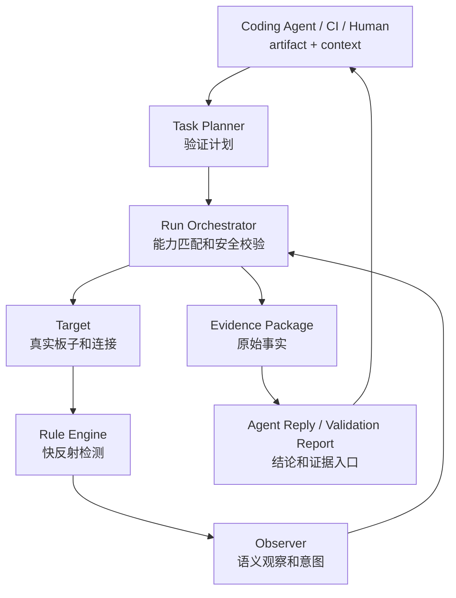

# Artifact Validation Agent 产品定义

> 状态：Draft  
> 日期：2026-04-28  
> 目的：把当前正式方向讲清楚：这是一个不改代码的产物真机验证 agent。

## 1. 一句话

`Artifact Validation Agent` 是一个自动验证产物能否在真实设备上正常运行的系统。

一句人话：

```text
Coding Agent / CI / Human 负责提供 artifact 和验证背景。
Artifact Validation Agent 负责把 artifact 放到真实设备上跑，
主动观察运行过程，
保存 evidence，
产出 validation report，
并把结果回传给 Coding Agent / Human。
```

## 2. 为什么存在

很多问题不是编译阶段能发现的。

代码能编译，artifact 也生成了，但真实设备上可能会：

- 刷机失败。
- 启动 panic。
- 串口卡住。
- ADB 不回来。
- smoke test 失败。
- 某个日志出现异常。
- 偶发失败隔天才出现。

人可以手动刷机、看串口、抓日志。  
但这件事重复、碎、容易漏现场。

系统的价值是把这件事变成受控的验证任务：

```text
产物和验证背景进入系统
-> 自动真机验证
-> 运行中主动观察
-> 异常时补采集
-> 自动留证据
-> 生成 Agent Reply / Validation Report
```

## 3. 它不是什么

它不是：

- coding agent。
- 通用代码修复系统。
- 更智能的 LLM agent。
- 更好的串口终端。
- 完整实验室管理平台。
- labgrid / LAVA / pytest-embedded 的替代品。

它不负责：

- 读代码。
- 改代码。
- 生成 patch。
- 判断根因。
- 管完整 CI 流水线。
- 让 LLM 直接执行设备命令。

## 4. 它是什么

它是 artifact-first 的真机验证 agent。

核心闭环：



## 5. 角色

| 角色 | 做什么 | 不做什么 |
|---|---|---|
| Human | 配置 Target Profile、看报告、接收通知、处理异常 | 不每天手动刷机和盯日志 |
| Coding Agent | 产出 artifact、提供验证背景、接收 Agent Reply | 不配置设备连接、不直接控设备 |
| CI / Build System 可选 | 产出 artifact，触发验证 | 不负责真实设备现场 |
| Task Planner (LLM) | 任务开始时生成验证计划 | 不直接执行工具 |
| Observer (LLM) | 运行中观察事件摘要并提出意图 | 不做毫秒级检测、不绕过 Runtime |
| Rule Engine | pattern、timeout、silence、exit code 快速检测 | 不做复杂语义判断 |
| Run Orchestrator | 能力匹配、安全校验、状态调度 | 不做代码根因判断 |
| Tool Adapter | 调 flash、serial、ADB、SSH 等底层工具 | 不理解验证目标 |
| Evidence Store | 保存原始日志、事件、时间线和快照 | 不用摘要替代事实 |

## 6. 第一版主场景

### 场景 A：Coding Agent 请求验证

```text
Coding Agent 修完 boot crash
-> 提交 firmware.img + 验证背景
-> 刷到 board-01
-> 抓 120 秒串口
-> 等 ADB 180 秒
-> 执行 smoke_test
-> 运行中观察 panic / timeout / adb offline
-> 失败时补采集 dmesg / logcat / serial window
-> 生成 Agent Reply
```

### 场景 B：新产物触发验证

```text
CI 完成 build
-> 上传 artifact
-> 触发 validation task
-> 真机验证
-> report 回写到 CI 或发通知
```

### 场景 C：长期巡检

```text
每 6 小时刷一次最新稳定产物
-> 看启动是否稳定
-> 记录启动耗时和异常
-> 发现偶发问题时保存 evidence
```

## 7. 为什么不是前一个方向

前一个方向想做：

```text
Coding Agent 修代码时调用设备 runtime
```

它的问题是：

- 太容易退化成 terminal / serial / adb wrapper。
- 很多工具已经覆盖连接和执行。
- “更智能”站不住。
- LLM 不该参与实时控制。

现在方向改成：

```text
不改代码，只验证产物。
```

价值更清楚：

- 产物会持续出现。
- 验证可以定时或触发。
- 人不想重复手工刷机。
- 失败 evidence 有长期价值。

## 8. 成功标准

第一版成功，不看功能数量，看这件事是否跑通：

```text
给一个 artifact input
给一块 target
给一个验证 context
系统能自动跑 validation run
运行中能主动观察
失败时保留 evidence 并生成 Agent Reply / report
```

衡量指标：

- 人是否少做手动刷机。
- 失败现场是否不丢。
- report 是否足够判断下一步。
- 新 target 接入是否足够轻。
- 是否比直接写 cron + shell 脚本更稳。

## 9. 当前判断

这个方向仍然会撞 CI / HIL / lab 工具。

所以第一版必须轻：

- 单 target。
- 单 artifact 输入。
- 少量 step。
- 本地 evidence。
- 简单 Agent Reply / report。
- 本地 alert。

不要一开始做平台。

第一版只证明：

```text
真实设备产物验证这件重复工作，
能不能被一个轻量 agent 稳定接住。
```

## 10. 用户假设

当前产品判断基于这些假设：

| 假设 | 验证方式 | 如果不成立 |
|---|---|---|
| Coding Agent / CI 会持续产出 artifact。 | 接入一个真实 build 输出或手工 artifact 目录。 | 产品价值下降，转向手动验证辅助。 |
| Human 不想重复刷机和盯串口。 | 观察一次 boot 验证是否减少手工步骤。 | 只做 evidence packaging 可能更合适。 |
| 失败现场经常丢。 | 对比人工验证和系统保存的 evidence。 | Agent Reply 价值下降。 |
| Coding Agent 需要结构化结果继续修代码。 | 把 Agent Reply 交给 Coding Agent 看能否继续行动。 | 只做 Human report 即可。 |
| 单 target 本地 evidence 足以证明第一版价值。 | 跑通第一条 demo 链。 | 需要提前引入 target pool 或远端存储。 |

P0 不假设已经有大规模用户调研。

P0 的验证方式是：

```text
用一条真实或接近真实的 boot / smoke 验证链，
比较它和 cron + shell + 手工看日志的差异。
```

## 11. 竞品和替代方案边界

第一版不是替代成熟 HIL / lab 工具。

| 替代方案 | 强项 | 本系统避开的点 | 本系统要证明的差异 |
|---|---|---|---|
| cron + shell | 简单、快、可控。 | 不做复杂调度。 | 更稳定地保存 evidence，更容易给 Coding Agent 消费。 |
| 手工刷机看串口 | 灵活、现场判断强。 | 不追求人完全不可介入。 | 减少重复动作，避免漏现场。 |
| labgrid / LAVA | 设备编排、实验室规模化。 | P0 不做 board farm。 | 更轻量，面向 artifact validation 和 Agent Reply。 |
| pytest-embedded | 测试框架化强。 | P0 不替代测试框架。 | 关注运行中观察、证据包和 LLM 摘要。 |
| CI runner | 集成流水线强。 | P0 不管完整 CI。 | 把真实设备验证结果回传给 CI / Coding Agent。 |

竞争判断：

```text
如果第一版只做到“能跑命令”，它输给 cron + shell。
如果第一版能把失败现场稳定保存并压缩成可行动结果，它才有独立价值。
```
