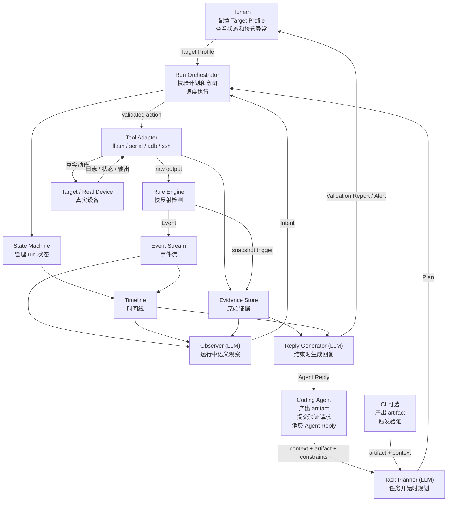

# Artifact Validation Agent 角色模型

> 状态：Draft  
> 日期：2026-04-28  
> 目的：把每个角色的职责、输入、输出和边界定清楚。

## 1. 一句话结论

这套系统不是让 Agent 猜板子怎么连。

正确分工是：

```text
Human 配置目标设备事实和安全边界。
Coding Agent / CI 提供 artifact 和验证背景。
Brain Layer 只产出计划、观察意图和回复。
Control Layer 校验计划、管理状态、执行快反射规则。
Tool Layer 执行真实 flash / serial / adb / ssh 动作。
Memory Layer 保存事件、时间线和原始证据。
```

核心原则：

```text
角色按职责和调用时机划分。
用户配置目标特定信息，系统推断通用能力。
快反射和慢思考分开。
LLM 不直接执行工具。
```

## 2. 总体协作图



## 3. 划分原则

| 原则 | 含义 |
|---|---|
| 设备事实不由 Agent 猜 | 串口、ADB、SSH、fastboot、危险动作边界由 Human 配置。 |
| 能力由系统推断 | 有 serial 就能观察启动，有 adb 就能执行 shell 和采日志，有 flash method 才能刷机。 |
| Agent 只规划能力需求 | Agent 说“需要 watch_serial / collect_logs”，不说“打开 `/dev/ttyUSB0` 执行这个命令”。 |
| Runtime 绑定工具 | 哪个能力对应哪个 adapter，由 Runtime 根据 Target Profile 匹配。 |
| Rule Engine 负责快反射 | pattern、timeout、silence、exit code 这类确定性检测不能等 LLM。 |
| Observer 负责慢思考 | LLM 根据事件摘要和上下文判断“当前情况意味着什么”。 |
| Evidence 保存事实 | LLM 判断可以进入 report，但不能替代原始日志和时间线。 |

## 4. 外部角色

| 角色 | 职责 | 输入 | 输出 |
|---|---|---|---|
| Human | 配置 Target、查看状态、接收告警、处理异常 | Console / Alert / Report | Target Profile、干预决策 |
| Coding Agent | 改代码、产出 artifact、请求验证、消费结果 | 代码上下文、artifact、Agent Reply | `validate_artifact` 调用、后续代码修改 |
| CI 可选 | 产出 artifact、触发验证、消费结果 | build artifact、pipeline context | `validate_artifact` 调用、pipeline 状态 |

### Human

P0 里不拆工程师和操作人，统一叫 Human。

原因很简单：第一版通常是同一个人知道板子怎么连，也负责看结果和处理异常。  
如果后续进入大团队场景，再把它拆成 Device Owner、Operator、Reviewer。

Human 做：

- 配置 `Target Profile`。
- 说明板子连接方式和刷机方式。
- 配置安全边界，例如是否允许 flash、reboot、power cycle。
- 配置目标特定提示，例如 boot markers、已知 fail patterns。
- 查看 validation report。
- 收到异常时暂停、继续、重跑或接管设备。

Human 不做：

- 不每天手工刷机。
- 不长期盯串口。
- 不每次把连接方式重新告诉 Agent。

### Coding Agent

Coding Agent 是验证请求方，不是设备控制方。

它知道这次改了什么、想验证什么、预期现象是什么、哪些异常值得关注。  
它不应该知道串口端口、fastboot id、ADB device id。

Coding Agent 做：

- 修改代码。
- 编译或获取 artifact。
- 调用 `validate_artifact`。
- 提供任务背景、预期结果、关注点和约束。
- 接收 `Agent Reply`。
- 根据验证结果继续修代码。

Coding Agent 不做：

- 不配置设备连接。
- 不猜板子协议。
- 不直接拼 flash / adb / serial 命令。
- 不管理真实设备状态机。

调用示例：

```json
{
  "context": {
    "task": "验证 boot crash 是否修复",
    "what_changed": "调整 init service 启动顺序",
    "expected": "设备能启动完成，ADB 能回来，不再出现 kernel panic",
    "concerns": ["kernel panic", "init timeout", "adb offline"]
  },
  "artifact": {
    "path": "/builds/firmware.img",
    "type": "firmware_img"
  },
  "target": "board-01",
  "constraints": {
    "max_duration_sec": 600,
    "allow_flash": true,
    "allow_reboot": true,
    "allow_power_cycle": false
  }
}
```

## 5. Brain Layer

Brain Layer 是 LLM 层。  
它不直接控制设备，只输出计划、观察意图和回复。

| 角色 | 职责 | 输入 | 输出 | 调用时机 |
|---|---|---|---|---|
| Task Planner | 规划验证步骤 | context、artifact、target capabilities、constraints | Plan | 任务开始时 1 次 |
| Observer | 观察事件摘要，提出下一步意图 | Event summary、timeline、target state、evidence window | Intent | 定期或事件触发，多次 |
| Reply Generator | 生成给 Coding Agent / Human 的结果 | Evidence、timeline、run result、observer notes | Agent Reply / Report | 任务结束时 1 次 |

### Task Planner

Task Planner 做：

- 理解验证任务。
- 选择需要哪些能力。
- 生成验证步骤。
- 给 Observer 设定关注点。
- 给 Runtime 提供可校验的计划。

Task Planner 不做：

- 不选择具体串口端口。
- 不拼真实命令。
- 不绕过安全约束。
- 不声明 Target Profile 里没有的能力。

输出示例：

```json
{
  "steps": [
    {
      "capability": "flash",
      "input": {
        "artifact_ref": "firmware_img",
        "artifact_type": "firmware_img"
      }
    },
    {
      "capability": "watch_serial",
      "input": {
        "duration_sec": 180,
        "patterns": ["kernel panic", "init timeout", "boot completed"]
      }
    },
    {
      "capability": "wait_adb",
      "input": {
        "timeout_sec": 180
      }
    },
    {
      "capability": "shell_exec",
      "input": {
        "command": "/vendor/bin/smoke_test",
        "timeout_sec": 60,
        "expected_exit_code": 0
      }
    },
    {
      "capability": "collect_logs",
      "condition": "on_failure",
      "input": {
        "items": ["dmesg", "logcat", "serial_last_window"]
      }
    }
  ],
  "observer_focus": [
    "kernel panic",
    "init timeout",
    "adb offline too long"
  ]
}
```

### Observer

Observer 是 Artifact Validation Agent 区别于普通 Runner 的核心。

它看的不是完整原始日志，而是被 Runtime 和 Rule Engine 压缩后的事件摘要、状态窗口和 evidence window。  
它输出的是意图，不是工具命令。

Observer 做：

- 判断当前阶段是否正常。
- 判断是否需要继续等待。
- 判断是否需要补采集。
- 判断是否需要暂停给 Coding Agent / Human。
- 判断是否可以提前结束。

Observer 不做：

- 不负责毫秒级检测。
- 不直接 kill 进程。
- 不直接执行 adb / fastboot。
- 不替代 Rule Engine 的确定性规则。
- 不把语义判断当作原始事实。

输出示例：

```json
{
  "intent": "stop",
  "reason": "kernel panic detected after init service timeout",
  "confidence": 0.95,
  "requested_actions": [
    {
      "capability": "collect_logs",
      "input": {
        "items": ["serial_last_window"]
      }
    },
    {
      "capability": "save_snapshot",
      "input": {
        "reason": "kernel panic detected",
        "include": ["serial_last_window", "target_state", "events"]
      }
    }
  ],
  "report_to_caller": true
}
```

### Reply Generator

Reply Generator 做：

- 压缩 evidence。
- 生成面向 Coding Agent 的结论。
- 提供关键证据和建议下一步。
- 明确哪些是事实，哪些是判断。

Reply Generator 不做：

- 不改代码。
- 不给未经证据支持的根因结论。
- 不用摘要替代 evidence 路径。

## 6. Control Layer

Control Layer 不是 LLM。  
它负责安全、状态、一致性和可追踪执行。

| 角色 | 职责 | 输入 | 输出 |
|---|---|---|---|
| Run Orchestrator | 校验 Plan / Intent，调度动作，执行降级规则 | Plan、Intent、Target Profile、constraints | validated action、run decision |
| State Machine | 管理 run 生命周期 | Orchestrator 指令、tool result、events | run state |
| Rule Engine | 快速检测关键事件 | 日志流、命令状态、时间窗口 | Event、snapshot trigger |

### Run Orchestrator

Run Orchestrator 做：

- 读取 Target Profile。
- 推断 target capabilities。
- 校验计划和约束。
- 把能力绑定到 Tool Adapter。
- 调度 step。
- 接收 Observer intent 并决定是否执行。
- 执行内置降级规则。

Run Orchestrator 不做：

- 不做代码根因判断。
- 不让 LLM 直接控制工具。
- 不根据猜测选择设备协议。

### State Machine

第一版 run 状态：

```text
queued
-> planning
-> running
-> collecting_evidence
-> completed | failed | paused | cancelled
```

State Machine 做：

- 保证状态转换合法。
- 记录每次状态变化。
- 给 `get_run_status` 和 `watch_run` 提供稳定视图。

### Rule Engine

Rule Engine 是快反射层。

它负责：

- Pattern Matcher：panic、oops、fatal、known fail pattern。
- Timeout Detector：总超时、step 超时、command hang。
- Silence Detector：serial 长时间无输出。
- Exit Code Detector：命令失败。
- Connectivity Detector：ADB offline、serial disconnect。

Rule Engine 输出事件，不做复杂语义判断。

示例：

```json
{
  "event": "pattern_matched",
  "source": "serial",
  "pattern": "kernel panic",
  "time": "+42s",
  "default_action": "snapshot_and_escalate"
}
```

## 7. Tool Layer

Tool Adapter 是手脚。

它只执行 Runtime 校验过的动作。

| 能力 | Adapter 来源 | 第一版动作 |
|---|---|---|
| `flash` | flash method | fastboot 或自定义 flash command |
| `watch_serial` | serial | 打开串口并记录输出 |
| `wait_adb` | adb | 等 ADB online |
| `shell_exec` | adb / ssh | 执行 smoke 命令 |
| `check_process` | adb / ssh | 检查目标进程是否存在 |
| `collect_logs` | adb / serial | dmesg、logcat、serial window |
| `save_snapshot` | evidence store | 保存现场快照 |

Tool Adapter 不做：

- 不自己规划。
- 不自己判断业务成败。
- 不自己决定下一步。
- 不绕过 Runtime。

## 8. Memory Layer

| 角色 | 职责 | 输入 | 输出 |
|---|---|---|---|
| Event Stream | 保存运行中事件 | Rule Engine、State Machine、Tool Adapter | event list |
| Timeline | 保存按时间排序的过程 | 状态变化、step、event、observer note | timeline |
| Evidence Store | 保存原始证据 | raw logs、command output、snapshots、reports | evidence package |

Memory Layer 的原则：

- 保存事实，不保存猜测。
- 保存原始证据，不只保存摘要。
- LLM 判断可以作为 note 保存，但不能覆盖事实。

## 9. Target Profile 边界

Target Profile 由 Human 配置，不由 Agent 猜。

P0 配置应该尽量简单：

```json
{
  "target_id": "board-01",
  "connections": {
    "serial": {
      "port": "/dev/ttyUSB0",
      "baud": 115200
    },
    "adb": {
      "device_id": "ABC123"
    }
  },
  "flash": {
    "method": "fastboot",
    "artifact_type": "firmware_img"
  },
  "target_hints": {
    "boot_markers": ["Booting Linux", "init started", "boot completed"],
    "fail_patterns": ["kernel panic", "kernel oops", "init service timeout"]
  },
  "safety": {
    "allow_flash": true,
    "allow_reboot": true,
    "allow_power_cycle": false
  }
}
```

系统从 Target Profile 自动推断能力：

```json
{
  "target_id": "board-01",
  "available_capabilities": {
    "flash": true,
    "watch_serial": true,
    "wait_adb": true,
    "shell_exec": true,
    "check_process": true,
    "collect_logs": true,
    "save_snapshot": true,
    "power_cycle": false
  }
}
```

配置边界：

| Human 配置 | 系统推断 |
|---|---|
| 连接参数 | `watch_serial`、`wait_adb`、`shell_exec`、`collect_logs` 等能力 |
| 刷机方式 | `flash` 能力和 adapter 绑定 |
| 安全边界 | 哪些动作可以执行 |
| 目标特定提示 | Rule Engine 初始 pattern 和 Observer 关注点 |

## 10. 决策边界

| 决策 | 归属 |
|---|---|
| 板子怎么连 | Human |
| 板子支持什么协议 | Human 配置，Runtime 读取 |
| 哪些动作允许 | Human / constraints |
| 当前 target 暴露哪些能力 | Runtime capability inference |
| 这次验证需要哪些能力 | Task Planner |
| 能力绑定哪个工具 | Run Orchestrator |
| 工具如何执行 | Tool Adapter |
| pattern / timeout / silence 是否触发 | Rule Engine |
| 当前异常意味着什么 | Observer |
| 是否执行 Observer 的意图 | Run Orchestrator |
| 如何回复 Coding Agent | Reply Generator |
| 代码怎么修 | Coding Agent |

## 11. P0 收敛

P0 只保留这些角色：

- External：Human、Coding Agent、CI 可选。
- Brain：Task Planner、Observer、Reply Generator。
- Control：Run Orchestrator、State Machine、Rule Engine。
- Tool：Tool Adapter。
- Memory：Event Stream、Timeline、Evidence Store。

P0 不拆：

- Human 先不拆成 Engineer / Operator / Reviewer。
- CI 先作为可选调用方，不做完整 CI 集成。
- Target pool 先不做。
- 权限系统先不做。

## 12. 收口

最终边界是：

```text
Human 给设备事实。
Coding Agent / CI 给验证背景和产物。
Task Planner 给验证计划。
Rule Engine 抓关键事件。
Observer 做语义判断并提出意图。
Run Orchestrator 校验意图并调度执行。
Tool Adapter 调真实工具。
Evidence Store 留事实。
Reply Generator 回传结论。
```

这条边界不能再混。
