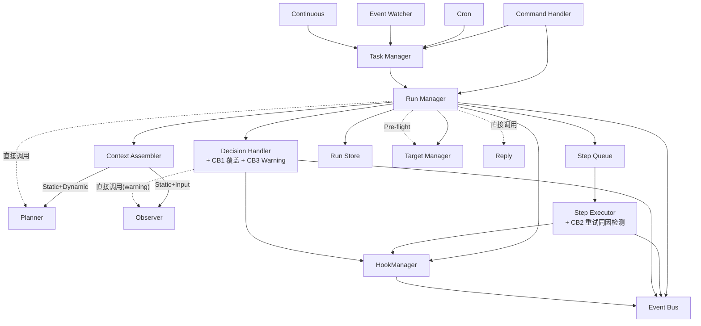
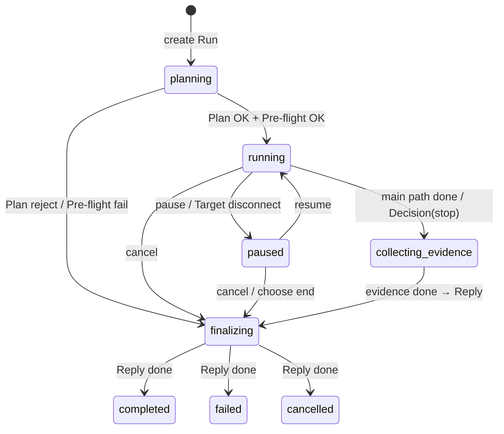
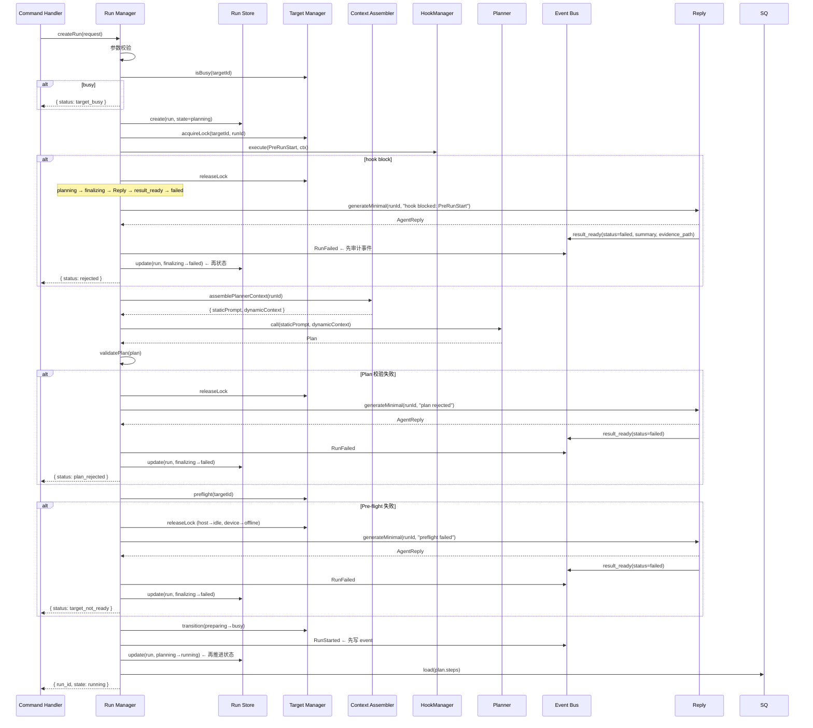

# Runtime 详细设计

> 状态：Draft / 日期：2026-04-29
> 对应架构: Section 10-11, 18-20, 22, 25

## 1. 组件总图



## 2. Run Manager — 状态机



### 2.1 createRun 完整流程



### 2.2 finalizing 收口

```typescript
// 所有终态路径统一走 finalizing
async function finalizeRun(runId: string): Promise<void> {
  // 1. OnFinalizing Hook — 补采证据的最后窗口
  await hookManager.execute("OnFinalizing", { run_id: runId });
  // hook 只做补采。不改变流程结局。

  // 2. Reply 生成结果（normal / minimal / cancelled）
  const reply = await replyGenerator.generate(runId);

  // 3. Reply 发布 result_ready（Reply 是唯一发布者。不是 RM）
  //    replyGenerator 内部: eventBus.emit({ type: "result_ready", ...replyPayload })

  // 4. RM 收到 result_ready → 先审计事件，再改状态
  await eventBus.emit({ type: `run_${reply.status}`, run_id: runId });
  await runStore.update(runId, { state: reply.status, ended_at: now() });
  await targetManager.releaseLock(targetId); // busy → cleaning → idle

  // 5. PostRunEnd Hook
  await hookManager.execute("PostRunEnd", { run_id: runId, state: reply.status });
}
```

## 3. Step Executor

### 3.1 执行一个 Step

```typescript
class StepExecutor {
  async executeStep(step: Step): Promise<void> {
    // 1. PreStepExecute Hook
    const hookResult = await this.hookManager.execute("PreStepExecute", {
      run_id: this.runId, step_id: step.id, capability: step.capability
    });
    if (hookResult.decision === "block") {
      await this.runManager.pause(`hook blocked: ${hookResult.reason}`);
      return;
    }
    if (hookResult.decision === "retry") {
      await this.retryCurrentStep(); return;
    }

    // 2. 获取 Connection
    const conn = await this.connectionManager.getConnection(this.targetId, step.action);
    await conn.connect();

    // 3. 执行
    this.eventBus.emit({ type: "step_started", step_id: step.id });
    await this.runStep(step, conn);

    // 4. PostStep Hook
    const failed = this.hadError;
    if (failed) {
      await this.hookManager.execute("PostStepFailed", ctx);
    } else {
      await this.hookManager.execute("PostStepComplete", ctx);
    }
  }
}
```

### 3.2 失败重试（含 CB2）

```typescript
class StepExecutor {
  private retryBreaker = new StepRetryBreaker(); // CB2

  async executeWithRetry(step: Step, conn: Connection): Promise<void> {
    let attempt = 0;
    const maxRetries = step.retryPolicy?.maxRetries ?? this.systemConfig.retry.maxRetries;
    const intervals = step.retryPolicy?.intervals ?? this.systemConfig.retry.intervals;

    while (attempt <= maxRetries) {
      try {
        await this.runStep(step, conn);
        return; // 成功
      } catch (e) {
        const failureType = this.classifyFailure(e);

        // 不可重试 → 直接失败
        if (!this.isRetryable(failureType)) throw e;

        // CB2: 同类型连续失败检测
        if (!this.retryBreaker.shouldRetry(failureType)) {
          this.eventBus.emit({ type: "step_failed", reason: "possible_hardware_issue" });
          throw e;
        }

        attempt++;
        if (attempt > maxRetries) throw e;
        await sleep(intervals[attempt - 1] * 1000);
      }
    }
  }

  private isRetryable(type: string): boolean {
    return this.systemConfig.retry.retryable.includes(type);
  }
}
```

### 3.3 采样子动作

```typescript
// LongRun Step 有 observe.samplingCommands 时
async function runSamplingSubActions(step: Step, conn: Connection): Promise<void> {
  for (const cmd of step.observe.samplingCommands) {
    // 子动作。不进 Step Queue。不分配 step_id。归属当前 Step。
    const { stdout, stderr, exitCode } = await conn.exec(cmd, 10);
    this.outputPipe.feedExec(stdout, stderr, exitCode);
    // evidence 归属当前 Step。Aggregator 从 observation Event 提 metrics。
  }
}
```

## 4. Decision Handler

### 4.1 核心流程

```typescript
class DecisionHandler {
  private overrideBreaker = new ObserverOverrideBreaker(); // CB1
  private warningAccum = new WarningAccumulator();          // CB3

  async handleEvent(event: Event): Promise<void> {
    const severity = this.rulePolicy.lookup(event.rule_id);

    // fatal → 准备 stop。不受 CB1/3 影响。
    if (severity === "fatal") {
      const hookResult = await this.hookManager.execute("OnStopDecision", ctx);
      if (hookResult.decision === "block") {
        // Hook 要求暂停。不进 collecting_evidence。等人介入。
        await this.runManager.pause(`OnStopDecision hook blocked: ${hookResult.reason}`);
        return;
      }
      return this.executeStop(event);
    }

    // CB1: 熔断 → 只出 suggest
    if (this.overrideBreaker.isActive()) {
      await this.recordSuggestion("自动 stop 已禁用");
      return;
    }

    // CB3: warning 累加
    this.warningAccum.record(event.rule_id);

    // debounce
    if (this.isDebounced(event.rule_id)) return;

    // 调 Observer
    const { staticPrompt, input } = await this.assembler.assembleObserverContext(runId, event);
    const decision = await this.observer.decide(staticPrompt, {
      ...input,
      circuitBreakerActive: this.overrideBreaker.isActive(),
      warningEscalation: this.warningAccum.isEscalated(),
    });

    // 校验 Decision
    if (!this.validateDecision(decision)) {
      this.eventBus.emit({ type: "decision_rejected", reason: "validation_failed" });
      return;
    }

    // 执行
    await this.executeDecision(decision);
    this.observer.writeWorkingMemory(runId, { summary: decision.reason });
    this.eventBus.emit({ type: "decision_made", source: "observer", ...decision });
  }

  // Human override
  onOverride(): void {
    this.overrideBreaker.onOverride();
    this.eventBus.emit({ type: "decision_overridden" });
  }
}
```

## 5. Task Manager

```typescript
class TaskManager {
  async onCronTrigger(task: Task): Promise<void> {
    // 检查上次 Run 是否还在执行
    if (task.lastRun) {
      const state = await this.runStore.get(task.lastRun.runId).state;
      if (["planning","running","paused","collecting_evidence","finalizing","cleaning"].includes(state)) {
        this.eventBus.emit({ type: "skipped_run", task: task.name, reason: "previous_run_still_active" });
        return;
      }
    }
    // 创建新 Run
    const runId = await this.runManager.createRunFromTask(task);
    task.lastRun = { runId, state: "planning" };
  }
}
```

## 6. Host 崩溃恢复

```typescript
async function recoverOnStartup(): Promise<void> {
  const runs = await runStore.listNonTerminal();
  const profiles = await targetStore.listAll();
  const targetStates = await Promise.all(profiles.map(p => targetStore.getState(p.targetId)));

  for (const run of runs) {
    switch (run.state) {
      case "running": {
        // 取最后一条 Event（不是第一条。用 cursor 取最新）
        const lastEvents = await eventStore.read(run.runId, run.lastEventSeq > 0 ? run.lastEventSeq - 1 : 0, 2);
        const lastEvent = lastEvents[lastEvents.length - 1];
        if (!lastEvent || isStale(lastEvent.time)) {
          // 统一走 Reply → result_ready → failed
          const reply = await replyGenerator.generateMinimal(run.runId, "runtime crashed");
          replyGenerator.publishResultReady(reply);  // Reply → EB(result_ready)
          await eventBus.emit({ type: "run_failed", run_id: run.runId });
          await runStore.update(run.runId, { state: "failed" });
        }
        break;
      }
      case "planning": {
        const ts = targetStates.find(t => t.currentRunId === run.runId);
        if (ts && ts.state !== "offline") {
          await runManager.retryPlanner(run.runId);
        } else {
          const reply = await replyGenerator.generateMinimal(run.runId, "runtime crashed during planning");
          replyGenerator.publishResultReady(reply);
          await eventBus.emit({ type: "run_failed", run_id: run.runId });
          await runStore.update(run.runId, { state: "failed" });
        }
        break;
      }
      case "paused":
        break;  // 保持 paused
      case "collecting_evidence":
      case "finalizing": {
        const reply = await replyGenerator.generateMinimal(run.runId, "runtime crashed during finalization");
        replyGenerator.publishResultReady(reply);
        await eventBus.emit({ type: "run_failed", run_id: run.runId });
        await runStore.update(run.runId, { state: "failed" });
        break;
      }
    }
  }

  // 清理 stale Target 锁
  for (const ts of targetStates) {
    if (ts.currentRunId) {
      const run = await runStore.get(ts.currentRunId);
      if (!run || ["completed","failed","cancelled"].includes(run.state)) {
        await targetManager.releaseLock(ts.targetId);
      }
    }
  }

  await targetManager.reconnectAll();
  await viewLayer.rebuild();
}
```

## 7. Agent 自观测

```typescript
// 关键指标（内部计数 + Event Store 查询）
interface SystemMetrics {
  // Event Bus
  eventsPerRun: number;
  eventQueueDepth?: number;

  // LLM
  observerCalls: number;
  observerLatencyP50: number;
  observerLatencyP99: number;
  observerFallbackRate: number;
  plannerSuccessRate: number;
  replySuccessRate: number;

  // Target
  targetOnlineRate: number;       // 各 Target 的在线时长占比
  targetAvgBusyDuration: number;  // 平均每次占用多久

  // Storage
  evidenceDiskUsage: number;
  totalRuns: number;

  // Cost
  sessionCost: number;
}

// 暴露方式:
//  - TUI status bar: cost, cache hit rate
//  - CLI: va status (系统级)
//  - Notification: LLM 成功率持续 < 阈值 → 告警
```

## 8. 调用方式汇总

```
直接调用（需要返回值）:
  RM → Planner                 RM → Reply
  RM → TargetManager           RM → ContextAssembler
  DH → Observer                DH → ContextAssembler
  RM/SE/DH → HookManager       SE → ConnectionManager → Connection
  Agent → Memory

Event Bus（广播/持久化）:
  RuleDetector → EB(RuleMatched)
  Aggregator → EB(Checkpoint, Correlated, BaselineDiff)
  TargetManager → EB(TargetStateChanged)
  RM → EB(RunStarted, RunCompleted, RunFailed, RunCancelled, RunPaused, RunResumed)
  SE → EB(StepStarted, StepCompleted, StepFailed)
  Planner → EB(PlanGenerated)                    [审计]
  Observer → EB(DecisionMade, Suggestion)        [审计]
  Reply → EB(result_ready)
  HookManager → EB(HookExecuted)                 [审计]
  TaskManager → EB(skipped_run)                  [审计]
  EB → DecisionHandler(RuleMatched, Checkpoint, Correlated, BaselineDiff)
  EB → NotificationFilter(result_ready, target_state_changed, suggestion_generated)
  EB → Store
```
