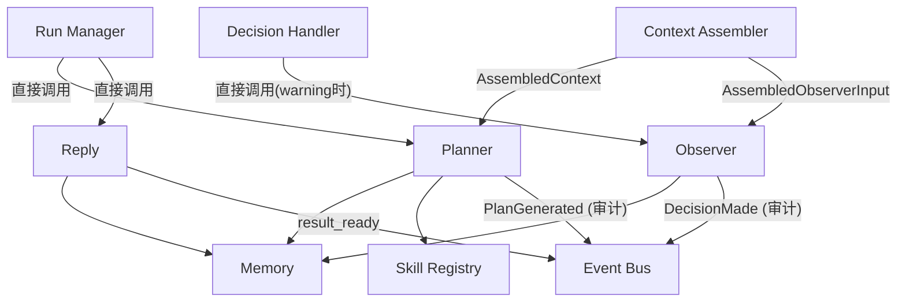
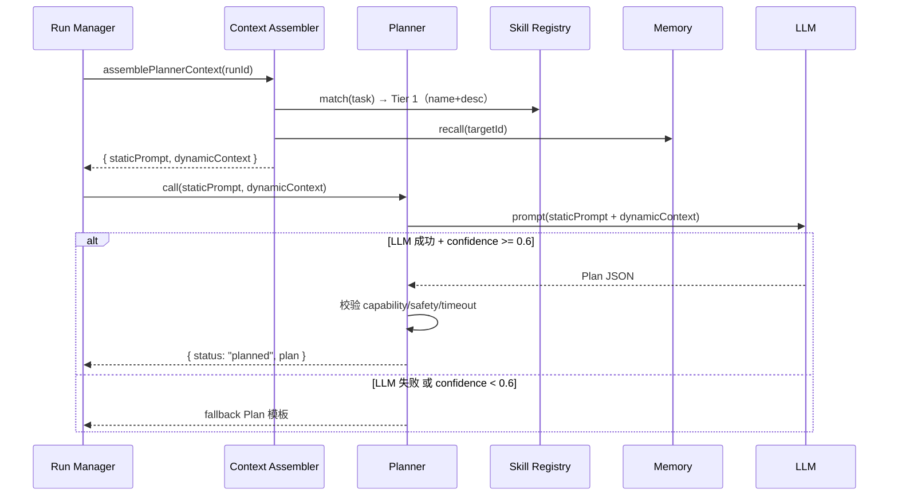
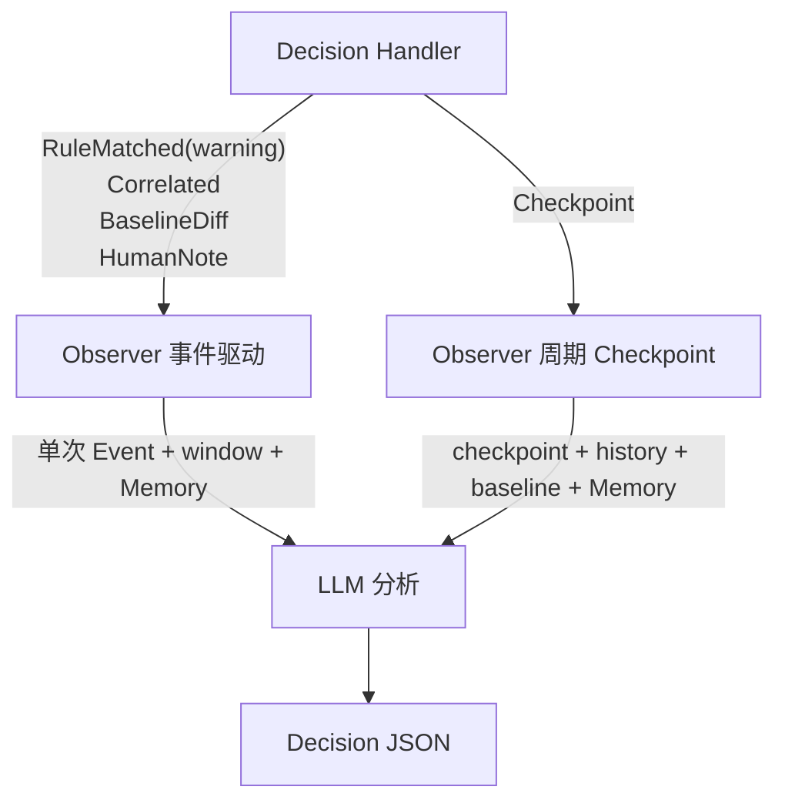
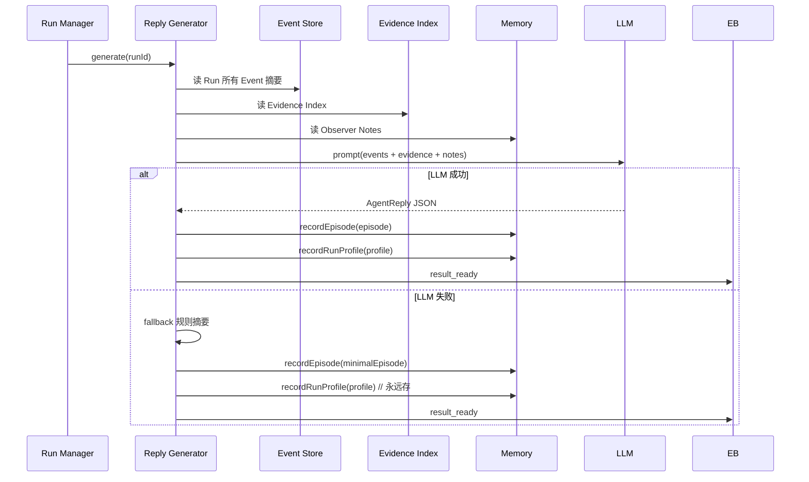

# Agent 详细设计

> 状态：Draft
> 日期：2026-04-29
> 对应架构文档 Section 9、10、11、12、13、14

## 1. 调用拓扑



**关键：Agent 层组件不订阅 Event Bus 做触发。全是 Runtime 直接调用。Event Bus 只用于审计发布。**

---

## 2. 模型分层

```typescript
interface AgentModelConfig {
  models: {
    planner: { provider: string; model: string; timeout: number; fallback: string };
    observer: { provider: string; model: string; timeout: number; fallback: string };
    reply: { provider: string; model: string; timeout: number; fallback: string };
  };
  observerPolicy: {
    debounceSec: number;
    maxConcurrentPerRun: number;
    defaultCheckpointInterval: number;
  };
}
```

---

## 3. Planner

### 3.1 调用方式

Run Manager 直接调用。不通过 Event Bus。Planner 是同步依赖——RM 必须等 Plan 才能推进 Run。

### 3.2 Prompt 分层（借鉴 Claude Code）

```
[System]  StaticPrompt（Run 间不变，cacheable）:
  身份:    "你是 Embed Agent 的 Task Planner"
  能力目录: 所有 capability 的 name/description/input_schema/limits/risk
  输出格式: Plan JSON Schema
  决策规则: "缺信息返回 clarification_needed，不硬编 Plan"
  约束规则: "不生成连接参数、不绕过 safety"

[User]    <system-reminder>
  # Request: { task, expected, concerns, test_hint }
  # Target: { capabilities, hints, boot_markers, known_quirks }
  # Memory: { recent_episodes, semantic_facts }
  # Constraints: { max_duration, safety }
  # Matched Skills: [{ name, category, description }]  ← 只 name+desc，不含 steps
  </system-reminder>

[User]    "请根据以上上下文生成验证 Plan"
```

**StaticPrompt 缓存 → 每次 Run 只传 DynamicContext → 成本低、延迟低。**

```typescript
type PlanResult =
  | { status: "planned"; plan: Plan }
  | { status: "clarification_needed"; missingInfo: string[]; suggestedNext: string };

// RM 处理 clarification_needed: → finalizing → Reply.generateMinimal → failed。
// 返回调用方 { status: "clarification_needed", ... }。调用方补充信息后重新 validate。

interface Planner {
  call(staticPrompt: string, dynamicContext: PlannerDynamicContext): Promise<PlanResult>;
}

interface PlannerDynamicContext {
  request: ValidateRequest;
  targetCapabilities: Capability[];
  targetHints: TargetHints;
  constraints: Constraints;
  matchedSkills: Skill[];              // Tier 2: 已包含完整 steps + evidence_policy
  memory: {
    recentEpisodes: Episode[];
    semanticFacts: SemanticFact[];
    knownIssuePatterns: string[];
  };
}
```

### 3.3 Skill 渐进加载

```
ContextAssembler 在组装 DynamicContext 时完成:

Tier 1: SkillRegistry.match(task) → 返回 [{ name, category, description }]。
        StaticPrompt 里只有 name + desc（省 token）。
Tier 2: ContextAssembler 取匹配到的 top-3 Skill → 调 SkillRegistry.get(name)
        → 加载完整 steps + evidence_policy → 放入 DynamicContext.matchedSkills。
        不需要 Planner 二次请求。Planner 只调一次。
Tier 3: Skill 引用的外部脚本/模板 → Planner 生成 Step 时按需从 Skill Store 读取。
```

### 3.4 流程



### 3.3 Fallback Plan

```typescript
const FALLBACK_PLAN: Plan = {
  steps: [
    { action: "flash",  capability: "flash",         timeout: 300, condition: "always" },
    // image/partition 由 RM 从 artifact 解析填入
    { action: "stream", capability: "watch_serial",   timeout: 180,
      observe: { interval: 60, metrics: [] } },
    { action: "exec",   capability: "wait_adb",       command: "wait_adb", timeout: 180 },
    // shell_exec: command 从 target_hints.recommended_checks[0] 取
    { action: "exec",   capability: "shell_exec",     timeout: 60, condition: "always" },
    { action: "exec",   capability: "collect_logs",   command: "dmesg", timeout: 120, condition: "always" },
  ],
  evidencePolicy: {
    always: ["serial:full", "events", "dmesg"],
    onFailure: ["serial:last_window", "logcat"]
  }
};

// Run Manager 校验时:
// → Step.capability 不存在或 safety 禁止 → 标记 skipped
// → 所有 Step 都 skipped → Run(failed, no_viable_plan)
```

---

## 4. Observer

### 4.1 调用方式

Decision Handler 直接调用。不通过 Event Bus。DH 负责 debounce/并发控制/fallback。

### 4.2 Prompt 分层

```
[System]  StaticPrompt（每次调用命中 cache）:
  身份:    "你是 Embed Agent 的 Observer"
  决策格式: Decision JSON Schema
  决策规则: "fatal → stop, warning → 分析上下文, known_issue → continue"
  限制:    "只基于 Signal + window 判断，不读全量日志"

[User]    <system-reminder>
  # Current State: { run.state, run.elapsed, current_step, target state }
  # Trigger Event: { type, rule_id, severity, summary }
  # Signals: [ 最近 signal 序列 ]
  # Evidence Windows: [{ ref, text }]  ← 截断后的小窗口
  # Checkpoint History: [{ metrics, trend }]  ← 周期触发时
  # Memory: { working_memory, known_issues }
  # Constraints: { remaining_sec, allowed_capabilities }
  </system-reminder>
```

**Observer 每 event 调一次 → StaticPrompt 完全不变 → 每次都命中 cache。成本极低。**

```typescript
interface Observer {
  decide(staticPrompt: string, input: ObserverInput): Promise<Decision>;
}

interface ObserverInput {
  run: { state: string; elapsed: number; currentStep?: Step };
  target: { serialState: string; adbState: string };
  triggerEvent: Event;
  signals: Signal[];
  evidenceWindows: EvidenceWindow[];
  checkpointHistory?: Checkpoint[];
  memory: {
    workingMemory: WorkingMemoryEntry[];
    knownIssues: SemanticFact[];
  };
  constraints: { remainingSec: number; allowedCapabilities: string[] };

  // Circuit Breaker 信号
  circuitBreakerActive?: boolean;   // CB1: Observer 自动 stop 已禁用
  warningEscalation?: boolean;      // CB3: Warning 已累计 5 个
}
```

### 4.2 两种模式



### 4.3 Decision 输出

```typescript
interface Decision {
  decision: "stop" | "continue" | "collect_more" | "extend_wait" | "pause"
           | "suggest" | "observe_more_frequent" | "observe_again_at";
  reason: string;
  confidence: number;             // 0-1
  reasoningTrace: string;         // 可审计的决策依据
  evidenceRefs: string[];

  params?: {
    extraWaitSec?: number;
    logs?: string[];
    observeInterval?: number;
    observeAt?: number;
  };

  suggestion?: string;            // suggest 时给人看的
}
```

### 4.4 能力

```
事件驱动模式:
  - 分析单个 Signal + evidence window → 判断需不需要干预
  - 查 Memory: 是否是 known_issue 变体 → 是 → continue
  - 不读全量日志。只看 Signal + window

周期 Checkpoint 模式:
  - 分析最近 K 个 checkpoint 的趋势
  - 对比 baseline (来自 ObserverInput.signals 中的 BaselineDiff)
  - 判断: 正常 → continue / 偏离 → 调频 / 临界 → stop

因果链分析:
  - 如果 ObserverInput.signals 里有多个 Signal 序列
  - LLM 推理因果: "22s foo_service 异常 → 42s kernel panic"
  - 在 suggestion 里说明根因建议
```

### 4.5 Failback

```
LLM timeout 或失败:
  - triggerEvent.severity = fatal → stop
  - triggerEvent.type = target_state_changed(disconnected) → pause
  - 其他 → continue
```

---

## 5. Reply Generator

### 5.1 调用方式

Run Manager 直接调用。不通过 Event Bus。Reply 完成后 RM 才标记终态。

```typescript
interface ReplyGenerator {
  generate(runId: string): Promise<AgentReply>;             // 正常流程（LLM）
  generateMinimal(runId: string, reason: string): Promise<AgentReply>;  // 早期失败（规则）
  generateCancelled(runId: string, reason: string): Promise<AgentReply>; // 取消（规则）
}

// Reply 是 result_ready 的唯一发布者。RM 只消费。
// Reply.generate() 内: 写 reply.json → eventBus.emit("result_ready", payload)
// payload: { run_id, status, summary, suggested_next, evidence_path, key_evidence }
```

### 5.2 流程



### 5.3 AgentReply 结构

```typescript
interface AgentReply {
  runId: string;
  status: "completed" | "failed" | "cancelled";
  summary: string;               // 关键发现
  keyEvidence: { summary: string; refs: string[] }[];
  suggestedNext: string;
  evidencePath: string;
  confidence: number;
}
```

**LLM 是提取器不是总结器。** 原始证据引用存在 keyEvidence.refs 中。人想看就展开。

### 5.4 RunProfile（基线数据）

```typescript
interface RunProfile {
  runId: string;
  targetId: string;
  artifact: { path: string; type: string; version?: string; buildId?: string };
  result: "completed" | "failed" | "cancelled";
  stageDurations: { stage: string; duration: number }[];
  finalMetrics: Record<string, number>;
  outputSummary: {
    totalLines: number;
    peakLinesPerSec: number;
    silenceCount: number;
    ruleHits: Record<string, number>;
  };
  recordedAt: string;
}
```

**Reply 调用 Memory.recordRunProfile() 存。LLM 失败也存——metrics 不依赖 LLM。**

---

## 6. Memory

```typescript
interface Memory {
  // Working Memory
  writeWorkingMemory(runId: string, entry: WorkingMemoryEntry): Promise<void>;
  readWorkingMemory(runId: string): Promise<WorkingMemoryEntry[]>;

  // Episode
  recordEpisode(episode: Episode): Promise<void>;
  recallEpisodes(targetId: string, limit?: number): Promise<Episode[]>;

  // Semantic Fact
  writeFact(fact: SemanticFact): Promise<void>;
  queryFacts(scope: string, scopeId: string, category?: string): Promise<SemanticFact[]>;
  confirmFact(factId: string): Promise<void>;
  deleteFact(factId: string): Promise<void>;

  // RunProfile
  recordRunProfile(profile: RunProfile): Promise<void>;
  getLatestProfile(targetId: string): Promise<RunProfile | null>;
}

interface WorkingMemoryEntry {
  key: string;
  summary: string;
  source: "observer" | "planner" | "human";
  at: string;
}

interface Episode {
  episodeId: string;
  runId: string;
  targetId: string;
  artifactRef: string;
  task: string;
  result: string;
  summary: string;
  keyEvidence: { summary: string; refs: string[] }[];  // 对齐 AgentReply.keyEvidence
  suggestions: string[];
  pitfalls: string[];
  recordedAt: string;
}

interface SemanticFact {
  factId: string;
  scope: "global" | "target" | "workspace";
  scopeId: string;
  category: "known_issue" | "threshold" | "test_entry" | "connection" | "workflow";
  statement: string;
  source: "auto" | "human_confirmed";
  evidenceRefs: string[];
  extendedPattern?: string;     // 已知无害错误的泛化正则
  verified: boolean;
  createdAt: string;
}
```

### SemanticFact 生效路径

```
人确认(verified=true) → 持久化 Memory Store
→ 下次 Run 开始时 ContextAssembler 读取
→ 提取 extendedPattern → AssembledContext.knownIssuePatterns
→ RuleDetector 加载（仅下次 Run。不热更新。当前 Run 不受影响）
```

---

## 7. Skill Registry

```typescript
interface SkillRegistry {
  loadAll(): Promise<void>;
  match(task: string): Promise<Skill[]>;
  get(name: string): Promise<Skill>;
  create(name: string, plan: Plan): Promise<void>;
}

interface Skill {
  name: string;
  description: string;
  category: string;
  params: { name: string; type: string; required: boolean; default?: any }[];
  steps: StepTemplate[];
  evidence: { always: string[]; onFailure: string[] };
  success: string[];
  failure: string[];
}
```

**来源：** `skills/`（系统内置）+ `skills/custom/`（人写+从 Plan 另存）+ `targets/{id}/skills/`（设备专属）

**匹配：** 按 category + keyword。先做简单 keyword match。
