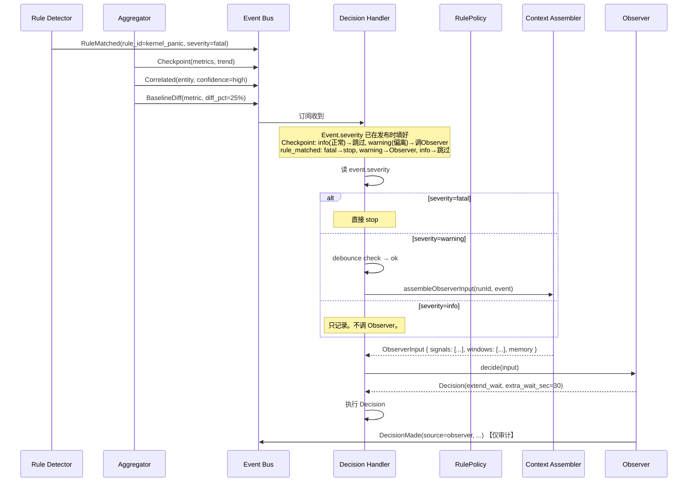

# Observation 详细设计

> 状态：Draft
> 日期：2026-04-29
> 对应架构文档 Section 10

## 1. 六层观测

```
第一层: 单行匹配        Rule Detector       grep 关键词 + 语义变体
第二层: 单源时序        Aggregator          输出速率 / 阶段识别 / 静默 / 输出模式
第三层: 跨源关联        Aggregator          同时间窗口 + 同实体 → CorrelatedEvent
第四层: 因果链          Observer(LLM)       Event 序列 → 根因推断
第五层: 基线对比        Aggregator+Memory   当前指标 vs 历史 RunProfile → BaselineDiff
第六层: 主动采样        SE + Aggregator     周期查系统状态
```

```
数据流:
  全量存储 → Evidence Store (不丢)
  实时 grep → Rule Detector 逐行 → RuleMatched + evidence window
  周期采样 → Aggregator 每 N 秒 → Checkpoint (速率/指标/趋势)
  跨源关联 → Aggregator exec 完成后 → CorrelatedEvent
  基线对比 → Aggregator 读 Memory Store → BaselineDiff
  语义分析 → Observer 读 signals + windows → Decision
```

---

## 2. Rule Detector 检测类型

```typescript
type RuleKind = "pattern" | "silence" | "exit_code" | "timeout" | "connectivity";

interface Rule {
  id: string;
  kind: RuleKind;
  pattern?: RegExp;           // pattern 类型
  silenceSec?: number;        // silence 类型
  expectedExitCode?: number;  // exit_code 类型
  severity: "fatal" | "warning" | "info";  // 加载时已从 RulePolicy 填入
  // fatal → DH 直接 stop。warning → DH 调 Observer(除非 CB 熔断)。info → 只记 Event。
  source: "system" | "target" | "plan" | "memory";
  capture?: { beforeLines: number; afterLines: number; ref: string };
  debounceSec: number;
}
```

### Pattern 来源与加载时机

```
系统默认 (代码内置):      kernel_panic, kernel_oops → 编译时确定, 永远生效
Target Profile:           fail_patterns → Run 开始时加载
Plan 指定:                step.input.watch → Step 开始时加载
Memory known_issue 变体:  verified SemanticFact → Run 开始时 ContextAssembler 加载 → 不热更新
```

### Severity 赋值

Rule Detector 在 Run 开始时加载 RulePolicy 配置。每个 Rule 的 severity 在加载时即确定。Event 发布时 severity 已完整。

---

## 3. Aggregator — 阶段识别

```typescript
// 阶段切换: 匹配 Target Profile 的 boot_markers
// "Booting Linux" → bootloader, "init started" → init, "boot completed" → system_ready

class Aggregator {
  private currentStage = "unknown";
  private stageData: Map<string, StageStats> = new Map();

  private detectStage(line: string): void {
    // 第一个阶段: 第一条输出时初始化（如果没有 boot marker，全程为 "unknown"）
    if (this.currentStage === "unknown" && this.lineCount === 0) {
      this.startStage(this.currentStage);
    }

    const marker = this.bootMarkers.find(m => line.includes(m.text));
    if (marker) {
      // 结束上一个阶段（当前阶段非 unknown 且非首次才结束）
      if (this.currentStage !== "unknown") {
        this.stageData.get(this.currentStage)!.end(this.elapsed);
        this.eventBus.emit({
          type: "stage_transition",
          from: this.currentStage,
          to: marker.stage,
          duration: this.stageData.get(this.currentStage)!.duration,
          baseline: this.baseline?.stageDurations.find(s => s.stage === this.currentStage)?.duration
        });
      }
      this.currentStage = marker.stage;
    }
  }
}
```

// Run 结束时收尾最后一个阶段:
onRunEnd(): void {
  if (this.currentStage !== "unknown" && !this.stageData.get(this.currentStage).ended) {
    this.stageData.get(this.currentStage).end(this.elapsed);
  }
}
// 保证 stage_durations 覆盖完整 Run。基线对比有完整数据。

如果 Target Profile 没配 boot_markers → `currentStage = "unknown"`。不产出 stage_transition Event。

---

## 4. Aggregator — 输出模式

```
每 checkpoint 计算 lines/sec。

模式判定 (阈值可配):
  silence:          rate = 0 且连接正常
  burst:            rate > 3x baseline
  oscillation:      rate 在高低间反复 ≥ 3 次
  gradual_decline:  rate 在 5 个连续 checkpoint 中持续下降
  stable:           rate 波动 < 20%
```

---

## 5. Aggregator — 跨源关联

```
触发: exec Step (dmesg/logcat) 执行完成

流程:
  1. 读当前 Step 的 exec 结果 (Evidence Store)
  2. 提取实体: 正则匹配进程名(空格分隔第3 token)、PID
  3. 时间窗口 (±5s) 内查其他源:
     - stream Step 进行中 → OutputPipe 的 ring buffer
     - 上一个 exec Step → Evidence Store
  4. 同实体 → CorrelatedEvent (发布时 severity 已完整):
     { entity, sources: ["serial:342", "dmesg:89", "logcat:156"],
       severity: "fatal" | "warning" }
  5. confidence→severity 映射 (确定性, Aggregator 发布前填充):
     3 源+PID一致 → confidence=high → severity=fatal
     2 源+进程名一致 → confidence=medium → severity=warning
     1 源 → 不关联
     来源数量取决于 Target connections 数量。

只在 exec Step 完成后触发。stream Step 进行中不触发。
```

---

## 6. Aggregator — 基线对比

```
Aggregator 维护当前 Run 实时指标。

取 baseline: Aggregator(Tool) → Memory Store(Store) 直接读
             同 Target 最近一次成功 Run 的 RunProfile。
             这是 Tool→Store 读路径。不走 Agent。不违反禁止交互。

对比项:
  - stage_durations: 每阶段耗时
  - final_metrics: 内存/CPU/...

偏离阈值:
  > 20% → BaselineDiff(severity=warning) → DH 调 Observer 分析
  > 50% → BaselineDiff(severity=fatal)   → DH 直接反射 stop, 不进 Observer
```

---

## 7. Observer 输入结构

```typescript
interface ObserverInput {
  run: {
    state: string;
    elapsed: number;
    currentStep?: Step;
  };
  target: {
    serialState: string;
    adbState: string;
  };
  triggerEvent: Event;

  // 聚合的 Signal 序列（一到三层产出）
  signals: Signal[];
  // Signal: RuleMatched | Checkpoint | Correlated | BaselineDiff | StageTransition

  // 证据窗口
  evidenceWindows: EvidenceWindow[];

  // 周期触发时附带的最近 K 个 checkpoint
  checkpointHistory?: Checkpoint[];

  // Memory
  memory: {
    workingMemory: WorkingMemoryEntry[];
    knownIssues: SemanticFact[];
  };

  // 剩余约束
  constraints: {
    remainingSec: number;
    allowedCapabilities: string[];
  };
}

interface Signal {
  type: "rule_matched" | "step_timeout" | "checkpoint" | "correlated" | "baseline_diff" | "stage_transition";
  at: number;
  summary: string;
  // ... 各类型特有字段
}

interface EvidenceWindow {
  ref: string;
  kind: "window" | "snapshot";
  text: string;              // 窗口内容（限制长度）
}
```

### Observer 不看全量日志

```
ObserverInput 的大小:
  - triggerEvent: ~200 bytes
  - signals[]: 5-20 条 Signal, ~2KB
  - evidenceWindows[]: 1-3 个窗口, 每个 ~20KB (截断后)
  - checkpointHistory[]: 3-5 条, ~1KB
  - memory: ~2KB

  总计 < 100KB。远小于全量 serial.log (可能几百 MB)。

  人看日志的方法 → 系统做的方法:
    grep 关键词 → Rule Detector
    翻前后文 → evidence window
    watch -n 趋势 → Aggregator checkpoint
    感觉不对才细看 → Observer 看 signals
```

---

## 8. Observer 决策能力

```
事件驱动:
  - 单次 Signal + evidence window → 判断需不需要干预
  - 查 Memory known_issues → 是否是已知问题 → continue
  - 因果链: 如果 signals[] 包含多个相关 Signal
    → LLM 推理: "22s foo_service 异常 → 42s kernel panic"

周期 Checkpoint:
  - checkpoint_history + baseline + metrics → 趋势分析
  - 正常 → continue
  - 偏离但未临界 → observe_more_frequent 或 suggest
  - 临界 → stop

语义变体识别:
  - RuleMatched 命中 pattern → Observer 查 Memory
  - LLM 判断是否和 known_issue 语义相似 → continue(reason: known_issue 变体)
```

### Debounce

```
- debounce key: rule_matched → rule_id; Correlated → entity+confidence;
    BaselineDiff → metric_name; Checkpoint → "checkpoint"; HumanNote → "human"
  - 同 key 30s 内不重复 (由 DH 控制)
- 同 Run 同一时间最多 1 个 Observer 调用 (由 DH 控制)
- Observer LLM timeout 30s
- LLM 失败 → fallback 规则 (由 Observer 内部处理)
```

---

## 9. 从 Event 到 Observer 的路径


