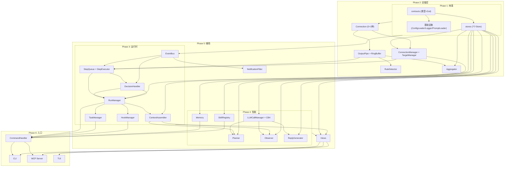

# 功能清单

> 状态：Draft / 日期：2026-04-29
> 按实现计划 Phase 1-6 拆解。每项可独立验证。

## Phase 1: 地基 (contracts + stores)

### 1.1 contracts

```
□ 1.1.1   Run 类型          RunState, RunRecord, ValidateRequest, ValidateResponse
□ 1.1.2   Target 类型       TargetState, TargetProfile, TargetRuntimeState, ConnectionConfig
□ 1.1.3   Step 类型         Step, StepAction, ObserveConfig, RetryPolicy
□ 1.1.4   Event 类型        Event, EventType (全部枚举), EventPayload (每个 event 的 payload)
□ 1.1.5   Decision 类型     Decision, DecisionType
□ 1.1.6   Connection 类型   Connection (interface), ExecResult
□ 1.1.7   Memory 类型       WorkingMemory, Episode, SemanticFact, RunProfile
□ 1.1.8   Skill 类型        Skill, SkillSummary
□ 1.1.9   Hook 类型         HookConfig, HookPoint, HookResult, HookContext
□ 1.1.10  Notification 类型 NotificationConfig, NotificationChannel
□ 1.1.11  公共错误码        ErrorCode, ErrorResponse
□ 1.1.12  Task 类型         Task, TaskTrigger, TaskState
□ 1.1.13  Zod schema        TargetProfileSchema, LLMConfigSchema, SystemConfigSchema, HookConfigSchema

  🧪 测试:
    □ 所有 Zod schema: 合法数据通过 / 非法数据精确报错(含路径)
    □ ErrorCode 枚举完整性: 每个 error code 有对应 message
    □ EventType 枚举: 和架构文档 Section 24 一致
```

### 1.2 stores

```
□ 1.2.1   EventStore         append(runId, event) + appendGlobal(event) + read(runId, afterSeq) + readGlobal
□ 1.2.2   EvidenceStore      write(runId, ref, data) → emit evidence_collected + read + getIndex + updateKeyEvents
□ 1.2.3   RunStore           create + update + updateLastEventSeq + get + listNonTerminal
□ 1.2.4   TargetStore        get + getState + updateState + listAll + listStates + add + remove
□ 1.2.5   MemoryStore        write/read WM + write/list Episode + write/query/update/delete Fact + write/get Profile
□ 1.2.6   SkillStore         loadAll + load + loadByTarget + save
□ 1.2.7   存储布局初始化      .embed-agent/ 目录结构创建
□ 1.2.8   TaskStore          create/update/get/list/delete Task
□ 1.2.9   Evidence 清理      success 30d / failure 90d 保留策略 + 超限自动清理

  🧪 测试:
    □ EventStore: append+read 正确分配 seq。afterSeq cursor 分页正确。全局事件独立分区
    □ EvidenceStore: 文件层读写原子(临时文件+rename)。索引层 keyEvents 更新正确
    □ RunStore: listNonTerminal 只返回非终态(planning/running/paused/collecting/finalizing)
    □ TargetStore: listStates 返回正确运行时状态。updateState 原子更新
    □ MemoryStore: WM 按 runId 隔离。Fact query 按 scope+category 过滤
    □ Evidence清理: 到上限触发清理。不删 important 标记
```

### 1.3 基础设施

```
□ 1.3.1   ConfigLoader       加载 + Zod 校验 TargetProfile / LLMConfig / SystemConfig / HookConfig
                              校验失败 → 拒绝启动 + 行号 + 错误原因
□ 1.3.2   Logger             结构化日志。LEVEL + module + message + kv。不 log 敏感信息
□ 1.3.3   PromptLoader       从 prompts/ 目录加载 markdown 文件。按 role+version 索引

  🧪 测试:
    □ ConfigLoader: 合法 YAML→通过。非法(缺必填/类型错/枚举错)→精确报错+行号
    □ Logger: 各级别正确过滤。API key 不出现在日志中
```

## Phase 2: 设备层 (tools)

### 2.1 Connection

```
□ 2.1.1   Connection 接口    connect / disconnect / state / exec / stream / push / flash
□ 2.1.2   LocalConnection    child_process.exec + fs 文件操作
□ 2.1.3   SerialConnection   serialport 封装。stream + ring buffer + 断连检测
□ 2.1.4   AdbConnection      adb shell/exec-out/push/poll devices。wait_adb 轮询
□ 2.1.5   FastbootConnection  fastboot flash/getvar/reboot
□ 2.1.6   SshConnection       ssh2 exec/push (P1: P1 但不影响主线)

  🧪 测试:
    □ LocalConnection: exec 返回 stdout/stderr/exitCode。文件操作正确
    □ SerialConnection: stream 逐行产出。ring buffer 维护。断连回调触发
    □ AdbConnection: exec shell 命令。wait_adb 轮询到 online。push 推送成功
    □ FastbootConnection: flash 执行并监控输出。getvar 返回设备信息
    □ FakeConnection: 预设输出+模拟断连。集成测试基础
```

### 2.2 OutputPipe + RingBuffer

```
□ 2.2.1   OutputPipe         feedStream（行拼接+证据写入+规则检测+聚合）+ feedExec（exec模式）
                              feedStream/feedExec → emit observation Event（每100行或exec完成时）
□ 2.2.2   RingBuffer         定长循环数组。push / getWindow / getRecent
□ 2.2.3   SilenceTimer       定时器。每次 feed 重置。到期 → emit silence
□ 2.2.4   EvidenceWriter     流式写文件 + 异步 append

  🧪 测试:
    □ feedStream: chunk 不完整行→正确拼接。ringBuffer.push 在 ruleDetector.detect 之前
    □ feedExec: stdout+stderr 逐行处理。exitCode 检测触发
    □ RingBuffer: 500行上限。getWindow 切前后N行。getRecent 读最近窗口
    □ SilenceTimer: feed 后重置。到期→emit。disconnect→不触发
```

### 2.3 RuleDetector

```
□ 2.3.1   规则加载           loadRunRules（系统+target+known）+ loadStepPatterns/clearStepPatterns
□ 2.3.2   精确匹配           pattern regex → 命中 → 切窗口 + emit RuleMatched
□ 2.3.3   Silence 检测       60s 无输出 + 连接正常 → emit
□ 2.3.4   ExitCode 检测      exec 完成后检查 exit_code
□ 2.3.5   Timeout 检测       Step 超时 → emit step_timeout
□ 2.3.6   Connectivity 检测  Connection.state() 变化 → emit target_state_changed
□ 2.3.7   Severity 赋值      加载时从 RulePolicy 填入。发布时完整
```

  🧪 测试:
    □ pattern: 命中→RuleMatched(severity已填, evidence_refs有窗口)
    □ pattern: 多条同时命中→每条都出Event
    □ silence: 60s→RuleMatched(warning)。feed后重置。disconnect→不触发
    □ exit_code: 0(预期0)→无Event。1(预期0)→RuleMatched
    □ semantic: known_issue变体pattern→命中但severity=info
    □ Step级: loadStepPatterns→生效。clearStepPatterns→失效

### 2.4 Aggregator

```
□ 2.4.1   行级统计           feed(line) → lineCount + detectStage + extractMetrics
□ 2.4.2   阶段识别           匹配 boot_markers → 切阶段 → StageTransition
□ 2.4.3   输出模式检测       silence / burst / oscillation / gradual_decline / stable
□ 2.4.4   跨源关联           onExecComplete → 读 EvidenceStore + ringBuffer → CorrelatedEvent
□ 2.4.5   基线对比           读 MemoryStore RunProfile → 偏离 → BaselineDiff
□ 2.4.6   周期 checkpoint    每 observe_interval → Checkpoint(severity, metrics, trend)
□ 2.4.7   主动采样           触发采样子动作 → exec samplingCommands → 提 metrics
```

  🧪 测试:
    □ 阶段识别: boot_markers匹配→StageTransition。无markers→unknown
    □ 输出模式: silence/burst/oscillation/decline/stable 判定正确
    □ 跨源关联: 3源+PID→Correlated(severity=fatal)。2源+进程→warning。1源→不关联
    □ 基线对比: 偏离25%→BaselineDiff(warning)。55%→fatal
    □ 周期checkpoint: 每interval产出Checkpoint(含severity+metrics+trend)

### 2.5 ConnectionManager + TargetManager

```
□ 2.5.1   ConnectionManager  getConnection(targetId, transport) → 按需创建/池化复用
□ 2.5.2   TargetManager      preflight(requiredTransports, artifactPath) → checks
□ 2.5.3   环境恢复           recover → 重启/重刷/验证 → idle|offline
□ 2.5.4   状态操作           acquireLock / releaseLock / isBusy / transitionState
□ 2.5.5   连接状态事件       onDisconnect → TargetStateChanged(完整 payload)
```

  🧪 测试:
    □ CM: 同target+transport复用Connection。不同target独立
    □ TM: preflight全部通过→OK。任一失败→分类(host/device)。recover成功/失败路径
    □ 连接状态: disconnect→TargetStateChanged(完整payload: target_state+serial/adb/fastboot状态)

## Phase 3: 运行时 (runtime)

### 3.1 EventBus

```
□ 3.1.1   发布/订阅          emit(event) + subscribe(types, handler) → unsubscribe
□ 3.1.2   同 Run 分区        按 run_id 分区。保证同 Run 顺序
□ 3.1.3   全局事件           无 run_id 事件独立分区
```

  🧪 测试:
    □ emit+subscribe: 同run_id顺序保证。多run并发不串扰。全局事件独立

### 3.2 StepQueue + StepExecutor

```
□ 3.2.1   StepQueue          入队(Plan.steps) + 取队 + 追加(collect_more) + 清空(stop/cancel)
□ 3.2.2   StepExecutor       取 Step → CM.getConnection → 执行 → OutputPipe
□ 3.2.3   中断机制           interrupt → 当前 Step 结束 + final evidence
□ 3.2.4   Timeout 延长       extendTimeout(seconds)
□ 3.2.5   失败重试 + CB2     retry(3次, 2s/5s/10s) + 同因检测 → hardware_issue
□ 3.2.6   采样子动作         checkpoint_interval → exec samplingCommands
□ 3.2.7   Hook 集成          PreStepExecute/PostStepComplete/PostStepFailed
□ 3.2.8   生命周期事件发布    StepStarted/StepCompleted/StepFailed（在 Step 执行前后发）
```

  🧪 测试:
    □ exec Step→Connection.exec→feedExec→StepCompleted
    □ stream Step→Connection.stream→逐行feedStream→StepCompleted
    □ interrupt→StepFailed(interrupted)+final evidence
    □ 重试: flash失败→retry→成功。同类型3次→StepFailed(possible_hardware_issue)
    □ 超时: timeout→StepFailed(timeout)
    □ 采样子动作: checkpoint_interval→exec samplingCommands→metrics(需Aggregator协作)

### 3.3 DecisionHandler

```
□ 3.3.1   事件分流           EB 订阅 RuleMatched/Checkpoint/Correlated/BaselineDiff/HumanNote
□ 3.3.2   Severity 路由      fatal→反射stop。warning→调Observer。info→跳过
□ 3.3.3   Debounce           同 trigger_key 30s 内不重复
□ 3.3.4   Decision 执行      stop/continue/collect_more/extend_wait/pause/...
□ 3.3.5   Decision 校验      拒绝非法 Decision。发 decision_rejected
□ 3.3.6   CB1 覆盖计数器     override 3次 → 只 suggest
□ 3.3.7   CB3 Warning 累加  5 个不同 rule_id → escalation
□ 3.3.8   Hook 集成          OnStopDecision
□ 3.3.9   审计事件发布        DecisionMade(Rule反射 stop)。DecisionRejected(校验失败)
```

  🧪 测试:
    □ fatal→直接stop。不调Observer
    □ warning→debounce通过→调Observer。debounce命中→跳过
    □ Observer返回stop→DH执行stop。collect_more→追加Step
    □ Decision校验失败→拒绝+decision_rejected Event
    □ CB1: override 3次→只suggest不调Observer。新Run→重置
    □ CB3: 5个不同rule_id→Observer收到warningEscalation=true。新Run→重置

### 3.4 RunManager

```
□ 3.4.1   createRun          校验→RS.create(planning)→锁→Planner→Plan校验→Pre-flight→running
□ 3.4.2   早期失败收口       hook block/Plan reject/Pre-flight fail → finalizing→Reply→result_ready→failed
□ 3.4.3   pause/resume       interrupt + 状态切换 + Event
□ 3.4.4   cancel             finalizing→Reply.generateCancelled→result_ready→cancelled
□ 3.4.5   add_instruction    HumanNote Event
□ 3.4.6   ignore_rule        Run.ignored_rules 记录 + RuleIgnored Event
□ 3.4.7   override_decision  CB1 计数 + 恢复或继续 + DecisionOverridden Event
□ 3.4.8   finalizeRun        OnFinalizing hook → Reply → result_ready → 终态 → PostRunEnd hook
□ 3.4.9   Target 断开处理    TargetStateChanged → auto pause
□ 3.4.10  Hook 集成          PreRunStart/OnFinalizing/PostRunEnd
□ 3.4.11  Host 崩溃恢复      listNonTerminal → 每个非终态 Run 判定 → stale→failed → lock清理 → View重建
□ 3.4.12  生命周期事件发布    RunStarted/RunCompleted/RunFailed/RunCancelled/RunPaused/RunResumed
                              (PlanGenerated 由 Planner 4.2.5 发。Step 事件由 3.2.8 发)
```

  🧪 测试:
    □ createRun: Plan+Pre-flight通过→running。Plan reject→finalizing→failed
    □ createRun: Pre-flight失败→finalizing→failed。Target busy→target_busy
    □ pause→paused+RunPaused Event。resume→running+RunResumed Event
    □ cancel→finalizing→Reply.generateCancelled→result_ready(cancelled)→run_cancelled
    □ Target断开→auto pause。重连→保持paused等人resume
    □ Host崩溃恢复: listNonTerminal→stale判定→锁清理

### 3.5 ContextAssembler

```
□ 3.5.1   assemblePlannerContext  TargetStore+MemoryStore+SkillStore+Config → StaticPrompt+DynamicContext
□ 3.5.2   assembleObserverContext  Event+RunState+TargetState+Signal+Memory → StaticPrompt+ObserverInput
□ 3.5.3   Prompt 分层           StaticPrompt(cacheable) + DynamicContext(user message侧)
□ 3.5.4   Skill 渐进加载        Tier1(name+desc) → Tier2(top-3 full steps)
```

  🧪 测试:
    □ StaticPrompt + DynamicContext 正确组装。Skill渐进加载(Tier1→Tier2)
    □ ObserverInput: signals+windows+checkpoint_history+memory 完整

### 3.6 TaskManager

```
□ 3.6.1   Cron 触发            解析表达式 → 到时触发。重叠跳过
□ 3.6.2   Event 触发           watch 文件变化 → 触发
□ 3.6.3   Continuous 触发      创建 long-run Run
□ 3.6.4   Task CRUD            create/list/show/pause/resume/delete
```

  🧪 测试:
    □ Cron触发: 按时触发+重叠跳过+skipped_run Event
    □ Event触发: 文件变化→触发
    □ Task CRUD 全部可用

### 3.7 HookManager

```
□ 3.7.1   配置加载             hooks.yml → Hook[]
□ 3.7.2   事件执行             execute(point, context) → spawn → stdout JSON → HookResult
□ 3.7.3   返回值校验           按 hook 点限制 decision (block/retry 只在 PreStepExecute/OnStopDecision)
□ 3.7.4   字符串插值           {{variable}} → HookContext 字段
□ 3.7.5   审计                 HookExecuted Event。成功/失败都发
□ 3.7.6   超时/错误处理        超时→proceed。失败→proceed。不阻塞主流程
□ 3.7.7   短路逻辑             同点首个非 proceed → 返回。后续不执行
```

  🧪 测试:
    □ 配置加载+匹配过滤+返回值校验+字符串插值+审计Event
    □ PreStepExecute block→Run paused。OnStopDecision block→不stop
    □ 超时→proceed。非法返回值→忽略。成功/失败都发HookExecuted
    □ 短路: 同点首个非proceed→返回。后续不执行

## Phase 4: 智能 (agent)

### 4.1 LLMCallManager + CB4

```
□ 4.1.1   Provider 抽象        Anthropic/OpenAI/Gateway/Mock → LlmProvider 接口
□ 4.1.2   Call Manager         call(role, prompt) → 路由 provider + 超时 + retry
□ 4.1.3   CB4 降级器           连续 3 次失败 → degraded。5 分钟后探测恢复
□ 4.1.4   Usage 记录           每次调用 token 统计
```

  🧪 测试:
    □ Anthropic/OpenAI/Gateway/Mock 切换正确。timeout+retry
    □ CB4: 连续3次失败→degraded。5分钟后探测→成功→恢复。失败→再等5分钟
    □ Usage 记录: token统计准确

### 4.2 Planner

```
□ 4.2.1   Plan 生成            StaticPrompt + DynamicContext → LLM → Plan JSON
□ 4.2.2   Fallback              LLM 失败 → 默认 Plan 模板
□ 4.2.3   clarification_needed  缺信息 → 返回 missingInfo + suggestedNext
□ 4.2.4   Skill 引用            从 DynamicContext.matchedSkills 取完整 steps
□ 4.2.5   审计事件发布          PlanGenerated Event（成功后）。PlanGenerationFailed（失败后）
```

  🧪 测试:
    □ LLM成功→Plan(含capability)。LLM失败→fallback模板
    □ clarification_needed→missingInfo+suggestedNext
    □ Skill引用: matchedSkills完整steps可用

### 4.3 Observer

```
□ 4.3.1   事件驱动决策          RuleMatched(warning)/Correlated/BaselineDiff/HumanNote → LLM → Decision
□ 4.3.2   周期 Checkpoint       Checkpoint(warning) + checkpointHistory → LLM → 趋势分析 → Decision
□ 4.3.3   Fallback              LLM 超时 → 纯规则 (fatal→stop, target_disconnected→pause, others→continue)
□ 4.3.4   CB 信号处理          circuitBreakerActive → 只 suggest。warningEscalation → suggest stop
□ 4.3.5   语义变体             查 Memory known_issues → 匹配 → continue
□ 4.3.6   Working Memory 写    Decision 理由写入 WM
□ 4.3.7   审计事件发布          DecisionMade（Observer决策后）+ SuggestionGenerated（suggest时）
```

  🧪 测试:
    □ 事件驱动: RuleMatched(warning)→LLM→Decision(含reasoning_trace)
    □ 周期Checkpoint: Checkpoint(warning)+history→LLM→趋势Decision
    □ Fallback: LLM超时→fatal→stop, disconnect→pause, others→continue
    □ CB信号: circuitBreakerActive→只suggest。warningEscalation→suggest stop
    □ 语义变体: known_issue匹配→continue

### 4.4 ReplyGenerator

```
□ 4.4.1   generate              读 Event 摘要+Evidence+ObserverNotes → LLM → AgentReply
□ 4.4.2   generateMinimal       早期失败 → 规则摘要 → AgentReply
□ 4.4.3   generateCancelled     取消 → 规则摘要 → AgentReply
□ 4.4.4   result_ready 发布     Reply → EB(result_ready)。唯一发布者
□ 4.4.5   Episode 存储          recordEpisode
□ 4.4.6   RunProfile 存储       recordRunProfile。LLM 失败也存
□ 4.4.7   Fallback              LLM 失败 → 规则摘要
□ 4.4.8   reply.json 落盘      runs/{run_id}/brain/reply.json。结果产物持久化。LLM输入/输出也落盘 brain/
```

  🧪 测试:
    □ generate→LLM→AgentReply+Episode+RunProfile+reply.json
    □ generateMinimal→规则摘要+Episode(minimal)+RunProfile
    □ generateCancelled→取消摘要+Episode+RunProfile
    □ LLM失败→fallback→仍存RunProfile
    □ result_ready payload 统一契约。RM/NF/Store共用

### 4.5 Memory

```
□ 4.5.1   Working Memory      writeWorkingMemory / readWorkingMemory
□ 4.5.2   Episode              record / recallEpisodes
□ 4.5.3   Semantic Fact        write / query / confirm / delete
□ 4.5.4   RunProfile           record / getLatestProfile
□ 4.5.5   known_issue 扩展      confirmed → extended_pattern 生成
```

  🧪 测试:
    □ WM: 同Run读写隔离。Episode: 按target查询。Fact: 按scope+category查询
    □ Fact确认→verified=true。扩展pattern生成
    □ RunProfile: 按target取最新

### 4.6 SkillRegistry

```
□ 4.6.1   加载                  skills/ + skills/custom/ + targets/{id}/skills/
□ 4.6.2   匹配                  match(task) → keyword + category → top-3
□ 4.6.3   get                   load(name) → 完整 Skill
□ 4.6.4   create                从 Plan 另存为 Skill
```

  🧪 测试:
    □ 多源加载(skills/+custom/+target)。match按keyword+category返回top-3
    □ create: 从Plan另存

## Phase 5: 辅助 (notify + views)

### 5.1 NotificationFilter

```
□ 5.1.1   Event 订阅           result_ready / target_state_changed / suggestion_generated
□ 5.1.2   语义分类映射         Event → run_result / target_offline / target_offline_long / memory_suggestion
□ 5.1.3   Slack 适配器         webhook 发送
□ 5.1.4   Email 适配器         SMTP 发送
□ 5.1.5   去重                 同 Run 同原因 5min。target_offline 30min
□ 5.1.6   模板渲染             消息模板 + payload 字段
□ 5.1.7   审计                 notification_sent Event 持久化
```

  🧪 测试:
    □ result_ready→Slack通知(含summary+evidence_path)
    □ target_state_changed(offline)→即时通知。>30min→升级通知
    □ suggestion_generated(memory)→通知。notification_sent Event持久化
    □ 去重: 同Run同原因5min。target_offline 30min内不重复

### 5.2 Views

```
□ 5.2.1   Run View             从 EventStore+RunStore 构建。当前状态+历史列表+详情
□ 5.2.2   Target View          从 TargetStore 构建。状态列表+连接详情
□ 5.2.3   Evidence View        从 EvidenceStore 构建。索引+搜索+分页
□ 5.2.4   SSE / Watch Feed     完整 Event 流推送。按 after_seq cursor。覆盖 lifecycle/rule/decision/hook 全部事件类型
```

  🧪 测试:
    □ Run View: 从Event+Run Store正确构建当前状态+历史
    □ Target View: 从Target Store构建。连接状态实时
    □ Evidence View: 索引+搜索+分页
    □ SSE: 完整Event流推送。after_seq cursor正确。全部事件类型覆盖

### 5.3 Agent 自观测

```
□ 5.3.1   LLM Metrics          调用次数 + 延迟 p50/p99 + fallback 率 (per role)
□ 5.3.2   Event Metrics        每 Run 事件数 + 总线积压
□ 5.3.3   Storage Metrics      磁盘用量 + 总 Run 数
□ 5.3.4   Target Metrics       在线率 + 平均 busy 时长
□ 5.3.5   Cost Metrics         每 Session LLM 成本
□ 5.3.6   暴露方式              TUI status bar / CLI va status(系统级) / 超标告警
```

  🧪 测试:
    □ 所有metrics正确暴露。TUI status bar+CLI va status可用
    □ 超标告警: LLM成功率<阈值→通知

## Phase 6: 入口 (apps)

### 6.1 CommandHandler

```
□ 6.1.1   统一命令入口         CLI/MCP → CommandHandler → RM/TM/TargetManager/Memory/Skill/Hook/ExportService
□ 6.1.2   参数校验             必填/可选/格式
□ 6.1.3   错误翻译             内部错误 → 人可读消息
□ 6.1.4   ExportService         Run+Event+Evidence 打包导出 / 导入。只读查询，不恢复执行
□ 6.1.5   HookHistoryQuery      按 run_id 查 hook_executed 审计事件（读 EventStore）
```

  🧪 测试:
    □ 所有command正确路由到对应模块
    □ 参数校验: 必填缺失→报错。格式错误→报错
    □ 错误翻译: internal_error→人可读消息

### 6.2 CLI

```
□ 6.2.1   validate / run       发起验证
□ 6.2.2   task                 任务管理
□ 6.2.3   status / watch / events / result / evidence  查询
□ 6.2.4   pause / resume / cancel / intervene / ignore-rule / override  干预
□ 6.2.5   memory / skill / target / hook / export / import  管理
□ 6.2.6   --json 输出          结构化 JSON（给脚本用）
```

  🧪 测试:
    □ 全部命令可用。--json输出正确
    □ watch 实时输出Timeline格式

### 6.3 MCP Server

```
□ 6.3.1   validate_artifact
□ 6.3.2   get_run_status / watch_run / get_run_events
□ 6.3.3   get_evidence / get_run_result
□ 6.3.4   intervene_run / cancel_run
□ 6.3.5   get_target_capabilities
```

  🧪 测试:
    □ 全部9个tool可用。input/output schema正确
    □ 错误返回: error_code+message符合接口规范

### 6.4 TUI

```
□ 6.4.1   主面板               Runs + Targets + Tasks 概览
□ 6.4.2   Run 详情             Timeline + 证据窗口 + LLM 分析
□ 6.4.3   快捷键               Enter 展开 / p pause / c cancel / e evidence / q back
□ 6.4.4   实时更新             SSE → 自动刷新
```

---

  🧪 测试:
    □ 主面板: Runs+Targets+Tasks实时
    □ Run详情: Timeline+证据窗口+LLM分析
    □ 快捷键全部可用。SSE自动刷新

## 汇总

```
Phase 1:  26 实现 + 11 测试 = 37 项  (+TargetStore.remove)
Phase 2:  29 实现 + 24 测试 = 53 项
Phase 3:  49 实现 + 23 测试 = 72 项  (+生命周期事件发布 +审计事件 +Rule/Override审计)
Phase 4:  33 实现 + 24 测试 = 57 项  (+PlanGenerated +DecisionMade +Suggestion)
Phase 5:  17 实现 + 11 测试 = 28 项
Phase 6:  20 实现 +  7 测试 = 27 项  (+ExportService +HookHistoryQuery)

实现: 174 项    测试: ~100 项    总计: ~274 项
```

---

## 实现顺序与依赖

### 依赖图



### Phase 1 内部顺序

```
1.1 contracts (0依赖)           → 全部类型定义。先行。其他人并行等它。
1.3 基础设施 (依赖 1.1)         → ConfigLoader/Logger/PromptLoader。可并行。
1.2 stores (依赖 1.1)           → 7个Store + Evidence清理。可并行。
    建议顺序:
      1.2.1 EventStore (最先。其他组件测试依赖它)
      1.2.3 RunStore + 1.2.4 TargetStore (RunManager 需要)
      1.2.2 EvidenceStore (OutputPipe 需要)
      1.2.5 MemoryStore + 1.2.8 TaskStore (Agent 需要, Phase 4 才用)
      1.2.6 SkillStore (SkillRegistry 需要, Phase 4 才用)
      1.2.7 存储布局 (最先。所有 Store 依赖目录存在)
      1.2.9 Evidence清理 (最后。依赖 1.2.2)
```

### Phase 2 内部顺序

```
2.1 Connection      (依赖 1.1)
    建议顺序: Local → Serial → ADB → Fastboot → SSH(最后, P1)
2.2 OutputPipe      (依赖 2.1)
2.3 RuleDetector    (依赖 2.2)
2.4 Aggregator      (依赖 2.2 + 1.2.2 + 1.2.5)
2.5 CM + TM         (依赖 2.1 + 1.2.4)
    建议顺序: ConnectionManager → TargetManager
```

### Phase 3 内部顺序

```
3.1 EventBus        (依赖 1.1)                     ← 先行。一切通信基础
3.2 StepExecutor    (依赖 3.1 + 2.2 + 2.5)        ← 可以和 3.3 并行
3.3 DecisionHandler (依赖 3.1 + 3.5 stub)          ← 可以和 3.2 并行
3.5 ContextAssembler(依赖 1.2 + Config)            ← 先做 stub。Phase 4 完善
3.4 RunManager      (依赖 3.1+3.2+3.3+2.5+3.5 stub+4.2 stub+4.4 stub)
                    ← 核心编排。等上面全就绪
3.6 TaskManager     (依赖 3.4 + 1.2.3)            ← RunManager 就绪后
3.7 HookManager     (依赖 1.1)                     ← 独立。可并行
```

### Phase 4 内部顺序

```
4.1 LLMCallManager  (依赖 Config)                  ← 先行。Agent 基础
4.5 Memory          (依赖 1.2.5)                   ← 独立。可并行
4.6 SkillRegistry   (依赖 1.2.6)                   ← 独立。可并行
4.2 Planner         (依赖 4.1 + 4.5 + 4.6 + contracts类型)  ← 不依赖 ContextAssembler。Context 由 RM 传入
4.3 Observer        (依赖 4.1 + 4.5 + contracts类型)        ← 不依赖 ContextAssembler。Input 由 DH 传入
4.4 ReplyGenerator  (依赖 4.1 + 4.5 + 1.2.2+1.2.1) ← 等 EventStore+EvidenceStore
```

### Phase 5 内部顺序

```
5.2 Views           (依赖 1.2.1+1.2.2+1.2.3+1.2.4) ← 独立。可和 5.1 并行
5.1 NotificationFilter (依赖 3.1 + Config)          ← 独立。可和 5.2 并行
5.3 自观测          (依赖 5.2)                     ← View 就绪后
```

### Phase 6 内部顺序

```
6.1 CommandHandler  (依赖 3.4+3.6+4.5+4.6+3.7)    ← 集成所有 Runtime+Agent
6.2 CLI             (依赖 6.1 + 5.2)
6.3 MCP Server      (依赖 6.1 + 5.2)
6.4 TUI             (依赖 5.2)
    CLI/MCP/TUI 可并行。
```

### 关键路径 (最长依赖链)

```
contracts → EventBus → StepExecutor + DecisionHandler → RunManager
         → OutputPipe → RuleDetector → DecisionHandler → RunManager
         → TargetManager → RunManager
         → ContextAssembler → Planner + Observer → RunManager(集成)
         → ReplyGenerator → RunManager(finalizing)
                                                         → CommandHandler → CLI/MCP
                                                         → Views → TUI

关键路径: contracts → stores → tools → runtime → agent → apps
无法跳步。每层必须等下层就绪。
```

### 可并行项

```
Phase 1: contracts/types 和 stores 和 infra 可并行(contracts 先出接口定义)
Phase 2: RuleDetector 和 Aggregator 可并行(都只依赖 OutputPipe)
Phase 3: StepExecutor 和 DecisionHandler 可并行
Phase 4: Memory 和 SkillRegistry 可并行(独立)
Phase 5: Views 和 NotificationFilter 可并行
Phase 6: CLI / MCP / TUI 可并行
```

### 验收门

```
M1 门 (Phase 1-3 完成):
  □ contracts + stores 全部单测通过
  □ FakeConnection + 手写 Plan → 完整 Run 到终态
  □ RuleDetector 正确检测 kernel panic 并 stop
  □ Evidence (serial.log, dmesg.log) 完整保留
  □ 状态机: planning → running → collecting → finalizing → completed/failed
  □ Host 崩溃恢复: running Run → 重启 → failed(crashed)

M2 门 (Phase 4 完成):
  □ 人一句话 → Planner 生成 Plan → 执行 → Observer 决策 → Reply 出结果
  □ Memory: Episode 自动保存。下一个 Run Planner 能查到历史
  □ Skill: 人指定 --skill validate-boot → 跳过 Planner 直接跑
  □ 熔断: override 3次 → Observer 只 suggest
  □ LLM 降级: mock LLM 失败 3次 → fallback 模式
  □ 早期失败: Pre-flight/Plan reject → result_ready(status=failed) → RunProfile 存

M3 门 (Phase 5-6 完成):
  □ CLI: 全部命令可用
  □ MCP: 全部 tool 可用
  □ TUI: Run/Target/Task 实时
  □ Hook: PreStepExecute block → Run paused
  □ 通知: result_ready → Slack
  □ 定时: Cron 创建/触发/列表
  □ 持续: continuous 30min → 处于 running + checkpoint 产出。人 stop → 终态
  □ 崩溃恢复: 重启后诚实
```
