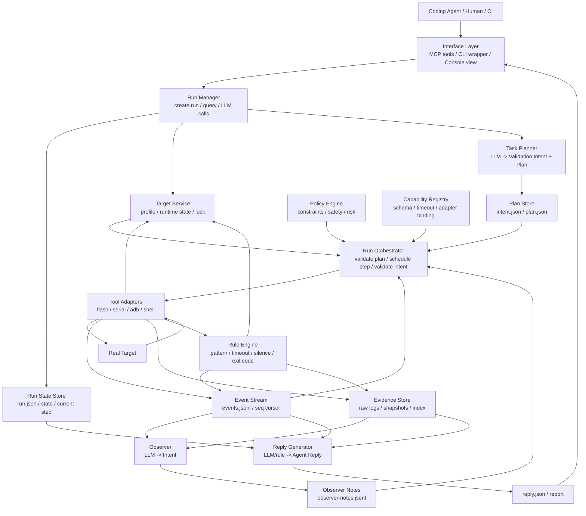

# Artifact Validation Agent 架构设计

> 状态：Draft  
> 日期：2026-04-28  
> 目的：合并两版架构思考，形成当前主线架构文档。  
> 核心口径：Runtime-first，先让 Runtime 独立成立，再接入 LLM 增强。  
> 关系：本文件是主架构文档；Runtime-first 比对稿已归档到 [../99-archive/2026-04-architecture-drafts/](../99-archive/2026-04-architecture-drafts/)；Runtime-only 具体执行契约见 [ARTIFACT-VALIDATION-AGENT-RUNTIME-CONTRACTS.md](ARTIFACT-VALIDATION-AGENT-RUNTIME-CONTRACTS.md)；LLM 接入契约见 [ARTIFACT-VALIDATION-AGENT-LLM-INTEGRATION.md](ARTIFACT-VALIDATION-AGENT-LLM-INTEGRATION.md)。

## 1. 核心判断

这个系统的核心不是 LLM，也不是 Tool Adapter。

核心是：

```text
Run State
+ Event Stream
+ Evidence Store
+ Run Orchestrator
```

LLM 只是围绕 Runtime Backbone 的 3 个生产者：

```text
Task Planner -> Validation Intent + Plan
Observer -> Intent
Reply Generator -> Agent Reply
```

第一版必须证明：

```text
没有 LLM，也能用手写 Plan 跑完真机验证并留下完整 evidence。
有 LLM，只是让 Plan 更自动、运行中判断更聪明、结果更好读。
```

如果这一点不成立，系统会退化成：

```text
LLM 拼命令 + 日志摘要器
```

## 2. 架构原则

| 原则 | 含义 | 反例 |
|---|---|---|
| Runtime-first | Runtime 是可审计、可恢复、可查询的验证系统。 | LLM 临时拼流程，系统只负责转发。 |
| LLM 不直接控制设备 | LLM 输出 Plan / Intent，Orchestrator 校验后执行。 | LLM 直接调用 adb / fastboot。 |
| Orchestrator 是唯一执行入口 | 所有 Tool Adapter 动作必须经过 Orchestrator 校验。 | Observer 直接触发 collect_logs。 |
| Event Stream 是 Backbone | 所有状态变化、检测结果、主动汇报都写事件。 | 各模块自己写散落日志。 |
| Evidence Store 是 Backbone | 原始日志、snapshot、window 必须保留。 | LLM summary 替代原始证据。 |
| Run Manager 是门面 | Run Manager 创建 run、持久化状态、响应查询、管理 LLM 调用。 | Run Manager 直接执行 step。 |
| Observer 不读全量日志 | Observer 只读 Event summary + Evidence window。 | Observer 每次吃完整 serial.log。 |
| 接口语义统一 | MCP tools 是 P0 正式语义，CLI / Console 只是 wrapper / view。 | CLI 和 MCP 各有一套状态模型。 |

## 3. 架构总图



## 4. 分层架构

### 4.1 Interface Layer

职责：

```text
接收外部调用。
做入参形态转换。
返回 Runtime 状态和结果。
```

P0 入口：

| 入口 | 用途 | 规则 |
|---|---|---|
| MCP tools | Coding Agent 正式入口 | P0 语义源。 |
| CLI wrapper | Human 本地入口 | 只映射 MCP 语义。 |
| Console view | Human 状态视图 | 只读 Runtime 状态；pause/resume/cancel 也走接口。 |

不能做：

```text
不能保存独立 run 状态。
不能直接调用 Tool Adapter。
不能绕过 Orchestrator。
```

### 4.2 Application Layer

核心模块：Run Manager。

Run Manager 是门面，不是执行大脑。

| 负责 | 不负责 |
|---|---|
| 创建 run。 | 执行 step。 |
| 参数校验和 artifact 校验。 | 校验 Plan / Intent。 |
| 查询聚合。 | 直接调用 Tool Adapter。 |
| 管理 LLM 调用生命周期。 | 判断设备动作是否合法。 |
| 持久化 run state。 | 解释原始日志。 |

Run Manager 持有这些流程：

```text
validate_artifact
-> validate request
-> check target lock
-> create run
-> call Task Planner
-> hand Plan to Orchestrator

get_run_status / watch_run / get_evidence / get_run_result
-> read Runtime stores
-> return current view

run finished
-> call Reply Generator
-> write reply.json
```

### 4.3 Control Layer

核心模块：Run Orchestrator。

Orchestrator 是唯一执行控制中心。

| 输入 | Orchestrator 做什么 | 输出 |
|---|---|---|
| Plan | 校验 capability、constraints、target state、timeout。 | validated steps |
| Event | 判断是否触发 Observer 或降级规则。 | observer trigger / state change |
| Observer Intent | 校验 intent type、requested_actions、constraints。 | validated follow-up actions |
| Intervene action | 处理 pause/resume/cancel 的执行边界。 | state change event |

不能做：

```text
不创建 run。
不响应外部查询。
不直接调用 LLM API。
不生成最终 report。
```

### 4.4 Brain Layer

Brain Layer 是生产者，不是控制器。

| 模块 | 输入 | 输出 | 调用者 | 失败降级 |
|---|---|---|---|---|
| Task Planner | context、artifact metadata、capabilities、scenario references | Validation Intent + Plan | Run Manager | clarification_needed 或手写 Plan 路径 |
| Observer | event summary、target state、evidence window、current phase | Observer Intent | Run Manager 代 Orchestrator 调用 | Orchestrator 用默认规则 |
| Reply Generator | evidence index、key events、observer notes、run state | Agent Reply | Run Manager | 规则摘要 |

硬规则：

```text
LLM 输出必须先落盘。
LLM 输出必须可审计。
LLM 输出不能直接驱动 Tool Adapter。
LLM timeout 不能阻塞正在执行的 Tool Adapter。
```

### 4.5 Execution Layer

Tool Adapter 只做真实动作。

| Capability | Adapter | 写入 |
|---|---|---|
| `flash` | FlashAdapter | flash.log、step events、target state |
| `push` | AdbAdapter | push result、step events |
| `watch_serial` | SerialAdapter | serial.log、serial events、heartbeat |
| `wait_adb` | AdbAdapter | adb state event、target state |
| `shell_exec` | AdbAdapter | stdout/stderr、exit code event |
| `check_process` | AdbAdapter | process result event |
| `collect_logs` | AdbAdapter / SerialAdapter | dmesg/logcat/window refs |
| `save_snapshot` | EvidenceStore | snapshot refs |

Tool Adapter 不做：

```text
不规划。
不判断业务是否通过。
不修改 Plan。
不调用 LLM。
```

### 4.6 Detection Layer

核心模块：Rule Engine。

Rule Engine 是快反射，只产 Event 和 evidence window。

| 检测 | 输出 |
|---|---|
| pattern matched | `rule_matched` event + window ref |
| step timeout | `step_timeout` event + failure snapshot |
| serial silence | `rule_matched` 或 `step_timeout` event |
| command exit code | `rule_matched` event |
| adb offline / online | `target_state_changed` event |

不能做：

```text
不直接 stop run。
不直接 collect logs。
不直接调用 Observer。
不替代 Orchestrator 做策略判断。
```

### 4.7 Memory Layer

Memory Layer 是事实源。

| Store | 文件 | 作用 |
|---|---|---|
| Run State Store | `run.json` | run 状态、current step、elapsed、last_event_seq。 |
| Event Stream | `events.jsonl` | 所有运行事件，支持 `after_seq` cursor。 |
| Evidence Store | logs / snapshots | 原始事实。 |
| Evidence Index | `evidence-index.json` | refs、key_events、partial、root_path。 |
| Target State Store | `runtime-state.json` | target 动态状态和 lock。 |
| Brain Output Store | `intent.json`、`plan.json`、`observer-notes.jsonl`、`reply.json` | LLM 输出可审计。 |

硬规则：

```text
Event 和 Evidence 不依赖 LLM。
LLM summary 不能覆盖原始 evidence。
Rule Engine 标记的 evidence window 必须保留。
```

## 5. 核心对象

这里定义实现时必须稳定的核心对象。完整接口契约见 [ARTIFACT-VALIDATION-AGENT-FUNCTION-LIST.md](ARTIFACT-VALIDATION-AGENT-FUNCTION-LIST.md)。

### 5.1 Validation Request

```json
{
  "context": {
    "task": "string, required",
    "what_changed": "string, recommended",
    "expected": "string, required",
    "concerns": ["string"],
    "test_hint": {
      "kind": "adb_shell",
      "command": "string",
      "timeout_sec": 60,
      "expected_exit_code": 0
    }
  },
  "artifact": {
    "path": "string, required",
    "type": "string, required",
    "sha256": "optional"
  },
  "target": "board-01",
  "constraints": {
    "max_duration_sec": 600,
    "allow_flash": true,
    "allow_reboot": false,
    "allow_shell_exec": true,
    "allow_power_cycle": false,
    "allow_kill_process": false,
    "allow_inject_fault": false,
    "max_log_bytes": 52428800
  }
}
```

### 5.2 Run

```json
{
  "run_id": "run-001",
  "state": "planning",
  "target_id": "board-01",
  "request_ref": "request.json",
  "intent_ref": "intent.json",
  "plan_ref": "plan.json",
  "evidence_path": "runs/run-001",
  "created_at": "2026-04-28T10:00:00+08:00",
  "started_at": null,
  "ended_at": null,
  "elapsed_sec": 0,
  "last_event_seq": 0,
  "current_step_id": null
}
```

允许状态：

```text
queued
planning
running
collecting_evidence
completed
failed
paused
cancelled
```

注意：

```text
queued 只表示 run 已接受并落盘，正在等待本地 run worker 开始 planning。
queued 不是 target 等待队列；target busy 时 validate_artifact 直接返回 target_busy，不创建 run。
单 run worker 立即处理时，可以直接从 planning 开始，queued 只是允许的瞬时状态。
clarification_needed、artifact_invalid、target_busy、plan_rejected 是 validate_artifact 的返回状态或拒绝原因。
它们不是 P0 Run State。
如果请求在创建 run 前被拒绝，不写 run.json。
如果 Plan 已落盘后被拒绝，run 可以进入 failed，并在 event / rejection reason 中记录 plan_rejected。
```

### 5.3 Validation Intent

```json
{
  "intent_id": "intent-001",
  "feature_area": "boot",
  "confidence": 0.82,
  "confidence_reason": "context mentions boot crash and adb offline",
  "expected_behavior": ["boot completed", "adb online"],
  "risk_focus": ["kernel panic", "init timeout", "adb offline"],
  "suggested_actions": ["flash", "watch_serial", "wait_adb", "shell_exec"],
  "observe": ["boot markers", "panic patterns", "adb state"],
  "evidence_need": ["serial log", "dmesg", "logcat"],
  "pass_fail": ["no kernel panic", "smoke command exits 0"],
  "assumptions": ["adb shell is available after boot"],
  "missing_info": [],
  "inferred_values": {
    "wait_adb_timeout_sec": 180
  }
}
```

### 5.4 Plan

```json
{
  "plan_id": "plan-001",
  "intent_ref": "intent-001",
  "estimated_duration_sec": 360,
  "steps": [
    {
      "id": "step-1",
      "capability": "watch_serial",
      "condition": "always",
      "input": {
        "duration_sec": 180,
        "patterns": ["kernel panic", "boot completed"]
      },
      "timeout_sec": 180,
      "on_failure": "collect_and_fail"
    }
  ],
  "success_criteria": ["boot completed", "adb online", "no kernel panic"],
  "failure_signals": ["kernel panic", "adb offline after timeout"],
  "evidence_policy": {
    "always": ["timeline", "events"],
    "on_failure": ["serial_last_window", "dmesg", "logcat"]
  }
}
```

### 5.5 Observer Intent

```json
{
  "intent": "collect_more",
  "reason": "serial shows init timeout and adb is still offline",
  "confidence": 0.82,
  "requested_actions": [
    {
      "capability": "collect_logs",
      "input": {
        "items": ["serial_last_window"]
      }
    }
  ],
  "report_to_caller": false
}
```

### 5.6 Event

```json
{
  "seq": 42,
  "run_id": "run-001",
  "time": "2026-04-28T10:01:42+08:00",
  "elapsed_sec": 42,
  "type": "rule_matched",
  "severity": "error",
  "source": "rule_engine",
  "step_id": "step-2",
  "summary": "kernel panic matched on serial",
  "payload": {
    "pattern": "kernel panic"
  },
  "evidence_refs": ["serial:last-200-lines"]
}
```

P0 event type 以 `FUNCTION-LIST` 为准：

```text
run_created
state_changed
step_started
step_completed
step_failed
step_timeout
rule_matched
target_state_changed
observer_intent
intermediate_observation
evidence_collected
intervention_requested
run_completed
run_failed
run_cancelled
```

### 5.7 Evidence Index

```json
{
  "run_id": "run-001",
  "partial": true,
  "updated_at": "2026-04-28T10:01:42+08:00",
  "root_path": "runs/run-001",
  "refs": [
    {
      "ref": "serial:last-200-lines",
      "kind": "window",
      "path": "snapshots/serial-last-200-lines.log",
      "available": true,
      "source_ref": "serial:full"
    }
  ],
  "key_events": [
    {
      "seq": 42,
      "summary": "kernel panic matched on serial",
      "evidence_refs": ["serial:last-200-lines"]
    }
  ]
}
```

### 5.8 Agent Reply

```json
{
  "run_id": "run-001",
  "status": "failed",
  "summary": "启动 42 秒后 serial 出现 kernel panic。",
  "confidence": 0.86,
  "key_evidence": [
    {
      "summary": "kernel panic matched on serial",
      "evidence_refs": ["serial:last-200-lines"]
    }
  ],
  "suggested_next": "优先检查 init service 启动顺序和 timeout 设置。",
  "evidence_path": "runs/run-001",
  "report_path": "runs/run-001/reply.json"
}
```

## 6. 核心数据流

### 6.1 创建 Run

```text
Caller
-> validate_artifact
-> Run Manager validate request
-> Target Service check busy
-> Run Manager create run.json
-> Event Stream append run_created
-> Run Manager call Task Planner
-> Planner writes intent.json + plan.json
-> Run Manager hands plan to Orchestrator
```

### 6.2 执行 Plan

```text
Orchestrator validate plan
-> Policy Engine check constraints
-> Capability Registry check schema / timeout / risk
-> Target Service check runtime state
-> Orchestrator append state_changed / step_started
-> Adapter execute step
-> Adapter writes raw evidence
-> Adapter appends step_completed / step_failed
-> Rule Engine watches output and appends detection events
```

### 6.3 运行中观察

```text
Rule Engine appends key event
-> Orchestrator reads event
-> Orchestrator decides observer trigger
-> Run Manager calls Observer
-> Observer reads event summary + evidence window
-> Observer writes observer-notes.jsonl
-> Orchestrator validates Intent
-> Orchestrator executes allowed follow-up action
```

### 6.4 结束生成结果

```text
Orchestrator marks collecting_evidence
-> final collect_logs / save_snapshot
-> Run Manager calls Reply Generator
-> Reply Generator reads Evidence Index + Event Stream
-> writes reply.json
-> Run Manager marks completed / failed
-> Caller get_run_result
```

## 7. 主流程详细版

### 7.1 validate_artifact

```text
Interface 调用 validate_artifact(request)
  ↓
Run Manager 参数校验
  - context.task、expected 必填
  - artifact.path 存在且可读
  - target 存在
  ↓
Run Manager 检查 Target Runtime State
  - target.state == idle？否则返回 busy
  ↓
Run Manager 创建 Run 对象
  - state = queued 或 planning
  - queued 仅表示等待本地 worker 开始，不表示等待 target 空闲
  - 写 run.json
  - 写 run_created event
  ↓
Run Manager 进入 planning 并异步调用 Task Planner
  - timeout = 60s
  - 输入：context、target capabilities、场景库参考
  ↓
Task Planner 输出
  - Validation Intent -> intent.json
  - Plan -> plan.json
  ↓
Run Manager 把 Plan 交给 Orchestrator 校验
  ↓
Orchestrator 校验 Plan
  - capability 存在？
  - constraints 允许？
  - target 可用？
  - steps 合法？
  ↓
校验失败 -> 返回 plan_rejected；如果 run 已创建则 state = failed 并保留 rejection reason
校验通过 -> state = running
  ↓
Orchestrator 调度 Step 执行
```

### 7.2 run 执行

```text
Orchestrator 按 condition 扫描 steps
  ↓
always step 顺序执行
  ↓
Tool Adapter 读 Target Profile 连接参数
  ↓
Tool Adapter 执行动作
  ↓
Tool Adapter 写 Evidence / Event / Target State
  ↓
Rule Engine 实时检测输出流
  ↓
Rule Engine 写 rule event + evidence window
  ↓
Orchestrator 根据 Event 决定：
  - 继续
  - 降级
  - 触发 Observer
  - 执行 on_failure step
  - stop / pause / failed
```

### 7.3 run 结束

```text
Orchestrator 进入 collecting_evidence
  ↓
执行最后补采集和 snapshot
  ↓
Run Manager 调用 Reply Generator
  ↓
Reply Generator 读 Evidence Index + key events + observer notes
  ↓
写 reply.json
  ↓
Run Manager 标记 completed / failed
```

## 8. 运行中闭环

### 8.1 Event 触发闭环

```text
Tool Adapter 执行
  ↓ 输出流
Rule Engine 检测
  ↓ pattern matched / timeout / silence / exit code
Rule Engine 写 Event
  ↓
Rule Engine 写 Snapshot
  ↓
Orchestrator 判断是否触发 Observer
  ↓
Run Manager 调用 Observer
  ↓
Observer 输出 Intent
  ↓
Orchestrator 校验 Intent
  ↓
执行允许的 follow-up action
```

### 8.2 Observer 输入边界

Observer 只读：

```text
Event summary:
  seq / type / severity / summary

Evidence window:
  Rule Engine 标记的关键窗口
  对应 evidence_refs

Current context:
  current step
  run state
  target runtime state
```

Observer 不读：

```text
完整 serial.log
完整 logcat
完整 dmesg
未经过 Rule Engine 标记的大段日志
```

### 8.3 Orchestrator 降级规则

| 情况 | 默认处理 | 是否触发 Observer |
|---|---|---|
| panic/oops pattern | 保存 snapshot，触发 Observer。 | 是 |
| step timeout | 保存 failure snapshot，触发 Observer。 | 是 |
| flash failed | 停止 run，保存 flash.log。 | 是 |
| ADB 长时间 offline | 记录 event，触发 Observer。 | 是 |
| serial disconnected | 保存已有 evidence，暂停或失败。 | 是 |
| serial silence | 记录 event，触发 Observer。 | 是 |
| command exit code 非预期 | 记录 event，按策略触发。 | 条件触发 |
| Intent 执行失败 | 记录 observer_intent 处理结果和失败原因，必要时暂停。 | 否 |

## 9. 状态和所有权

### 9.1 Run State

| 状态变化 | 发起方 | 写入方 |
|---|---|---|
| queued | Run Manager 接收 run，但本地 worker 尚未开始 planning | Run Manager |
| planning | Run Manager 开始 Task Planner 调用或手写 Plan 装载 | Run Manager |
| running | Orchestrator 校验通过 | Run Manager 写状态，Orchestrator 写 event |
| paused | Observer / intervene_run | Run Manager 写状态 |
| cancelled | cancel_run / intervene_run | Run Manager 写状态 |
| collecting_evidence | Orchestrator | Run Manager 写状态 |
| completed / failed | Reply 生成后 | Run Manager 写状态 |

原则：

```text
Run Manager 是 run state 持久化 owner。
Orchestrator 是执行推进 owner。
两者通过 Event Stream 和 run.json 交互。
```

### 9.2 Target Runtime State

| 字段 | 更新方 |
|---|---|
| `state` | Run Manager / Tool Adapter / Rule Engine |
| `current_run_id` | Run Manager |
| `serial` | SerialAdapter / Rule Engine |
| `adb` | AdbAdapter / Rule Engine |
| `last_heartbeat_at` | 长时间运行的 Tool Adapter |

P0 不做连接池。长任务 adapter 负责 heartbeat。

### 9.3 Event Stream

Event Stream 是 append-only。

| 写入者 | 写什么 |
|---|---|
| Run Manager | run_created、run_completed、run_failed、run_cancelled。 |
| Orchestrator | state_changed、step_started、intervention_requested。 |
| Tool Adapter | step_completed、step_failed、target_state_changed。 |
| Rule Engine | rule_matched、step_timeout、target_state_changed。 |
| Observer | observer_intent、intermediate_observation。 |
| Evidence Store | evidence_collected。 |

## 10. Failure Semantics

P0 必须把失败分清楚。

| 失败 | 状态 | 必须保留 |
|---|---|---|
| artifact invalid | 不创建 run | rejection reason |
| target busy | 不创建 run | busy target id |
| planner failed | 未创建 run 或 failed | planner error / missing_info / clarification_needed response |
| plan rejected | failed | rejection reasons / plan_rejected response |
| flash failed | failed | flash.log |
| boot panic | failed | serial window + events |
| adb timeout | failed 或 paused | serial log + target state |
| shell failed | failed | stdout / stderr / exit code |
| observer timeout | 按默认规则继续 / 暂停 / 失败 | event + fallback reason |
| reply failed | completed / failed 仍可结束 | rule-based minimal reply |

## 11. 存储设计

### 11.1 目录结构

```text
runs/
  run-001/
    request.json
    run.json
    target-profile.json
    inferred-capabilities.json
    intent.json
    plan.json
    events.jsonl
    observer-notes.jsonl
    evidence-index.json
    flash.log
    serial.log
    adb-smoke_test.json
    dmesg.log
    logcat.log
    snapshots/
      serial-last-200-lines.log
      failure-snapshot.json
    reply.json

targets/
  board-01/
    profile.json
    runtime-state.json
```

### 11.2 写入原则

```text
先写原始 evidence，再写 index ref。
先写 event，再让 watch_run 可见。
LLM 输出单独落盘，不混入原始 evidence。
Rule Engine 标记的 evidence window 不允许被 summary 替代。
```

### 11.3 Evidence Index 更新

```text
每次 Evidence Store 写入新文件后更新 evidence-index.json。
每次 Rule Engine 标记关键事件后，把对应 evidence ref 写入 key_events。
get_evidence 永远读取当前 evidence-index.json。
如果 Index 更新失败，必须写 event，不能静默失败。
```

## 12. 接口边界

### 12.1 MCP Tools

P0 对外接口以 MCP tool 语义为准。完整输入输出见 `FUNCTION-LIST` 第 6 节。

```text
validate_artifact
get_run_status
watch_run
get_run_events
get_evidence
get_run_result
intervene_run
cancel_run
get_target_capabilities
```

### 12.2 CLI Wrapper

CLI 只是 MCP 语义 wrapper。

```text
embedagent validate -> validate_artifact
embedagent status -> get_run_status
embedagent watch -> watch_run
embedagent evidence -> get_evidence
embedagent result -> get_run_result
embedagent cancel -> cancel_run
embedagent pause/resume -> intervene_run
```

### 12.3 Console View

P0 Console 采用纯 TUI。Console 是 read-only view，状态来源只能是：

```text
Run State
Target Runtime State
Event Stream
Evidence Index
Agent Reply
```

Console 不提供：

```text
直接执行命令。
修改 Target Profile。
删除 Evidence。
绕过 Orchestrator。
```

## 13. 内部模块接口

这里不是外部 MCP 契约，而是内部模块边界。

### 13.1 Run Manager

```text
create_validation_run(request) -> run_id | rejection
get_run_status(run_id) -> RunStatus
watch_run(run_id, after_seq) -> Event[]
finalize_run(run_id) -> AgentReply
call_planner(run_id) -> Plan | clarification_needed
call_reply_generator(run_id) -> AgentReply
```

### 13.2 Orchestrator

```text
validate_plan(run_id, plan) -> accepted | rejected
execute_plan(run_id, plan) -> final_state
handle_event(run_id, event) -> action
validate_intent(run_id, intent) -> accepted | rejected
execute_intent(run_id, intent) -> event
```

### 13.3 Tool Adapter

```text
execute(step, resolved_target_connection) -> AdapterResult
stream_output(step) -> output chunks
collect_logs(items) -> evidence refs
save_snapshot(reason, include) -> snapshot ref
```

### 13.4 Rule Engine

```text
inspect_output(chunk, context) -> Event[]
check_timeout(step, elapsed) -> Event?
check_silence(stream, elapsed) -> Event?
mark_window(event) -> evidence ref
```

### 13.5 Evidence Store

```text
write_log(ref, bytes) -> evidence ref
write_snapshot(reason, content) -> evidence ref
update_index(ref) -> void
get_index(run_id) -> EvidenceIndex
```

## 14. P0 进程模型

第一版不要上分布式队列。

P0 进程模型：

```text
一个 Runtime 进程
+ 一个 run worker loop
+ subprocess 调外部工具
+ 文件系统持久化 state / events / evidence
+ 轮询式 watch_run
```

推荐任务：

| 任务 | P0 做法 |
|---|---|
| Run worker | 单 run loop，顺序执行 step。 |
| Serial watch | 子进程或后台任务读串口，持续写 log。 |
| Rule Engine | 跟随输出流同步检测，必要时也可后台扫描。 |
| LLM call | 异步任务，有 timeout，不阻塞 adapter output 写入。 |
| Query API | 读文件状态，轻量返回。 |

不做：

```text
不做消息队列。
不做分布式 worker。
不做多 target scheduler。
不做数据库强依赖。
不做连接池。
```

## 15. P0 落地顺序

| 顺序 | 切片 | 目标 |
|---:|---|---|
| 1 | 文件存储骨架 | run.json、events.jsonl、evidence-index.json 能写能读。 |
| 2 | Target Profile / State | 能配置 board，能 busy lock。 |
| 3 | MCP tool skeleton | validate/status/watch/evidence/result 有返回。 |
| 4 | 手写 Plan 执行 | 不接 LLM，先跑 flash/watch/wait/shell。 |
| 5 | Rule Engine | 能检测 panic/timeout/exit code 并写事件。 |
| 6 | Failure Snapshot | 失败时能保存窗口和 index。 |
| 7 | Orchestrator 降级 | timeout、panic、adb offline 有默认处理。 |
| 8 | Task Planner | 把 context 变成 Plan。 |
| 9 | Observer | 事件触发后给 Intent。 |
| 10 | Reply Generator | 生成 Agent Reply。 |

这顺序的原因：

```text
先证明 Runtime 能跑。
再证明 evidence 不丢。
最后接 LLM。
```

## 16. 架构边界检查

| 问题 | 正确答案 |
|---|---|
| 谁能执行工具？ | 只有 Orchestrator 校验后的 Tool Adapter。 |
| 谁能改变 Plan？ | P0 不动态改 Plan；Observer 只能请求补采集或停止等受限 Intent。 |
| 谁拥有 run 状态？ | Run Manager。 |
| 谁推进 step？ | Orchestrator。 |
| 谁保存原始日志？ | Evidence Store。 |
| 谁写检测事件？ | Rule Engine。 |
| 谁触发 Observer？ | Orchestrator 决定，Run Manager 发起调用。 |
| 谁生成最终回复？ | Reply Generator，失败时 Run Manager 用规则摘要。 |
| 谁能看完整日志？ | Human / Coding Agent 通过 evidence ref；Observer 默认只看 window。 |

## 17. ADR 决策记录

### ADR-001：为什么 Runtime-first

```text
背景：
LLM-first 系统容易退化成“LLM 拼命令 + 日志摘要器”。

决策：
系统核心是 Orchestrator + Event/Evidence Backbone。
LLM 只是生产者，不是控制器。

理由：
- 可审计：Event Stream 记录所有决策和动作。
- 可恢复：Run State 可以查询。
- 可查询：直接读 Runtime 状态，不依赖 LLM 记忆。
- 可复现：Evidence Package 保存完整现场。
```

### ADR-002：为什么 Event Stream 是 Backbone

```text
背景：
运行中需要查询、复盘和触发后续判断。

决策：
所有模块写 Event，查询和 Observer 都从 Event Stream 读取。

拒绝：
各模块自己记日志，因为不可统一查询，也无法形成稳定闭环。
```

### ADR-003：为什么 Evidence Store 是 Backbone

```text
背景：
真机验证价值在于失败现场不丢。

决策：
所有原始输出写 Evidence Store，摘要只能引用 evidence ref。

拒绝：
LLM summary 替代原始 Evidence，因为关键现场可能丢失。
```

### ADR-004：为什么 Orchestrator 是唯一执行入口

```text
背景：
LLM 和 Rule Engine 都可能产生动作建议。

决策：
所有 Plan / Intent 必须经过 Orchestrator 校验才能执行。

拒绝：
Observer 或 Rule Engine 直接调用 Tool Adapter，因为会绕过 constraints。
```

### ADR-005：为什么 LLM 调用由 Run Manager 管理

```text
背景：
LLM 调用有 timeout、错误和替换实现问题。

决策：
Run Manager 管理 Planner / Observer / Reply Generator 调用生命周期。
Orchestrator 只负责校验和执行控制。

拒绝：
Orchestrator 直接调用 LLM API，因为会让执行控制器承担外部调用复杂度。
```

### ADR-006：为什么 Observer 不读全量日志

```text
背景：
全量日志可能很大，LLM 处理慢且成本高。

决策：
Observer 只读 Event summary + Evidence window。

拒绝：
Observer 每次读取完整 serial.log / logcat。
```

## 18. 收口

如果架构实现时只记住一句话：

```text
Runtime 先独立成立，LLM 后接入增强。
```

如果这些原则被破坏，系统会退化：

| 破坏点 | 后果 |
|---|---|
| LLM-first | 不可审计、不可恢复、不可查询。 |
| 无 Event Backbone | 不可触发闭环、不可追溯决策。 |
| 无 Evidence Backbone | 关键现场可能丢失。 |
| Orchestrator 不是唯一入口 | 安全边界被绕过。 |
| Observer 读全量日志 | 慢、贵、还容易漏关键片段。 |
