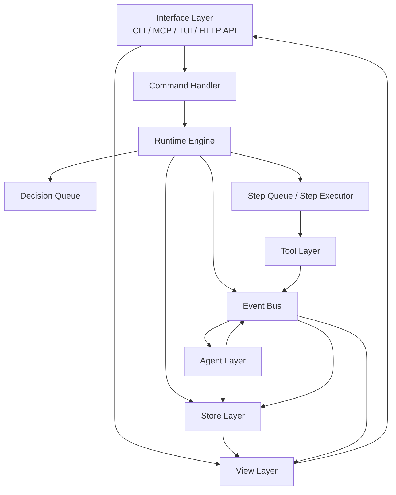

# Embed Agent 架构设计

> 状态：Draft  
> 日期：2026-04-29  
> 目的：用 agent 通用术语定义 Embed Agent 的正式架构、组件能力和交互路径。  
> 关系：本文件是架构总览和目标架构口径，不单独替代详细契约。`ARTIFACT-VALIDATION-AGENT-*` 文档在各自层面仍是当前详细设计和实现参考。

## 1. 核心判断

Embed Agent 不是一个“会跑几条命令的脚本集合”，而是一个围绕真实设备运行的 agent system。

它的核心循环只有一句话：

```text
观察 -> 决策 -> 调度 -> 执行 -> 再观察
```

落到系统里，就是：

```text
Tool Layer 产出 Observation / RuleMatched
-> fast reflex policy 或 Agent Layer 产出 Decision
-> Runtime Engine 把 Decision 变成 Step 或状态变化
-> Tool Layer 执行
-> Event 和 Evidence 持续沉淀
-> View Layer 给 Human / MCP / CLI / TUI 展示
```

如果这个闭环不成立，系统就会退化成：

```text
LLM 摘要器 + 命令转发器
```

## 2. 通用术语

| 术语 | 含义 |
|---|---|
| Agent | 会观察、会决策、会行动的智能体。 |
| Tool | Agent 可调用的设备能力，如 `flash`、`watch_serial`、`shell_exec`。 |
| Observation | Agent 从环境得到的信息，如串口输出、ADB 状态、规则命中、人工输入。 |
| Decision | Agent 或 Human 给 Runtime 的结构化判断，如 `stop`、`collect_more`、`extend_wait`。 |
| Plan | 一组有顺序的执行步骤。 |
| Step | 真实进入执行队列的设备动作，如 `flash`、`wait_adb`、`collect_logs`。 |
| Event | 系统里已经发生的事实。 |
| Evidence | 原始证据，如日志、窗口、快照、命令输出。 |
| Memory | 跨 Run 的经验和长期知识。 |
| Session | 一次完整的人机协作上下文。 |
| Run | 一次具体的验证执行。 |
| Target | 一台被验证的真实设备。 |
| View | 给 CLI/MCP/TUI/API 查询的只读视图。 |

这里有一个必须坚持的边界：

```text
Decision 不等于 Step。

Decision 是“应该做什么”。
Step 是“已经被 Runtime 批准并排队执行的设备动作”。
```

不把这两个概念分开，后面暂停、打断、忽略规则、补采集都会乱。

## 3. 架构原则

| 原则 | 含义 |
|---|---|
| Event-first | 所有事实先变成 Event，再驱动状态、视图和总结。 |
| Facts-before-summary | 原始 Evidence 优先于 LLM 总结。 |
| Runtime owns execution | 只有 Runtime Engine 能把 Decision 变成 Step 并调度执行。 |
| Tools do, Agents decide | Tool 负责执行设备动作，Agent 负责理解 Observation 和做 Decision。 |
| Interfaces stay thin | CLI / MCP / TUI / HTTP API 只发 Command、只读 View。 |
| Honest recovery | 重启后要么恢复事实，要么明确报中断，不能假装继续运行。 |
| Memory is first-class | Memory 从第一天就有接口和数据位，不靠后补。 |
| Human can intervene safely | Human 可以暂停、恢复、取消、加指令、忽略规则，但不能绕过安全边界直接发危险命令。 |

### 3.1 文档定位

这份文档的定位是：

- 定义统一术语。
- 讲清系统骨架、边界和主循环。
- 讲清关键决策路径和禁止交互。
- 作为总览，指向更细的契约文档。

这份文档不单独重写下面这些细节：

- 产品定义：`ARTIFACT-VALIDATION-AGENT-PRODUCT.md`
- 功能规格：`ARTIFACT-VALIDATION-AGENT-FUNCTION-LIST.md`
- Runtime 执行契约：`ARTIFACT-VALIDATION-AGENT-RUNTIME-CONTRACTS.md`
- LLM 接入契约：`ARTIFACT-VALIDATION-AGENT-LLM-INTEGRATION.md`
- 原型架构和当前实现对应关系：`ARTIFACT-VALIDATION-AGENT-ARCHITECTURE.md`

现状说明：

- 当前代码实现仍主要贴近 `ARTIFACT-VALIDATION-AGENT-*` 这组原型文档。
- 本文件描述的是统一术语下的目标架构，不表示所有组件都已经在代码中独立落地。
- 在新契约没有补齐前，Capability Registry、Plan 结构、Rule 定义、Evidence Index 更新规则等细节，仍以详细文档为准。

### 3.2 核心骨架和附加模块

这套系统需要区分“循环能不能转起来”和“循环转起来以后还能加什么”。

核心骨架：

- `Event Bus`
- `Run Manager`
- `Step Queue`
- `Step Executor`
- `Tool Layer`
- `Event Store`
- `Evidence Store`

没有这组骨架，系统的观察、执行和留证闭环跑不起来。

附加模块：

- `Streaming Rule Monitor`
- `Planner`
- `Observer`
- `Memory`
- `Reply Generator`

这些模块都建立在骨架之上，本质上是 Event 的生产者、消费者或增强器。  
系统第一版可以只靠骨架加确定性规则跑通，不要求一开始就依赖 LLM。

## 4. 顶层架构



系统只允许这四条主路径：

1. `Command -> Runtime Engine`
2. `Tool -> Observation/Event -> Agent`
3. `DecisionMade Event -> Runtime Engine -> Decision Queue -> Step / 状态变化 -> Tool`
4. `Event/Store -> View -> Interface`

补充说明：

- 图里的 `Command Handler` 是 `Runtime Engine` 的入口组件，只是为了把接口入口画清楚才单独展开，不表示它是 Runtime 外的一层独立系统。

## 5. 组件分层

### 5.1 Interface Layer

组件：

```text
CLI
MCP Server
TUI
HTTP API
```

职责：

```text
接收 Human 或外部系统输入。
把输入转成统一 Command。
查询 View。
订阅 SSE / watch feed。
```

必须具备的能力：

- 发起验证
- 暂停 / 恢复 / 取消
- 添加人工指令
- 忽略规则
- 查看当前 Run
- 查看历史 Run
- 查看 Evidence 内容
- 查看 Target 状态
- 查看 Session 成本
- 导出 / 导入结果包

不能做：

```text
不能持有 Run 状态。
不能持有设备连接。
不能直接调用 Tool。
不能直接调用 LLM。
```

### 5.2 Runtime Engine

Runtime Engine 是系统中枢。

内部建议至少拆成这些职责：

```text
Command Handler
Run Manager
Decision Handler
Scheduler
Step Executor
Target Lock Manager
Cost Manager
```

职责：

```text
创建 Session / Run。
管理 Run 状态机。
接收 Decision。
把 Decision 变成 Step 或状态变化。
调度 Step 执行。
处理暂停、恢复、取消、忽略规则。
处理 Target 冲突和锁。
处理重启恢复。
累计 LLM 成本。
```

必须具备的能力：

- `validate`
- `pause`
- `resume`
- `cancel`
- `add_instruction`
- `ignore_rule`
- `add_target`
- `export_run`
- `import_run`
- Target busy 拒绝或排队
- 重启后恢复或诚实失败

不能做：

```text
不能直接调 LLM。
不能直接解释完整日志语义。
不能把界面查询逻辑塞进自己。
```

### 5.3 Tool Layer

组件：

```text
Target Manager
Connection Manager
Serial Tool
ADB Tool
Flash Tool
Shell Tool
Log Tool
Streaming Rule Monitor
```

职责：

```text
维护真实设备连接。
执行真实设备动作。
持续产出 Observation。
持续检测流式规则。
写入 Evidence。
上报 Target 状态变化。
```

必须具备的能力：

- Serial / ADB / Fastboot / SSH 持久连接
- heartbeat
- reconnect
- 多 connection per target
- ring buffer
- pattern / silence / connectivity streaming rules
- shell exit code rules
- evidence window capture
- final evidence collection

不能做：

```text
不能调 LLM。
不能自己决定 Run 成败。
不能直接修改 Run 状态。
```

### 5.4 Agent Layer

组件：

```text
Planner
Observer
Reply Generator
Memory
Policy
```

职责：

```text
Planner 在 Run 开始时产出 Plan。
Observer 在运行中消费 Observation 和 RuleMatched，产出 Decision，并通过 `DecisionMade` 留痕。
Reply Generator 在 Run 结束后产出结果总结和建议。
Memory 提供历史经验和长期知识。
Policy 约束 Agent 的决策边界。
```

必须具备的能力：

- Planner fallback
- Observer fallback
- Decision debounce
- Memory recall / write
- Decision Trace output
- LLM usage accounting
- completion suggestion

不能做：

```text
不能直接碰设备。
不能绕过 Runtime 把 Decision 直接变成 Step。
```

补充说明：

- `Agent Layer` 里的 `Memory` 是记忆接口和策略层，对 `Planner`、`Observer`、`Reply Generator` 暴露 `recall` / `write` 能力。
- 持久化落点在 `Store Layer` 的 `Memory Store`，由 `Agent Layer Memory` 统一读写。

### 5.5 Store Layer

组件：

```text
Event Store
Run Store
Session Store
Target State Store
Target Registry
Evidence Store
Memory Store
Decision Trace Store
Projection Store
```

职责：

```text
持久化事实。
支持重启恢复。
支持历史查询。
支持导出导入。
支持 View 投影。
```

补充说明：

- `Event Store` 是事实源，保存已经发生的 Event。
- `Projection Store` 是物化后的只读视图缓存，不是事实源。
- `Run Store`、`Target State Store`、`Evidence Store` 保存当前可直接查询的结构化状态和证据索引。
- `Projection Store` 即使丢失，也必须能从 `Event Store` 和其他事实存储重新构建。
- `Evidence Store` 负责保存 Evidence 文件和索引；原始数据由 Tool 产出后写入这里，再通过 Event 广播索引事实。

### 5.6 View Layer

组件：

```text
Run View
Target View
Evidence View
Session View
Cost View
Watch Feed / SSE Projection
```

职责：

```text
从 Event 和 Store 构建只读视图。
支持实时视图。
支持历史视图。
支持 Evidence 搜索和分页。
```

补充说明：

- `View Layer` 负责定义投影规则。
- `Store Layer` 负责提供 `Projection Store` 的持久化介质。
- `View Layer` 通过订阅 Event 更新 Projection；不是由 Event Bus 主动执行投影逻辑。

不能做：

```text
不能修改 Runtime 状态。
不能自己补逻辑推断设备状态。
```

## 6. 核心运行对象

### 6.1 Event Bus

职责：

```text
模块间通信中心。
发布事件。
订阅事件。
保持同一 Run 的事件顺序。
只负责顺序广播，不负责业务逻辑。
```

补充说明：

- `Event Bus` 不负责持久化，不负责决策，不负责更新视图。
- `Store Layer` 通过订阅 Event 完成 `Event Store`、`Run Store`、`Decision Trace Store` 等写入。
- `View Layer` 通过订阅 Event 更新 `Projection Store` 和 SSE / watch feed。

### 6.2 Decision Queue

职责：

```text
缓存 Runtime 已接收、待处理的 Decision。
保证同一 Run 的 Decision 被串行处理。
```

来源：

- Observer 发布的 `DecisionMade(source=agent, ...)`
- Human 直接控制命令被 Runtime 规范化后发布的 `DecisionMade(source=human, ...)`
- 确定性 fallback policy 对 fatal rule / connectivity 事件直接发布的 `DecisionMade(source=fallback, ...)`

补充说明：

- Agent 和 Human 都不直接写 `Decision Queue`。
- 标准路径是：先产生 `DecisionMade Event`，再由 Runtime 订阅后写入 `Decision Queue`。
- 这样既保留审计轨迹，也保留 Runtime 对 Decision 的统一校验入口。
- `Tool Layer` 不允许直接产出 `Decision`。规则命中只能变成 `RuleMatched Event`，再由 fast reflex policy 或 `Observer` 继续处理。
- 快速反射路径也不例外：`Streaming Rule Monitor` 只能产出 `RuleMatched`，真正的 `stop` / `pause` 仍要由上层 policy 产出 `DecisionMade`。

### 6.3 Step Queue

职责：

```text
只保存已批准执行的 Step。
支持顺序执行。
支持追加 follow-up step。
支持暂停和恢复。
支持清空后续 step。
```

### 6.4 Step Executor

职责：

```text
真正执行 Step。
发布 StepStarted / StepCompleted / StepFailed。
支持 cancel / interrupt / timeout extend。
```

这是 Runtime Engine 的明确组件，不能藏在别的模块里。

补充说明：

- `Step Executor` 必须持有当前执行中的 `current_step`。
- `Step Executor` 必须支持 `interrupt_requested` 标记或等价取消令牌。
- `Decision(stop / cancel / pause)`、Target 断开、超时，都可以触发这个中断通道。
- Tool 在收到中断后，应先做最小必要的 final evidence collection，再收口为 `StepFailed` 或 `StepCompleted`。
- 对等待类 Step，`Step Executor` 还要持有可刷新的 timeout deadline，并支持短暂 grace period 处理 `extend_wait` 的竞争。

### 6.5 Decision Handler

职责：

```text
接收 Decision。
做 policy 检查。
决定：
- 转成 Step
- 转成状态变化
- 转成 Suggestion
- 被拒绝
```

### 6.6 Decision 到 Runtime 的标准处理

| Decision | Runtime 结果 | 标准处理 |
|---|---|---|
| `continue` | 无新动作 | 不追加 Step，不改当前状态，调度器继续执行下一个 Step。 |
| `stop` | 状态变化 | 请求中断当前 Step，清空后续 `Step Queue`，Run 进入 `failed`，并保留终止原因。 |
| `collect_more` | 追加 Step | 在 Run 仍可执行时，把 `collect_logs`、`save_snapshot` 等 Step 追加到 `Step Queue` 末尾；Run 已终态则拒绝。 |
| `extend_wait` | 修改当前 Step | 只允许修改当前运行中的等待类 Step，如 `wait_adb`、`watch_serial`；否则拒绝。 |
| `pause` | 状态变化 | 暂停 `Step Queue`；若当前 Step 可中断则发起中断，不可中断则在当前 Step 结束后进入 `paused`。 |
| `resume` | 状态变化 | 仅在 Run 处于 `paused` 且 Target 已可用时恢复调度；若 Target 未就绪则保持 `paused` 或转 `waiting_target`。 |
| `cancel` | 状态变化 | 请求中断当前 Step，清空 `Step Queue`，Run 进入 `cancelled`。 |
| `ignore_rule` | policy 变化 | 记录本 Run 对指定 rule 的忽略策略，发布 `RuleIgnored`，后续相同 rule 不再触发 stop 类处理。 |
| `suggest` | Suggestion | 只记录建议和理由，供 Reply Generator 或 Interface 展示，不生成 Step。 |

这张表是 Runtime 的标准语义，不允许不同接口各自发明另一套含义。

### 6.7 Target 锁规则

`Target Lock Manager` 的标准语义如下：

- Run 创建并准备进入 `planning` / `running` 前，必须先尝试获取 Target 锁。
- 获取失败时，只允许两种结果：拒绝本次 Run，或进入排队态等待；不能绕过锁直接运行。
- Run 进入 `paused` 时默认保留锁，不把设备释放给其他 Run。
- Run 进入 `completed`、`failed`、`cancelled` 后释放锁。
- Runtime 重启后，非终态 Run 的锁先标记为 stale；启动阶段结合 Run 状态和实际 Target 连接情况重新确认或释放。

### 6.8 Evidence 写入路径

Evidence 的标准写入路径如下：

```text
Tool 产出原始数据
-> Tool 调用 Evidence Store.write(ref, data, metadata)
-> Evidence Store 落文件并更新索引
-> Tool 发布 EvidenceCollected(ref, content_type, size, source_step)
-> View / Reply Generator 通过 Evidence Store.read(ref) 查询内容
```

Event 负责广播“Evidence 已经存在”这个事实，不负责承载原始大文件本身。

### 6.9 决策分层和优先级

不是所有 Decision 都应该走同一条慢路径。

系统内的决策应分成三层：

| 层次 | 来源 | 延迟目标 | 典型动作 | 是否走 LLM |
|---|---|---|---|---|
| Human override | Human Command | 立即 | `pause`、`resume`、`cancel`、`ignore_rule` | 否 |
| Fast reflex | `RuleMatched`、关键 `TargetStateChanged` | 毫秒级到亚秒级 | `stop`、`pause` | 否 |
| Slow intelligence | `Observation`、非 fatal `RuleMatched`、`HumanNote` | 秒级 | `collect_more`、`extend_wait`、`continue`、`suggest` | 是 |

优先级固定为：

```text
Human > Fast reflex > Slow intelligence
```

标准规则：

- Human 命令永远可以覆盖自动决策。
- Fast reflex 用于 fatal pattern、关键连接断开、明显不能继续等待的确定性场景。
- Slow intelligence 用于需要语义判断、上下文理解或权衡的场景。
- 如果 Slow intelligence 的 Decision 到达时，Run 已被 Human 或 Fast reflex 改成终态或 paused，则该 Decision 必须被拒绝并记录 `DecisionRejected`。

Fast reflex 的标准路径：

```text
Streaming Rule Monitor / Connection Manager
-> RuleMatched / TargetStateChanged
-> deterministic fallback policy
-> DecisionMade(source=fallback)
-> Runtime 写入 Decision Queue
-> Decision Handler
```

Slow intelligence 的标准路径：

```text
Observation / non-fatal RuleMatched / HumanNote
-> Observer
-> LLM analysis
-> DecisionMade(source=agent)
-> Runtime 写入 Decision Queue
-> Decision Handler
```

## 7. 数据模型

### 7.1 Session

最小职责：

```text
容纳多个 Run。
记录成本。
关联 Memory。
承载导出、导入和历史查询。
```

补充说明：

- `validate` Command 可以显式携带 `session_id`；有则复用已有 Session。
- 如果 `validate` 没带 `session_id`，Runtime 自动创建新 Session。
- Session 默认不因单个 Run 结束而立即关闭，主要作为多次协作的上下文和成本归集容器。

### 7.2 Run

最小职责：

```text
一次完整验证执行。
有自己的状态机。
绑定一个 Target。
持有 Plan、Decision Trace、Evidence 引用、Result。
```

### 7.3 Target

最小职责：

```text
表示一台真实设备。
可有多个 Connection。
有当前 Runtime State。
可被 Run 占用。
```

### 7.4 Plan / Step / Decision

```text
Plan: 一组 Step。
Step: 真正设备动作。
Decision: Agent 或 Human 给 Runtime 的结构化判断。
```

### 7.5 Observation / Event / Evidence

```text
Observation: 原始感知结果。
Event: 被系统接受并持久化的事实。
Evidence: 原始文件、窗口、快照、命令输出。
```

### 7.6 Memory

建议从第一天就至少分三类：

| Memory 类型 | 用途 |
|---|---|
| Working Memory | 当前 Run 的临时知识和上下文。 |
| Episode | 历史 Run 的经验记录。 |
| Semantic Fact | Workspace / Target 的长期知识。 |

分层关系：

- `Agent Layer Memory` 对上提供记忆读写接口。
- `Memory Store` 对下负责持久化这三类数据。
- `Planner`、`Observer`、`Reply Generator` 不直接碰 `Memory Store`，统一经由 `Agent Layer Memory` 访问。

## 8. 状态机

### 8.1 Run 状态

```text
planning
waiting_target
running
paused
collecting_evidence
completed
failed
cancelled
```

说明：

- `planning`：等待 Planner 或加载手写 Plan
- `waiting_target`：Target 离线，等待上线
- `running`：正在执行 Step
- `paused`：被 Human 或 Target 异常暂停
- `collecting_evidence`：收尾采证
- `completed`：验证成功
- `failed`：验证失败
- `cancelled`：Human 主动取消

补充说明：

- `waiting_target` 用于“还没法开始执行”的情况，例如 Run 已创建但 Target 还未联机。
- 当 `waiting_target` 收到 `TargetStateChanged(connected)` 时，Runtime 把 Run 转回 `planning`，重新进入正常规划路径。
- 运行中途 Target 断开，默认进入 `paused` 或 `failed`，而不是回退成 `waiting_target`。

### 8.2 Step 状态

```text
queued
running
cancel_requested
completed
failed
timed_out
interrupted
```

### 8.3 Target 状态

顶层状态：

```text
offline
idle
busy
```

连接细分状态：

```text
serial_connected / serial_disconnected
adb_connected / adb_offline / adb_disconnected
ssh_connected / ssh_disconnected
fastboot_connected / fastboot_disconnected
```

## 9. 命令、决策、步骤、事件

### 9.1 Command

命令来自 Interface Layer，面向 Runtime Engine。

建议最小集合：

```text
validate
pause
resume
cancel
add_instruction
ignore_rule
add_target
list_runs
get_run
get_target
get_evidence
export_run
import_run
get_cost
```

### 9.2 Decision

Decision 来自 Agent 或 Human，面向 Runtime Engine。

进入 Runtime 前，标准形式应落成 `DecisionMade Event`，用于审计和追溯。

建议最小集合：

```text
continue
stop
collect_more
extend_wait
pause
resume
cancel
ignore_rule
suggest
```

说明：

- `continue`：不追加新动作
- `stop`：终止当前 Run
- `collect_more`：让 Runtime 追加证据采集 Step
- `extend_wait`：延长当前等待类 Step
- `suggest`：给 Human 的建议，不强制执行

### 9.3 Step

Step 是 Runtime 批准后真正执行的设备动作。

建议最小集合：

```text
flash
watch_serial
wait_adb
shell_exec
check_process
collect_logs
save_snapshot
push
```

### 9.4 Event

建议按四类划分。

#### Lifecycle Event

```text
RunStarted
PlanGenerated
PlanGenerationFailed
StepQueued
StepStarted
StepCompleted
StepFailed
StepTimeoutExtended
RunCompleted
RunFailed
RunCancelled
RunPaused
RunResumed
```

#### Observation Event

```text
Observation
TargetStateChanged
HumanNote
LLMUsed
TargetAdded
```

#### Decision Event

```text
DecisionMade
DecisionRejected
RuleIgnored
SuggestionGenerated
```

#### Evidence Event

```text
RuleMatched
EvidenceCollected
EvidenceIndexed
```

#### Guard Event

```text
CostLimitReached
TargetLockAcquired
TargetLockReleased
```

## 10. 关键交互路径

### 10.1 发起验证

```text
Human / MCP / CLI / TUI
-> validate Command
-> Runtime 创建 Session / Run
-> 发布 RunStarted
-> Planner 消费 RunStarted，生成 Plan
-> Planner 发布 PlanGenerated
-> Runtime 消费 PlanGenerated，把 Plan 展开成 Step Queue
-> 对每个 Step 发布 StepQueued
-> Step Executor 开始执行
```

### 10.2 运行中监测和干预

```text
Tool 执行 Step
-> 产出 Observation
-> Streaming Rule Monitor 产出 RuleMatched
-> fatal rule / connectivity break 走 fast reflex policy
-> 复杂 Observation / 非 fatal rule / HumanNote 走 Observer
-> fast reflex policy 或 Observer 发布 DecisionMade
-> Runtime 消费并写入 Decision Queue
-> Decision Handler 决定是：
   - stop
   - extend_wait
   - collect_more
   - continue
-> Step Queue / Run State 更新
```

补充说明：

- fatal pattern、关键连接断开这类确定性场景，默认优先走 fast reflex path，不等待 Observer LLM。
- `Observer` 主要处理非 fatal、需要上下文理解或需要权衡的场景。
- 如果 `Observer` 的 LLM 调用失败，允许由 deterministic fallback policy 再发布一个保守的 `DecisionMade`，例如 `stop` 或 `continue`。
- 这些 fallback 仍然属于上层决策行为，不是 `Tool Layer` 直接做决定。

#### fast reflex path

```text
Streaming Rule Monitor 命中 fatal pattern
-> 发布 RuleMatched(severity=fatal)
-> deterministic fallback policy 立即发布 DecisionMade(stop)
-> Runtime 写入 Decision Queue
-> Decision Handler 请求中断当前 Step
```

这条路径的目标不是“更聪明”，而是“不要比人盯串口更慢”。

#### stop 打断当前 Step

```text
DecisionMade(stop)
-> Runtime 写入 Decision Queue
-> Decision Handler 接收 stop
-> Step Executor 设置 interrupt_requested
-> Tool 收到中断信号
-> Tool 做 final evidence collection
-> 发布 StepFailed(reason=interrupted)
-> Runtime 清空后续 Step Queue
-> Run 状态 -> failed
-> 发布 RunFailed
```

#### collect_more 追加 Step

```text
DecisionMade(collect_more, params)
-> Runtime 写入 Decision Queue
-> Decision Handler 检查 Run 是否仍允许追加
-> 构造 follow-up Step
   - collect_logs
   - save_snapshot
   - 其他白名单证据采集动作
-> 追加到 Step Queue 末尾
-> 发布 StepQueued
```

如果 Run 已终态，或当前 policy 不允许追加，则拒绝该 Decision，并记录拒绝原因。

#### extend_wait 的时序保障

`extend_wait` 不能只靠“先到先得”，否则会和 timeout 产生竞争。标准处理如下：

```text
Step Executor 在 timeout 前 N 秒发布 Observation(timeout_approaching)
-> Observer 看到后发布 DecisionMade(extend_wait)
-> Runtime 写入 Decision Queue
-> Decision Handler 校验当前 Step 是否匹配
-> Step Executor 在真正触发 timeout 前，先检查是否存在针对 current_step 的 pending extend_wait
-> 如果存在，则刷新 deadline，发布 StepTimeoutExtended
-> 如果不存在，才进入 timed_out
```

这里允许一个很短的 grace period，用来吸收 Event Bus 和 Decision Queue 的传递延迟。

#### suggest 的展示

运行中的 `suggest` 标准行为如下：

```text
DecisionMade(suggest)
-> Runtime 记录 Suggestion
-> 发布 SuggestionGenerated
-> View Layer 可实时推送给已订阅的 Interface
-> Run 不暂停，不自动执行
-> Reply Generator 在 Run 结束时汇总全部 Suggestion
```

### 10.3 Human 干预

需要分两类：

#### 直接控制命令

```text
pause
resume
cancel
ignore_rule
```

这类命令直接由 Runtime 处理，不经过 Observer。

但必须留下审计事实：

```text
Human pause / resume / cancel / ignore_rule Command
-> Runtime 直接执行
-> Runtime 发布 DecisionMade(source=human, ...)
-> Runtime 再发布对应生命周期 Event
   - RunPaused
   - RunResumed
   - RunCancelled
   - RuleIgnored
```

#### 补充上下文命令

```text
add_instruction
```

这类命令进入 `HumanNote`，给 Observer 和 Reply Generator 作为新 Observation。

不同 Run 状态下的标准处理：

| Run 状态 | `add_instruction` 处理 |
|---|---|
| `planning` | 进入 `HumanNote`，同时作为 Planner 的额外输入约束。 |
| `running` | 发布 `HumanNote`，由 Observer 消费。 |
| `paused` | 发布 `HumanNote`，由 Observer 消费，等待恢复后生效。 |
| `collecting_evidence` | 发布 `HumanNote`，允许影响 final evidence 采集。 |
| `completed` / `failed` / `cancelled` | 默认拒绝并发布 `DecisionRejected`；如果产品需要补充总结，可单独走 post-run note，不复用本命令。 |

### 10.4 Target 断开和恢复

```text
Connection Manager 检测断开
-> 发布 TargetStateChanged(disconnected)
-> Runtime 识别影响的 Run
-> 自动 pause 或 fail
-> 如果 Run 原本处于 waiting_target，则继续等待，不进入失败
-> Human 重新接回设备
-> Connection Manager 重连
-> 发布 TargetStateChanged(connected)
-> 如果 Run 状态 = waiting_target，Runtime 转回 planning
-> 如果 Run 状态 = paused，Runtime 保持 paused，等待 Human 决定是否 resume
```

Target 锁在这里的行为：

- `waiting_target` 和 `paused` 默认继续持有锁。
- 只有 Run 进入终态，或 Runtime 明确认定该 Run 不再继续时，才释放锁并发布 `TargetLockReleased`。

### 10.5 重启恢复

```text
Runtime 启动
-> 加载非终态 Run、Target State、Projection
-> Target Manager 尝试重连
-> Target Lock Manager 把非终态锁标记为 stale
-> 对看起来仍是 running 但已中断的 Run 做诚实收口
-> 根据恢复后的 Run 终态或 paused 状态，重新确认或释放 Target 锁
-> 标记为 failed，或标记为 paused 并附带 reason=runtime_interrupted
-> 重建 View
```

### 10.6 导出和导入

导出包最小应包含：

- `Run Record`
- `Session` 基本元数据
- 全量 `Event`
- `Decision Trace`
- `Evidence` 文件和索引
- 可选 `Memory Snapshot`

导入后的标准行为：

```text
写入 Event Store
写入 Evidence Store / Evidence Index
重建 Projection / View
允许查询、检索、对比和展示
不恢复执行，不继续未完成 Run
```

导入的目标是复盘和共享，不是跨进程接力执行。

## 11. 组件必须拥有的能力

### 11.1 Interface Layer

- 统一命令入口
- 实时进度展示
- 历史 Run 查询
- Evidence 内容查看
- 搜索和分页
- 成本查看
- 导出导入

### 11.2 Runtime Engine

- Session / Run 管理
- Run 状态机
- Decision Queue
- Step Queue
- Step Executor
- Target 锁
- 并发隔离
- 重启恢复
- 成本累计和限制

### 11.3 Tool Layer

- 持久连接
- 心跳
- 自动重连
- 多连接 per target
- 流式 Observation
- ring buffer
- 确定性规则检测
- evidence capture
- final evidence collection

### 11.4 Agent Layer

- Plan 生成
- 运行中 Decision
- Suggestion 生成
- Memory recall / write
- Decision Trace
- fallback
- debounce
- usage 记录

### 11.5 View Layer

- 当前 Run 视图
- 历史 Run 视图
- Target 视图
- Evidence 视图
- Session / Cost 视图
- SSE / watch feed

### 11.6 Store Layer

- Event 持久化
- Run / Session 持久化
- Target State 持久化
- Target Registry
- Evidence 文件存储
- Memory 存储
- Decision Trace 存储
- Projection 存储
- Export / Import

## 12. 必须支持的场景簇

这套架构至少要能覆盖以下场景簇：

1. 正常验证
2. 明确失败自动收口
3. 超时和延长等待
4. 串口断开 / ADB 掉线 / 静默
5. Human 暂停 / 恢复 / 取消 / 加指令 / 忽略规则
6. 多 Target 并发和同 Target 冲突
7. Runtime 正常重启和异常崩溃恢复
8. Planner / Observer LLM 调用失败 fallback
9. 历史 Run / Evidence 查询
10. Memory 驱动的跨 Run 学习
11. Target 动态添加
12. 成本统计和限制
13. Run + Evidence 导出导入

## 13. 禁止的交互

以下交互是架构级禁止项：

| 禁止交互 | 原因 |
|---|---|
| Interface -> Tool | 界面层不能直接执行设备动作。 |
| Interface -> Agent | 界面层不能直接调 LLM。 |
| Tool -> Agent direct call | Tool 只能发 Event，不能直接叫 Agent 决策。 |
| Agent -> Tool | Agent 不能直接执行设备动作。 |
| View -> Runtime mutation | View 是只读投影。 |
| Tool 修改 Run 状态 | Run 状态只能由 Runtime 改。 |
| Agent 写 Step Queue | Step Queue 只能由 Runtime 写。 |
| generic `device_exec` 作为正式产品接口 | 会打穿安全边界和能力模型。 |

## 14. 推荐仓库落点

建议按正式结构落，不再让旧原型决定目录边界：

```text
apps/
  cli/
  mcp-server/
  tui/
  runtime-api/

packages/
  contracts/
  runtime/
  tools/
  agent/
  views/
  stores/
```

每个目录建议职责：

| 目录 | 职责 |
|---|---|
| `contracts/` | Session、Run、Target、Decision、Step、Event、Evidence、Memory 等类型契约。 |
| `runtime/` | Event Bus、Run Manager、Decision Handler、Scheduler、Step Executor。 |
| `tools/` | Connection Manager、Serial/ADB/Flash/Shell/Log、Streaming Rule Monitor。 |
| `agent/` | Planner、Observer、Reply Generator、Memory、Policy。 |
| `views/` | Run/Target/Evidence/Session/Cost 的投影和 watch feed。 |
| `stores/` | Event Store、Run Store、Target State Store、Evidence Store、Memory Store、Decision Trace Store、Projection Store、Export/Import。 |

## 15. 收口

Embed Agent 的最终架构可以压缩成一句话：

```text
Interface 收命令，
Runtime 管状态和调度，
Tool 连设备并产出 Observation，
Agent 看 Observation 做 Decision，
Store 留住所有事实，
View 把事实组织给 Human 和外部系统。
```

如果后续实现偏离了下面这条主循环，就说明架构开始变形了：

```text
观察 -> 决策 -> 调度 -> 执行 -> 再观察
```
