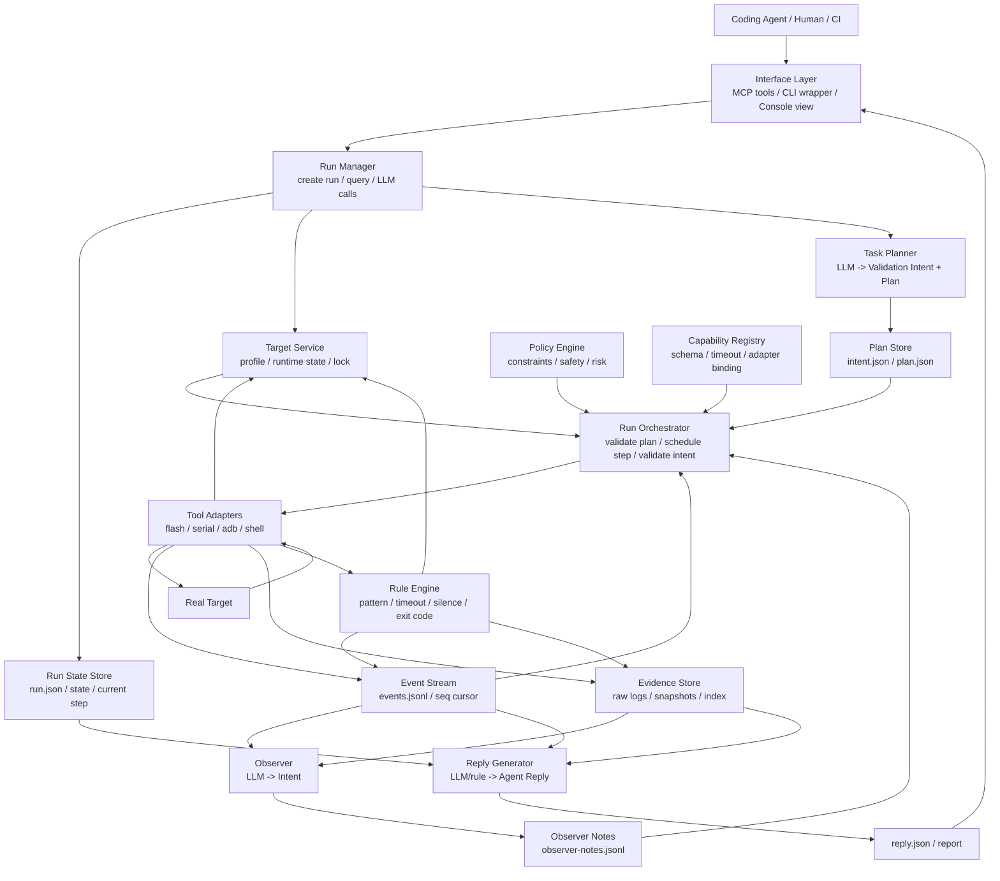

# Artifact Validation Agent Runtime-first 架构拆解

> 状态：Draft  
> 日期：2026-04-28  
> 目的：给出一份偏实现落地的架构方案，用 Runtime Backbone 先跑通系统，再接入 LLM 增强能力。  
> 关系：这是架构比对稿，功能名和接口契约以 [ARTIFACT-VALIDATION-AGENT-FUNCTION-LIST.md](ARTIFACT-VALIDATION-AGENT-FUNCTION-LIST.md) 为准。

## 1. 核心判断

这个系统的核心不是 LLM，也不是 Tool Adapter。

核心是：

```text
Run State
+ Event Stream
+ Evidence Store
+ Run Orchestrator
```

LLM 只是围绕这个 Runtime Backbone 的 3 个生产者：

```text
Task Planner -> Plan
Observer -> Intent
Reply Generator -> Agent Reply
```

第一版必须证明：

```text
没有 LLM，也能用手写 Plan 跑完真机验证并留下完整 evidence。
有 LLM，只是让 Plan 更自动、运行中判断更聪明、结果更好读。
```

## 2. 架构总图



## 3. 分层设计

### 3.1 Interface Layer

职责：

```text
接收外部调用。
做入参形态转换。
返回 Runtime 状态和结果。
```

P0 入口：

| 入口 | 用途 | 规则 |
|---|---|---|
| MCP tools | Coding Agent 正式入口 | P0 语义源。 |
| CLI wrapper | Human 本地入口 | 只映射 MCP 语义。 |
| Console view | Human 状态视图 | 只读 Runtime 状态，操作也走接口。 |

不能做：

```text
不能保存独立 run 状态。
不能直接调用 Tool Adapter。
不能绕过 Orchestrator。
```

### 3.2 Application Layer

核心模块：Run Manager。

Run Manager 是门面，不是执行大脑。

| 负责 | 不负责 |
|---|---|
| 创建 run。 | 执行 step。 |
| 参数校验和 artifact 校验。 | 校验 Plan / Intent。 |
| 查询聚合。 | 直接调用 Tool Adapter。 |
| 管理 LLM 调用生命周期。 | 判断设备动作是否合法。 |
| 持久化 run state。 | 解释原始日志。 |

Run Manager 持有这些流程：

```text
validate_artifact
-> validate request
-> check target lock
-> create run
-> call Task Planner
-> hand Plan to Orchestrator

get_run_status / watch_run / get_evidence / get_run_result
-> read Runtime stores
-> return current view

run finished
-> call Reply Generator
-> write reply.json
```

### 3.3 Control Layer

核心模块：Run Orchestrator。

Orchestrator 是唯一执行控制中心。

| 输入 | Orchestrator 做什么 | 输出 |
|---|---|---|
| Plan | 校验 capability、constraints、target state、timeout。 | validated steps |
| Event | 判断是否触发 Observer 或降级规则。 | observer trigger / state change |
| Observer Intent | 校验 intent type、requested_actions、constraints。 | validated follow-up actions |
| Intervene action | 处理 pause/resume/cancel 的执行边界。 | state change event |

不能做：

```text
不创建 run。
不响应外部查询。
不直接调用 LLM API。
不生成最终 report。
```

### 3.4 Brain Layer

Brain Layer 是生产者，不是控制器。

| 模块 | 输入 | 输出 | 调用者 | 失败降级 |
|---|---|---|---|---|
| Task Planner | context、artifact metadata、capabilities、scenario references | Validation Intent + Plan | Run Manager | clarification_needed 或手写 Plan 路径 |
| Observer | event summary、target state、evidence window、current phase | Observer Intent | Run Manager 代 Orchestrator 调用 | Orchestrator 用默认规则 |
| Reply Generator | evidence index、key events、observer notes、run state | Agent Reply | Run Manager | 规则摘要 |

硬规则：

```text
LLM 输出必须先落盘。
LLM 输出必须可审计。
LLM 输出不能直接驱动 Tool Adapter。
LLM timeout 不能阻塞正在执行的 Tool Adapter。
```

### 3.5 Execution Layer

Tool Adapter 只做真实动作。

| Capability | Adapter | 写入 |
|---|---|---|
| `flash` | FlashAdapter | flash.log、step events、target state |
| `watch_serial` | SerialAdapter | serial.log、serial events、heartbeat |
| `wait_adb` | AdbAdapter | adb state event、target state |
| `shell_exec` | AdbAdapter | stdout/stderr、exit code event |
| `check_process` | AdbAdapter | process result event |
| `collect_logs` | AdbAdapter / SerialAdapter | dmesg/logcat/window refs |
| `save_snapshot` | EvidenceStore | snapshot refs |

Tool Adapter 不做：

```text
不规划。
不判断业务是否通过。
不修改 Plan。
不调用 LLM。
```

### 3.6 Detection Layer

核心模块：Rule Engine。

Rule Engine 是快反射，只产 Event 和 evidence window。

| 检测 | 输出 |
|---|---|
| pattern matched | `rule_matched` event + window ref |
| step timeout | `step_timeout` event + failure snapshot |
| serial silence | `rule_matched` 或 `step_timeout` event |
| command exit code | `rule_matched` event |
| adb offline / online | `target_state_changed` event |

不能做：

```text
不直接 stop run。
不直接 collect logs。
不直接调用 Observer。
不替代 Orchestrator 做策略判断。
```

### 3.7 Memory Layer

Memory Layer 是事实源。

| Store | 文件 | 作用 |
|---|---|---|
| Run State Store | `run.json` | run 状态、current step、elapsed、last_event_seq。 |
| Event Stream | `events.jsonl` | 所有运行事件，支持 `after_seq` cursor。 |
| Evidence Store | logs / snapshots | 原始事实。 |
| Evidence Index | `evidence-index.json` | refs、key_events、partial、root_path。 |
| Target State Store | `runtime-state.json` | target 动态状态和 lock。 |
| Brain Output Store | `intent.json`、`plan.json`、`observer-notes.jsonl`、`reply.json` | LLM 输出可审计。 |

硬规则：

```text
Event 和 Evidence 不依赖 LLM。
LLM summary 不能覆盖原始 evidence。
Rule Engine 标记的 evidence window 必须保留。
```

## 4. 核心数据流

### 4.1 创建 Run

```text
Caller
-> validate_artifact
-> Run Manager validate request
-> Target Service check busy
-> Run Manager create run.json
-> Event Stream append run_created
-> Run Manager call Task Planner
-> Planner writes intent.json + plan.json
-> Run Manager hands plan to Orchestrator
```

### 4.2 执行 Plan

```text
Orchestrator validate plan
-> Policy Engine check constraints
-> Capability Registry check schema / timeout / risk
-> Target Service check runtime state
-> Orchestrator append state_changed / step_started
-> Adapter execute step
-> Adapter writes raw evidence
-> Adapter appends step_completed / step_failed
-> Rule Engine watches output and appends detection events
```

### 4.3 运行中观察

```text
Rule Engine appends key event
-> Orchestrator reads event
-> Orchestrator decides observer trigger
-> Run Manager calls Observer
-> Observer reads event summary + evidence window
-> Observer writes observer-notes.jsonl
-> Orchestrator validates Intent
-> Orchestrator executes allowed follow-up action
```

### 4.4 结束生成结果

```text
Orchestrator marks collecting_evidence
-> final collect_logs / save_snapshot
-> Run Manager calls Reply Generator
-> Reply Generator reads Evidence Index + Event Stream
-> writes reply.json
-> Run Manager marks completed / failed
-> Caller get_run_result
```

## 5. 状态和所有权

### 5.1 Run State 所有权

| 状态变化 | 发起方 | 写入方 |
|---|---|---|
| created / planning | Run Manager | Run Manager |
| running | Orchestrator 校验通过 | Run Manager / Orchestrator 写 event |
| paused / cancelled | intervene_run / Orchestrator | Run Manager |
| collecting_evidence | Orchestrator | Run Manager |
| completed / failed | Reply 生成后 | Run Manager |

原则：

```text
Run Manager 是 run state 持久化 owner。
Orchestrator 是执行推进 owner。
两者通过 Event Stream 和 run.json 交互。
```

### 5.2 Target Runtime State 所有权

| 字段 | 更新方 |
|---|---|
| `state` | Run Manager / Tool Adapter / Rule Engine |
| `current_run_id` | Run Manager |
| `serial` | SerialAdapter / Rule Engine |
| `adb` | AdbAdapter / Rule Engine |
| `last_heartbeat_at` | 长时间运行的 Tool Adapter |

P0 不做连接池。长任务 adapter 负责 heartbeat。

### 5.3 Event Stream 所有权

Event Stream 是 append-only。

| 写入者 | 写什么 |
|---|---|
| Run Manager | run_created、run_completed、run_failed、run_cancelled。 |
| Orchestrator | state_changed、step_started、intent_executed。 |
| Tool Adapter | step_completed、step_failed、target_state_changed。 |
| Rule Engine | rule_matched、step_timeout、target_state_changed。 |
| Observer | observer_intent、intermediate_observation。 |
| Evidence Store | evidence_collected。 |

## 6. P0 进程模型

第一版不要上分布式队列。

P0 进程模型：

```text
一个 Runtime 进程
+ 一个 run worker loop
+ subprocess 调外部工具
+ 文件系统持久化 state / events / evidence
+ 轮询式 watch_run
```

推荐线程/任务：

| 任务 | P0 做法 |
|---|---|
| Run worker | 单 run loop，顺序执行 step。 |
| Serial watch | 子进程或后台任务读串口，持续写 log。 |
| Rule Engine | 跟随输出流同步检测，必要时也可后台扫描。 |
| LLM call | 异步任务，有 timeout，不阻塞 adapter output 写入。 |
| Query API | 读文件状态，轻量返回。 |

不做：

```text
不做消息队列。
不做分布式 worker。
不做多 target scheduler。
不做数据库强依赖。
不做连接池。
```

## 7. 存储布局

```text
runs/
  run-001/
    request.json
    run.json
    target-profile.json
    inferred-capabilities.json
    intent.json
    plan.json
    events.jsonl
    observer-notes.jsonl
    evidence-index.json
    flash.log
    serial.log
    adb-smoke_test.json
    dmesg.log
    logcat.log
    snapshots/
      serial-last-200-lines.log
      failure-snapshot.json
    reply.json

targets/
  board-01/
    profile.json
    runtime-state.json
```

写入原则：

```text
先写原始 evidence，再写 index ref。
先写 event，再让 watch_run 可见。
LLM 输出单独落盘，不混入原始 evidence。
```

## 8. P0 模块接口

这里不是对外 MCP 契约，而是内部模块边界。

### 8.1 Run Manager

```text
create_validation_run(request) -> run_id | rejection
get_run_status(run_id) -> RunStatus
watch_run(run_id, after_seq) -> Event[]
finalize_run(run_id) -> AgentReply
call_planner(run_id) -> Plan | clarification_needed
call_reply_generator(run_id) -> AgentReply
```

### 8.2 Orchestrator

```text
validate_plan(run_id, plan) -> accepted | rejected
execute_plan(run_id, plan) -> final_state
handle_event(run_id, event) -> action
validate_intent(run_id, intent) -> accepted | rejected
execute_intent(run_id, intent) -> event
```

### 8.3 Tool Adapter

```text
execute(step, resolved_target_connection) -> AdapterResult
stream_output(step) -> output chunks
collect_logs(items) -> evidence refs
save_snapshot(reason, include) -> snapshot ref
```

### 8.4 Rule Engine

```text
inspect_output(chunk, context) -> Event[]
check_timeout(step, elapsed) -> Event?
check_silence(stream, elapsed) -> Event?
mark_window(event) -> evidence ref
```

### 8.5 Evidence Store

```text
write_log(ref, bytes) -> evidence ref
write_snapshot(reason, content) -> evidence ref
update_index(ref) -> void
get_index(run_id) -> EvidenceIndex
```

## 9. Failure Semantics

P0 必须把失败分清楚。

| 失败 | 状态 | 必须保留 |
|---|---|---|
| artifact invalid | 不创建 run | rejection reason |
| target busy | 不创建 run | busy target id |
| planner failed | planning / clarification_needed | planner error / missing info |
| plan rejected | failed 或 rejected | rejection reasons |
| flash failed | failed | flash.log |
| boot panic | failed | serial window + events |
| adb timeout | failed 或 paused | serial log + target state |
| shell failed | failed | stdout/stderr + exit code |
| observer timeout | 按默认规则继续/暂停/失败 | event + fallback reason |
| reply failed | completed/failed 仍可结束 | rule-based minimal reply |

## 10. 架构边界检查

| 问题 | 正确答案 |
|---|---|
| 谁能执行工具？ | 只有 Orchestrator 校验后的 Tool Adapter。 |
| 谁能改变 Plan？ | P0 不动态改 Plan；Observer 只能请求补采集或停止等受限 Intent。 |
| 谁拥有 run 状态？ | Run Manager。 |
| 谁推进 step？ | Orchestrator。 |
| 谁保存原始日志？ | Evidence Store。 |
| 谁写检测事件？ | Rule Engine。 |
| 谁触发 Observer？ | Orchestrator 决定，Run Manager 发起调用。 |
| 谁生成最终回复？ | Reply Generator，失败时 Run Manager 用规则摘要。 |
| 谁能看完整日志？ | Human / Coding Agent 通过 evidence ref；Observer 默认只看 window。 |

## 11. P0 落地顺序

| 顺序 | 切片 | 目标 |
|---:|---|---|
| 1 | 文件存储骨架 | run.json、events.jsonl、evidence-index.json 能写能读。 |
| 2 | Target Profile / State | 能配置 board，能 busy lock。 |
| 3 | MCP tool skeleton | validate/status/watch/evidence/result 有返回。 |
| 4 | 手写 Plan 执行 | 不接 LLM，先跑 flash/watch/wait/shell。 |
| 5 | Rule Engine | 能检测 panic/timeout/exit code 并写事件。 |
| 6 | Failure Snapshot | 失败时能保存窗口和 index。 |
| 7 | Orchestrator 降级 | timeout、panic、adb offline 有默认处理。 |
| 8 | Task Planner | 把 context 变成 Plan。 |
| 9 | Observer | 事件触发后给 Intent。 |
| 10 | Reply Generator | 生成 Agent Reply。 |

这顺序的原因：

```text
先证明 Runtime 能跑。
再证明 evidence 不丢。
最后接 LLM。
```

## 12. 与另一版架构的差异点

这版更强调：

```text
Run Manager 是门面，不是调度中心。
Orchestrator 是执行控制中心，但不直接管理 LLM API。
Event/Evidence 是系统 Backbone，不是附属日志。
P0 先支持手写 Plan，再引入 Planner。
```

如果架构实现时只记住一句话：

```text
Runtime 先独立成立，LLM 后接入增强。
```
