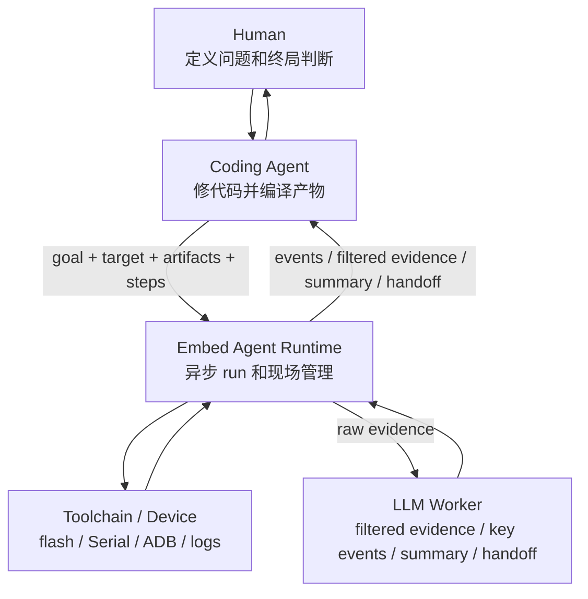

# Embed Agent 文档 Review

> 状态：Draft
> 日期：2026-04-28
> 目的：按当前确认的角色故事，检查所有现有文档是否一致，明确哪些是正式口径，哪些只是背景参考。

## 1. Review 基准

这次 review 只按一个故事判断文档是否成立：

```text
Human 是问题 Owner。
Coding Agent 读代码、改代码、编译产物、驱动验证。
Embed Agent Runtime 从产物进入真实设备现场开始接管。
Toolchain / Device 执行刷机、ADB、Serial 等真实动作。
LLM Worker 只读 evidence，先做前置过滤，再把现场摘要成人和 agent 能继续用的信息。
```

第一版从刷机和真实设备现场开始，不从 workspace、源码构建或审批系统开始。



## 2. 当前正式文档

| 文档 | 定位 | Review 结论 |
|---|---|---|
| [EMBED-AGENT-ROLE-MODEL.md](EMBED-AGENT-ROLE-MODEL.md) | 角色本质和分工 | 正式口径源头。后续功能和接口都应从它反推。 |
| [EMBED-AGENT-SCENARIOS-AND-CALLS.md](EMBED-AGENT-SCENARIOS-AND-CALLS.md) | Agent 如何调用、长任务如何交互 | 符合当前故事。强调 `create_run` 立即执行、不确认、不挡路。 |
| [EMBED-AGENT-FUNCTION-LIST.md](EMBED-AGENT-FUNCTION-LIST.md) | 功能清单 | 符合当前故事。已按角色和场景反推 P0。 |
| [EMBED-AGENT-FIRST-SLICE.md](EMBED-AGENT-FIRST-SLICE.md) | 第一条 Demo 链 | 符合当前故事。第一条链从 artifact 到 flash / Serial / ADB / evidence。 |
| [EMBED-AGENT-DIRECTION-AND-PRINCIPLES.md](EMBED-AGENT-DIRECTION-AND-PRINCIPLES.md) | 产品方向和原则 | 符合当前故事。用于守边界。 |
| [EMBED-AGENT-SPEC.md](EMBED-AGENT-SPEC.md) | 第一版规格 | 符合当前故事。用于后续实现验收。 |

推荐阅读顺序是：角色模型 -> 场景调用 -> 功能清单 -> 第一条薄片 -> 方向原则 -> 规格。

## 3. 背景参考文档

这些文档保留历史思考，但不再作为第一版正式需求来源。

| 文档 | 问题 | 当前处理 |
|---|---|---|
| [EMBED-AGENT-PRODUCT-FOUNDATION.md](EMBED-AGENT-PRODUCT-FOUNDATION.md) | 包含 workspace、build、recipe、verdict、确认流程等旧口径 | 顶部标注背景参考，冲突时以正式文档为准。 |
| [EMBED-AGENT-PRODUCT-STORYLINE.md](EMBED-AGENT-PRODUCT-STORYLINE.md) | 包含远端 build、push-only 首链、preview / confirm 等旧口径 | 顶部标注背景参考，不能作为第一版实现输入。 |
| [EMBED-AGENT-USABILITY-AND-ADOPTION.md](EMBED-AGENT-USABILITY-AND-ADOPTION.md) | 产品价值有参考意义，但功能对象偏旧 | 顶部标注背景参考，后续需要按新角色故事重写。 |

## 4. 已修正的不一致

| 不一致 | 修正方式 |
|---|---|
| 入口文档把 `Case` 放进“先记住”的核心对象 | 改成角色优先，再列 Runtime 第一版对象；`Case` 放到后续沉淀。 |
| `Failure Snapshot` 在场景里很重要，但功能清单像是完全 P1 | 改成最小版 P0，增强恢复和诊断放 P1。 |
| `candidate / verdict` 容易被理解成系统终判 | 统一成候选观察或候选结论，强调不内置固定通过规则。 |
| 文档阅读顺序偏方向和规格，弱化角色故事 | 调整为角色模型优先。 |
| 旧文档容易和正式口径混读 | 明确标成背景参考，不作为第一版需求来源。 |
| LLM Worker 只像“摘要器” | 改成 Evidence 前置过滤器，默认给 Coding Agent 过滤后的证据。 |
| Console 像后续可有可无 | 改成 Human 的直接入口；P0 做最小只读状态视图，完整 Console 后续做。 |

## 5. 当前故事是否完整

完整。

它有清楚的起点、执行链和收口：

```text
Human 定义问题
-> Coding Agent 修代码并编译产物
-> Embed Agent Runtime 接管真实设备现场
-> Toolchain / Device 执行真实动作
-> Runtime 保存 evidence
-> LLM Worker 过滤 evidence，生成 key events、observation summary 和 handoff
-> Coding Agent 决定下一轮
-> Human 做最终判断
```

它也覆盖了三个关键场景：

| 场景 | 是否符合当前故事 | 说明 |
|---|---|---|
| 普通代码修复闭环 | 符合 | Coding Agent 驱动修复，Runtime 只管真实设备现场和证据。 |
| 长任务卡死 / 无响应 | 符合 | Runtime 先留现场，恢复动作显式触发，不自动覆盖现场。 |
| CI / 非交互验证 | 方向符合，但非 P0 | CI 消费 evidence 和 summary，gate 规则由 CI 自己定义。 |

## 6. 当前不应提前做的事

- 不把 workspace 设成 P0 前提。
- 不让 Embed Agent 接管编译主线。
- 不要求先建 case 才能 run。
- 不要求先沉淀 recipe 才能 run。
- 不做逐次确认和审批挡路。
- 不把 LLM Worker 的输出当事实。
- 不把固定业务通过规则写进 Runtime。
- 不让 Console 和 MCP 各自保存状态。

## 7. 下一步应继续细化

- `steps` schema 的严格程度。
- 第一版 `flash` step 支持哪一种工具。
- `watch_serial` 是顺序 step 还是可以和 flash 并行。
- `get_run_events` 第一版用轮询还是 streaming。
- Evidence Package 目录结构。
- Observation Summary 第一版用规则摘要还是 LLM Worker。
- 最小 Console 先做 CLI/TUI/Web 哪种形态。
