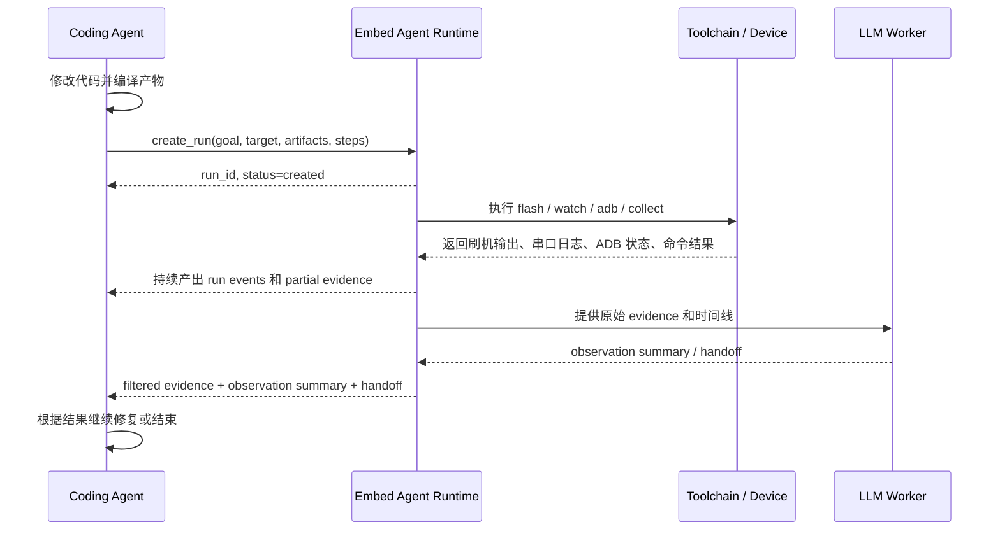
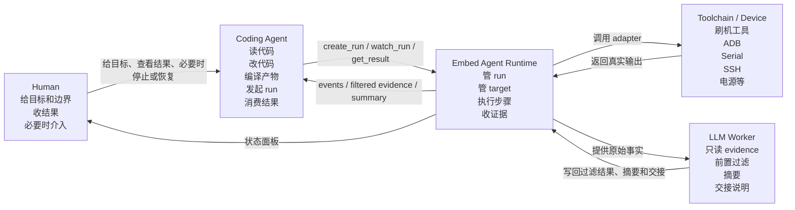
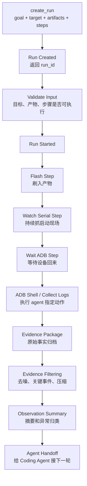
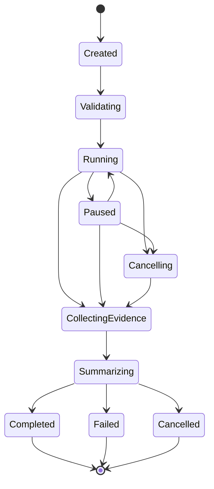
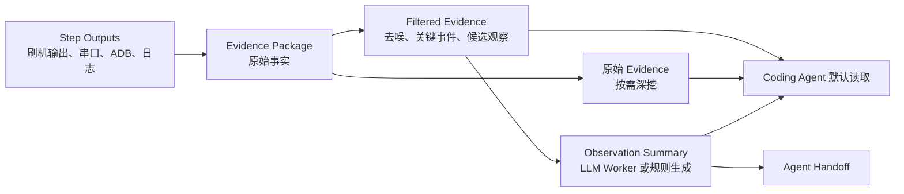

# Embed Agent 功能清单

> 状态：Draft
> 日期：2026-04-28
> 目的：按角色故事重新梳理第一版要做什么。先讲外部 agent 怎么用，再反推 runtime 需要哪些功能。

## 1. 当前口径

第一版不要先做一个“大而全验证平台”。

第一版的故事是：

```text
Coding Agent 负责读代码、改代码、编译产物。
Embed Agent 从产物进入真实设备现场开始接管。
```

也就是说，第一版主线不是：

```text
源码 -> build -> push -> run
```

而是：

```text
产物 -> flash / 下发 -> 启动观察 -> 命令执行 -> 日志采集 -> evidence -> 交接给 Coding Agent
```

`Embed Agent` 不替 agent 判断什么叫“业务通过”。  
它提供可组合的现场执行和观察能力，把事实完整留下来，再给出可解释的观察摘要。

## 2. 第一版主故事



这条故事里，关键不是让人填很多字段，也不是让 runtime 替 agent 做业务判断。

关键是：

- agent 能发起一个长任务 run。
- runtime 能异步执行真实设备动作。
- 运行中能持续看状态和证据。
- 结束后默认拿到过滤后的 evidence、可读摘要和原始 evidence 入口。
- agent 能基于这些结果继续修代码。

## 3. 角色分工



| 角色 | 负责什么 | 不负责什么 |
|---|---|---|
| Human | 给目标、定边界、看结果、必要时介入 | 不手工拼完整验证流程 |
| Coding Agent | 改代码、编译产物、发起 run、读取结果、继续修复 | 不直接控制设备连接和刷机过程 |
| Embed Agent Runtime | 管异步 run、目标设备、步骤执行、事件、证据 | 不编译源码，不替 agent 写代码 |
| LLM Worker | 基于证据做前置过滤、摘要、归类、交接说明 | 不保管事实，不直接控制设备 |
| Toolchain / Device | 执行刷机、ADB、Serial、SSH、电源等真实动作 | 不知道 case、业务目标和最终判断 |

## 4. Agent 怎么调用

第一版对外不是一个“同步执行并返回最终结果”的工具。  
它是一个异步 runtime。

### 4.1 最小请求

```json
{
  "goal": "把新固件刷到 board-01，并观察启动是否异常",
  "target": "board-01",
  "artifacts": [
    {
      "id": "firmware",
      "kind": "firmware_image",
      "path": "/path/to/firmware.img",
      "checksum": "optional"
    }
  ],
  "steps": [
    { "type": "flash", "artifact_id": "firmware" },
    { "type": "watch_serial", "duration_sec": 120 },
    { "type": "wait_adb", "timeout_sec": 180 },
    { "type": "adb_shell", "command": "dmesg | tail -100" }
  ],
  "source_ref": {
    "revision": "optional",
    "note": "optional"
  }
}
```

这里有几个原则：

- `goal` 是给人和 LLM Worker 理解任务用的，不是硬编码判定规则。
- `target` 是必须的，没有目标设备就没有现场验证。
- `artifacts` 是必须的，因为编译在 Coding Agent 那边完成。
- `steps` 是必须的，因为 runtime 提供能力，不替 agent 猜完整流程。
- `source_ref` 是可选的，只用于把结果回绑到代码上下文。

### 4.2 最小接口

| 接口 | 做什么 |
|---|---|
| `create_run` | 创建并立即开始执行 run，返回 `run_id` 和动作摘要 |
| `get_run` | 查询 run 当前状态、阶段、最近事件 |
| `watch_run` | 订阅或拉取运行事件 |
| `get_partial_evidence` | 运行中读取已经采集到的证据 |
| `cancel_run` | 取消长任务，但保留已采集证据 |
| `get_run_result` | run 结束后读取过滤后的证据、摘要、关键事件和原始证据入口 |
| `list_targets` | 查询可用目标设备 |
| `get_target` | 查询某个目标设备状态和能力 |
| `get_console_view` | 给 Human 读取最小状态视图 |

第一版没有 `confirm_run`。  
调试开发场景里，动作透明和可追溯比逐次拦截更重要。

## 5. 一次 run 怎么流动



运行过程中，`Run` 不是一个阻塞函数，而是一个长期存在的对象。



取消不等于丢弃。  
只要 run 已经开始，取消后也要保留 partial evidence。

## 6. P0 功能

P0 只服务第一条主故事：agent 已经有产物，Embed Agent 从刷机和现场观察开始接管。

### 6.1 Async Run

| 项 | 内容 |
|---|---|
| 要做什么 | 把一次真实设备操作建成异步 run，创建后立刻返回 `run_id`。 |
| 谁会用 | Coding Agent 用它发起和追踪长任务；Human 用它看进展。 |
| 为什么要做 | 刷机、启动、串口观察都可能持续很久，不能阻塞等最终结果。 |
| 缺了会怎样 | agent 会长时间失明，只能等一个最终包，中途无法判断卡在哪。 |
| 第一版范围 | 支持创建、启动、查询、取消、结束状态。 |

### 6.2 Target

| 项 | 内容 |
|---|---|
| 要做什么 | 描述一块目标设备，包括名称、连接方式、支持的步骤能力。 |
| 谁会用 | Coding Agent 指定目标；Runtime 找到设备；Adapter 找到真实连接参数。 |
| 为什么要做 | 没有目标设备，就没有真实现场。 |
| 缺了会怎样 | agent 只能说“跑一下”，runtime 不知道刷哪块板。 |
| 第一版范围 | 至少支持一块设备，包含刷机方式、串口、ADB。 |

### 6.3 Target Runtime State

| 项 | 内容 |
|---|---|
| 要做什么 | 记录设备当前状态，例如 online、flashing、booting、adb_ready、serial_active、busy、unknown。 |
| 谁会用 | Runtime 判断步骤是否可执行；Coding Agent 查询现场状态；Console 展示现场。 |
| 为什么要做 | 设备画像是静态的，run 需要知道设备此刻是否可用。 |
| 缺了会怎样 | 失败时分不清是刷机失败、设备没回来，还是连接断了。 |
| 第一版范围 | 记录当前状态、最后心跳、当前 run、关键连接状态。 |

### 6.4 Artifact Intake

| 项 | 内容 |
|---|---|
| 要做什么 | 接收 Coding Agent 编译好的产物，记录路径、类型、大小、可选校验值。 |
| 谁会用 | Coding Agent 提供产物；Runtime 校验输入；Evidence 记录产物来源。 |
| 为什么要做 | 第一版编译不归 Embed Agent 管，但刷机必须知道刷什么。 |
| 缺了会怎样 | runtime 只能操作设备，无法把 agent 的代码结果带到设备上。 |
| 第一版范围 | 支持本地文件路径和基本 metadata。 |

### 6.5 Step Plan

| 项 | 内容 |
|---|---|
| 要做什么 | 让 agent 用一组步骤描述本次要执行的现场动作。 |
| 谁会用 | Coding Agent 组合步骤；Runtime 按顺序执行；Evidence 按步骤归档。 |
| 为什么要做 | Embed Agent 提供能力，不应该替 agent 固定什么叫验证通过。 |
| 缺了会怎样 | 系统只能跑固定流程，agent 无法根据问题选择观察和采集方式。 |
| 第一版范围 | 支持 `flash`、`watch_serial`、`wait_adb`、`adb_shell`、`collect_logs`、`sleep`。 |

### 6.6 Step Executor

| 项 | 内容 |
|---|---|
| 要做什么 | 按 Step Plan 执行步骤，管理每步开始、结束、失败、超时和输出。 |
| 谁会用 | Runtime 内部使用；Coding Agent 通过 run events 观察。 |
| 为什么要做 | 长任务不是单个命令，而是一串可观察、可失败、可归档的动作。 |
| 缺了会怎样 | 所有步骤会糊成一个大脚本，失败后不知道是哪一步坏了。 |
| 第一版范围 | 支持顺序执行、失败停止、超时、取消。 |

### 6.7 Flash Step

| 项 | 内容 |
|---|---|
| 要做什么 | 把指定 artifact 刷到目标设备，记录刷机命令、输出、耗时、结果。 |
| 谁会用 | Coding Agent 请求刷产物；Runtime 调 adapter；Evidence 记录事实。 |
| 为什么要做 | 当前主线从刷机开始，这是 Embed Agent 接管现场的第一步。 |
| 缺了会怎样 | 第一版只能观察设备，不能把新产物带进真实现场。 |
| 第一版范围 | 支持一种目标设备的一种刷机方式，先把契约跑通。 |

### 6.8 Serial Watch Step

| 项 | 内容 |
|---|---|
| 要做什么 | 持续读取串口输出，保存原始日志，并打时间戳。 |
| 谁会用 | Runtime 采集启动现场；LLM Worker 后续摘要；Coding Agent 读取证据。 |
| 为什么要做 | 启动失败、卡死、panic 很多时候只在串口里有现场。 |
| 缺了会怎样 | 刷完之后只能知道设备有没有回来，看不到启动过程发生了什么。 |
| 第一版范围 | 支持按时长 watch，保存 raw serial log。 |

### 6.9 Wait ADB Step

| 项 | 内容 |
|---|---|
| 要做什么 | 等待目标设备 ADB 恢复，记录恢复时间、失败原因和超时。 |
| 谁会用 | Runtime 判断后续 ADB 命令能不能跑；Coding Agent 看设备是否回来。 |
| 为什么要做 | 刷机后常见问题是设备没有重新出现。 |
| 缺了会怎样 | 后续 adb shell 会直接失败，但证据里说不清是系统没起还是命令错。 |
| 第一版范围 | 支持 timeout 和状态事件。 |

### 6.10 ADB Shell Step

| 项 | 内容 |
|---|---|
| 要做什么 | 在设备恢复后执行 agent 指定的 ADB shell 命令。 |
| 谁会用 | Coding Agent 指定采集命令或 smoke 命令；Runtime 执行并记录。 |
| 为什么要做 | Embed Agent 不决定什么叫通过，但要提供 agent 可组合的检查能力。 |
| 缺了会怎样 | agent 只能刷机和看串口，不能主动采集系统状态。 |
| 第一版范围 | 支持单条或少量命令，记录 stdout、stderr、exit code。 |

### 6.11 Collect Logs Step

| 项 | 内容 |
|---|---|
| 要做什么 | 采集设备日志，例如 logcat、dmesg、指定文件或目录。 |
| 谁会用 | Coding Agent 指定要采什么；Evidence 保存结果；LLM Worker 摘要。 |
| 为什么要做 | 刷机和启动只是过程，定位问题还需要运行期日志。 |
| 缺了会怎样 | 证据包只有刷机日志和串口，下一轮修复信息不足。 |
| 第一版范围 | 先支持 ADB 可访问日志。 |

### 6.12 Run Events

| 项 | 内容 |
|---|---|
| 要做什么 | 持续输出 run 事件，例如 step_started、step_output、step_failed、device_state_changed、evidence_ready。 |
| 谁会用 | Coding Agent 观察长任务；Console 展示进度；Evidence 生成时间线。 |
| 为什么要做 | 长任务不能等最终结果才知道发生了什么。 |
| 缺了会怎样 | agent 只能盲等，无法中途判断是否取消、等待或读取 partial evidence。 |
| 第一版范围 | 支持查询最近事件；后续再做真正流式订阅。 |

### 6.13 Action Visibility / Audit

| 项 | 内容 |
|---|---|
| 要做什么 | 在 run 创建时返回动作摘要，并记录本次做过哪些设备动作。 |
| 谁会用 | Coding Agent 可以展示给用户；Human 可以事后查看；Runtime 用于审计。 |
| 为什么要做 | 用户不需要被每次确认打断，但需要看得见 agent 让系统做了什么。 |
| 缺了会怎样 | 系统虽然跑得快，但人和 agent 事后说不清到底刷了什么、采了什么。 |
| 第一版范围 | 记录 target、artifacts、steps、started_by、时间线和最终状态；不做审批。 |

### 6.14 Partial Evidence

| 项 | 内容 |
|---|---|
| 要做什么 | run 未结束时，也能读取已经采集到的日志、事件和步骤结果。 |
| 谁会用 | Coding Agent 中途判断；Human 看长任务是否卡住。 |
| 为什么要做 | 刷机和观察可能很长，不能所有证据都等结束才出现。 |
| 缺了会怎样 | 卡死现场可能已经出现，但 agent 还在等最终结果。 |
| 第一版范围 | 支持按 run_id 读取当前已有 evidence。 |

### 6.15 Failure Snapshot

| 项 | 内容 |
|---|---|
| 要做什么 | 在 step timeout、ADB 未恢复、串口长时间无输出等基础异常发生时，保存最后现场。 |
| 谁会用 | Coding Agent 判断下一步；Human 决定是否接管或恢复设备。 |
| 为什么要做 | 卡死现场最容易在恢复动作前丢掉，必须先留证据再谈恢复。 |
| 缺了会怎样 | 设备一重启或断电，最关键的失败现场就没了。 |
| 第一版范围 | 保存当前 step、最后 N 行串口、ADB 状态、Serial 状态、时间戳、已采集 evidence 索引；恢复建议可选。 |

### 6.16 Evidence Package

| 项 | 内容 |
|---|---|
| 要做什么 | 把一次 run 的原始事实打包，包括产物信息、步骤记录、刷机输出、串口日志、ADB 状态、采集日志。 |
| 谁会用 | Coding Agent 必要时深挖；Human 复盘；LLM Worker 生成过滤结果和摘要。 |
| 为什么要做 | Embed Agent 的核心价值是把真实现场留下来。 |
| 缺了会怎样 | 跑完只剩零散终端输出，下一轮还要重新拼现场。 |
| 第一版范围 | 原始事实和 LLM 摘要要分开保存。 |

### 6.17 Observation Summary

| 项 | 内容 |
|---|---|
| 要做什么 | 基于过滤后的 evidence 生成可读观察摘要，例如做了哪些步骤、哪里失败、关键日志是什么。 |
| 谁会用 | Coding Agent 快速理解现场；Human 看结果。 |
| 为什么要做 | 原始日志太长，agent 和人都需要压缩后的现场说明。 |
| 缺了会怎样 | 虽然证据在，但每次都要重新翻长日志。 |
| 第一版范围 | 只做摘要和异常归类，不硬编码业务是否通过。 |

### 6.18 Evidence Filtering

| 项 | 内容 |
|---|---|
| 要做什么 | 把几 MB 原始 evidence 过滤成几 KB 的结构化信息，包括 summary、key events、异常片段、候选观察和原始证据引用。 |
| 谁会用 | Coding Agent 默认消费过滤结果；Human 先看过滤结果，再按需深挖原始 evidence。 |
| 为什么要做 | 原始日志直接塞给 Coding Agent 会污染上下文、浪费 token，也会让修复 agent 被迫做日志清洗。 |
| 缺了会怎样 | Coding Agent 每轮都要翻大量串口和 ADB 输出，修复闭环会慢且不稳定。 |
| 第一版范围 | 可以先用规则摘要加 LLM Worker；输出必须能回溯到原始 evidence。 |

### 6.19 Agent Handoff

| 项 | 内容 |
|---|---|
| 要做什么 | 给 Coding Agent 一段可接手的说明：本次输入、执行步骤、关键观察、建议下一步查看的证据。 |
| 谁会用 | Coding Agent 接下一轮修复。 |
| 为什么要做 | 这个系统的价值是把验证结果接回修复闭环。 |
| 缺了会怎样 | agent 只能拿到一堆文件，不知道下一步该看哪里。 |
| 第一版范围 | run 级 handoff，不做 case 级长期总结。 |

### 6.20 Entry for Agent

| 项 | 内容 |
|---|---|
| 要做什么 | 给外部 Coding Agent 提供稳定入口，创建 run、查询状态、读取证据和结果。 |
| 谁会用 | Codex、Claude Code、OpenCode 等外部 agent。 |
| 为什么要做 | Embed Agent 首先是给 agent 接入真实设备现场的 runtime。 |
| 缺了会怎样 | 系统会退化成只能人手工操作的工具。 |
| 第一版范围 | 先定义 MCP / CLI 的同一套语义，具体入口可以先实现一个。 |

### 6.21 Minimal Console View

| 项 | 内容 |
|---|---|
| 要做什么 | 给 Human 一个直接看 Runtime 状态的入口，显示当前 run、阶段、action summary、关键事件、日志片段、failure snapshot 和结果摘要。 |
| 谁会用 | Human 监控长任务、查看结果、必要时接管设备；Coding Agent 不需要代替 Human 转述所有状态。 |
| 为什么要做 | Human 是问题 Owner，不能只能通过 Coding Agent 问“现在在干嘛、跑完没、失败现场是什么”。 |
| 缺了会怎样 | 系统对 agent 可用，但对人不透明；现场异常时 Human 接管成本高。 |
| 第一版范围 | 只读最小状态视图即可，可以先是 CLI/TUI/Web 任一种形态；完整历史和深度 Evidence 浏览后续再做。 |

## 7. P1 功能

P1 不是第一条链的阻塞条件，而是让系统从“能跑一次”变成“能反复用”。

| 功能 | 为什么要做 | 为什么不是 P0 |
|---|---|---|
| Case | 聚合多次 run，追踪一个问题的修复过程 | 第一次 run 不应该先要求 case |
| Recipe | 保存常用 Step Plan，下次复用 | P0 先让 agent 直接传 steps |
| Source Context / Revision | 把 run 结果回绑代码版本、PR、commit | 可选 metadata，不该挡住刷机验证 |
| Target Reservation | 防止多个 run 抢同一块设备 | 个人开发第一版可以先简单锁定 active run |
| Recovery | 设备异常后重连、重启、恢复 | 需要先有 failure evidence，再做恢复策略 |
| Failure Snapshot 增强 | 更完整的现场诊断、恢复建议、对比信息 | P0 只做最小 snapshot，增强项后续做 |
| Full Console | Run 历史、Case 聚合、多 target 面板、Evidence 深度浏览 | P0 只做最小 Human 状态视图 |
| Config Normalize | 把目标和步骤配置持久化 | P0 可以先用最小配置和显式请求 |

## 8. P2 功能

| 功能 | 为什么后做 |
|---|---|
| Build Adapter | 编译是 Coding Agent 的事，Embed Agent 后续可作为扩展接管部分构建 |
| Workspace | 这是代码工作区概念，不应作为 runtime P0 前提 |
| Risk Preview / Approval | 个人开发调试不应被确认流程阻塞，后续多人共享和高风险环境再加强 |
| CI / HIL | 需要 reservation、非交互策略和稳定 evidence schema |
| 多设备拓扑 | 先跑通单 target，再扩展多设备 |
| Power Control | 依赖恢复策略和硬件资源建模 |
| Probe 调试 | 依赖更完整的 target profile 和 adapter 契约 |
| Baseline 对比 | 依赖稳定 run history 和指标 schema |

## 9. Evidence 和 Summary 分开

这里要专门说清楚。



`Evidence Package` 只放事实：

- 输入 artifact metadata
- step plan
- step timeline
- flash output
- serial raw log
- ADB state
- command stdout / stderr / exit code
- collected logs

`Filtered Evidence` 是默认给 Coding Agent 看的前置过滤结果：

- summary
- key events
- 异常片段
- 重要时间点
- candidate observation
- 原始 evidence 引用

`Observation Summary` 是解释：

- 本次做了什么
- 关键异常是什么
- 哪一步失败或超时
- 哪些日志值得 Coding Agent 看
- 可选的候选观察，但必须带依据

不能把解释当事实。  
LLM Worker 的输出必须能回溯到原始 evidence。

默认情况下，Coding Agent 读 `Filtered Evidence + Observation Summary + Agent Handoff`。  
原始 Evidence Package 不丢，供 Human 深挖、复盘和归档。

## 10. 第一版最小交付范围

第一版最小范围：

| 功能 | 是否 P0 |
|---|---|
| Async Run | P0 |
| Target | P0 |
| Target Runtime State | P0 |
| Artifact Intake | P0 |
| Step Plan | P0 |
| Step Executor | P0 |
| Flash Step | P0 |
| Serial Watch Step | P0 |
| Wait ADB Step | P0 |
| ADB Shell Step | P0 |
| Collect Logs Step | P0 |
| Run Events | P0 |
| Partial Evidence | P0 |
| Failure Snapshot | P0 |
| Evidence Package | P0 |
| Evidence Filtering | P0 |
| Observation Summary | P0 |
| Agent Handoff | P0 |
| Agent Entry | P0 |
| Minimal Console View | P0 |
| Action Visibility / Audit | P0 |

明确不作为 P0：

| 功能 | 放到 |
|---|---|
| Workspace | P2 |
| Build Adapter | P2 |
| Case | P1 |
| Recipe | P1 |
| Risk Preview / Approval | P2 |
| 固定 Verdict 规则 | 不做成系统内置规则 |

## 11. 收口

第一版要证明的不是“我们能不能定义一套完整平台对象”。

第一版要证明的是：

```text
Coding Agent 编译好产物以后，
Embed Agent 能稳定接管真实设备现场，
执行刷机和观察步骤，
持续留下证据，
最后把现场讲清楚并交还给 Coding Agent。
```

这个故事跑通以后，再讨论 `Case`、`Recipe`、`Workspace`、`CI`、共享实验室这些沉淀和规模化能力。
