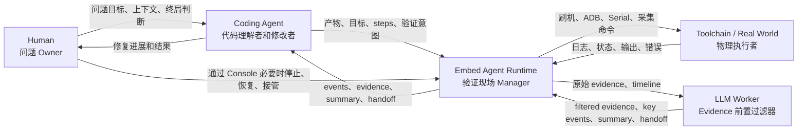
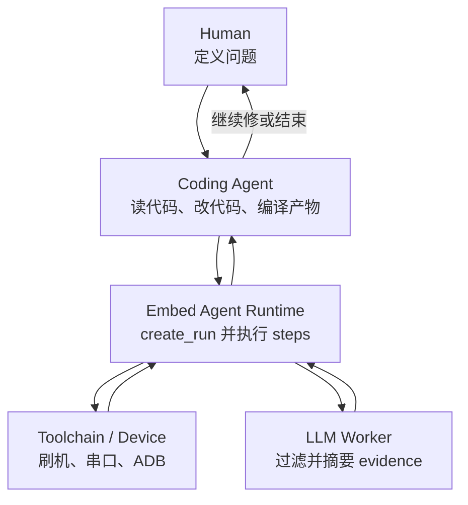

# Embed Agent 角色模型与协作分层

> 状态：Draft
> 日期：2026-04-28
> 目的：把每个角色的本质、职责、输入输出和边界讲清楚。后续场景、接口、功能清单都按这份分工展开。

## 1. 先说结论

`Embed Agent` 不是一个孤立 agent。

它是一个分层协作系统：

```text
Human 是问题 Owner
Coding Agent 是代码理解者和修改者
Embed Agent Runtime 是验证现场 Manager
LLM Worker 是 Evidence 前置过滤器
Toolchain / Real World 是物理执行者
```

一句人话：

```text
人定义问题和终局判断。
Coding Agent 读代码、改代码、编译产物、决定下一轮怎么修。
Embed Agent 接住真实设备现场，执行步骤、看状态、留证据。
LLM Worker 先把复杂证据过滤成人和 Coding Agent 能消费的信息。
Toolchain 负责对刷机工具、ADB、Serial、SSH、设备这些真实世界执行动作。
```

这五层不能混。

如果混了，产品会变成：

- Runtime 去假装自己会修代码。
- Coding Agent 被迫管设备连接和串口细节。
- LLM Worker 变成事实来源。
- Human 又回去手工盯日志和拼命令。

## 2. 总体协作图



## 3. Human

### 3.1 本质

Human 是问题的 Owner。

代码是 Human 要交付的，设备是 Human 的，问题最终也是 Human 要负责解决的。AI 和 runtime 都是帮手。

### 3.2 为什么存在

没有 Human，系统不知道真正要解决什么，也不知道什么时候可以结束。

Human 负责目标和责任，不负责体力活。

### 3.3 做什么

- 定义问题：现在在修什么，现象是什么。
- 提供上下文：哪块板、哪个产物、什么异常、什么约束。
- 看结果：是否接受本轮观察和候选判断。
- 做终局判断：继续修、结束、换方向、人工接管。
- 处理意外：设备真的挂住时，决定是否恢复、断电、放弃本轮。
- 直接看现场：通过 Console 看当前 run、阶段、关键日志和摘要。

### 3.4 不做什么

- 不手工拼完整验证流程。
- 不长期盯串口。
- 不负责把日志整理成证据包。
- 不反复解释同一块板怎么连、怎么刷、怎么看。

### 3.5 输入和输出

| 方向 | 内容 |
|---|---|
| 输入 | Console 状态视图、Observation Summary、Evidence Package、Agent Handoff、Coding Agent 的修复说明 |
| 输出 | 问题定义、目标边界、最终决策、必要时的人工恢复或接管 |

## 4. Coding Agent

### 4.1 本质

Coding Agent 是代码的理解者和修改者。

它是修复闭环的驱动者：把 Human 的问题变成代码变更，把 Embed Agent 的现场结果变成下一步修复策略。

### 4.2 为什么存在

代码修改需要读代码、理解调用链、做 patch、编译产物。  
这些不是 Embed Agent Runtime 的职责。

### 4.3 做什么

- 读代码：理解结构、定位问题。
- 改代码：写修复、补测试、调整配置。
- 编译产物：生成可刷固件、镜像、包或可下发产物。
- 发起验证：调用 `create_run`，传入 target、artifacts、steps 和验证意图。
- 观察长任务：读取 run status、events、partial evidence。
- 读结果：消费 evidence、observation summary、handoff。
- 深挖证据：默认读过滤后的 summary / key events，需要时再按时间点读取原始 evidence。
- 决定下一步：继续改、换验证方式、结束、请求 Human 介入。

### 4.4 不做什么

- 不直接管设备连接。
- 不直接拼刷机工具命令。
- 不直接持有串口状态。
- 不负责证据归档格式。
- 不把自己变成现场状态机。

### 4.5 输入和输出

| 方向 | 内容 |
|---|---|
| 输入 | Human 的问题目标、代码仓库、Filtered Evidence、Observation Summary、Key Events、Handoff、必要时的原始 Evidence |
| 输出 | 代码变更、编译产物、Run 请求、下一轮修复决策 |

### 4.6 和 LLM Worker 的边界

Coding Agent 和 LLM Worker 都会“分析”，但方向不同：

| 角色 | 分析什么 | 目的 |
|---|---|---|
| Coding Agent | 代码和修复策略 | 决定怎么改 |
| LLM Worker | 本次 run 的 evidence | 先过滤、再说明发生了什么 |

LLM Worker 的输出是给 Coding Agent 用的输入，不替 Coding Agent 修代码。

## 5. Embed Agent Runtime

### 5.1 本质

Embed Agent Runtime 是验证现场的 Manager。

它管真实设备现场，把原本临时拼出来的刷机、连接、观察、采集、证据归档，变成稳定的异步 run。

### 5.2 为什么存在

嵌入式验证最碎的不是“写代码”，而是代码产物进入设备之后的现场：

- 哪块板。
- 怎么刷。
- 串口是否还在。
- ADB 是否回来。
- 日志在哪里。
- 卡死前现场有没有留下。
- 下一轮 agent 能不能接上。

这些不该每次都靠人和 coding agent 手工拼。

### 5.3 做什么

- 接收 Coding Agent 的产物、target、steps 和 goal。
- 创建异步 `Run`，立即返回 `run_id`。
- 管理 target runtime state。
- 调用 flash、Serial、ADB、collect logs 等 adapter。
- 持续产生 run events。
- 保存 partial evidence。
- 生成 Evidence Package。
- 把原始 evidence 交给 LLM Worker 做过滤、摘要和交接说明。
- 暴露 MCP / CLI / Console 入口。
- 记录 action visibility 和 audit，让人看得到做过什么。

### 5.4 不做什么

- 不读代码、不改代码。
- 第一版不编译产物。
- 不替 agent 固定业务通过规则。
- 不默认做审批拦截。
- 不把 LLM 生成内容当事实。

### 5.5 输入和输出

| 方向 | 内容 |
|---|---|
| 输入 | goal、target、artifacts、steps、可选 source_ref / case_id |
| 输出 | run_id、events、partial evidence、Evidence Package、Filtered Evidence、Observation Summary、Key Events、Handoff、Console 状态 |

## 6. LLM Worker

### 6.1 本质

LLM Worker 是 Evidence 的前置过滤器。

它不是 Coding Agent 的替代品，也不是现场状态机。

它的核心价值不是“再分析一次代码”，而是在原始 evidence 进入 Coding Agent 上下文前，先做压缩、去噪、归类和交接。

### 6.2 为什么存在

原始 evidence 可能很大：

- 串口日志很长。
- ADB 输出很多。
- 刷机工具日志噪声多。
- 时间线里事件多。
- 还有时间戳、连接状态、缓冲区噪声和重复输出。

如果这些内容直接塞给 Coding Agent，会污染上下文、浪费 token，也会让 Coding Agent 被迫做大量现场日志清洗。

Coding Agent 和 Human 都应该先看到几 KB 的过滤结果，再按需深挖原始 evidence。

### 6.3 做什么

- 去噪：删掉低价值重复输出。
- 摘要：说明这次 run 做了什么。
- 提炼：把几 MB 原始 evidence 压成几 KB 可读信息。
- 归类：标出异常、超时、关键事件。
- 列出 Key Events：标出 crash、断连、ADB 恢复、关键日志出现的时间点。
- 生成 Observation Summary。
- 生成 Candidate Observation：如果证据足够，给出带依据的候选观察或候选结论。
- 生成 Handoff：告诉 Coding Agent 下一步最值得看哪里。

### 6.4 不做什么

- 不控制设备。
- 不直接读串口或 ADB。
- 不保管事实状态。
- 不伪造 evidence。
- 不替 Human 做终局判断。
- 不替 Coding Agent 改代码。

### 6.5 输入和输出

| 方向 | 内容 |
|---|---|
| 输入 | 原始 Evidence Package、run timeline、goal、step plan |
| 输出 | Filtered Evidence、Summary、Key Events、Candidate Observation、Agent Handoff |

默认交给 Coding Agent 的是过滤后的 evidence。  
原始 Evidence Package 仍由 Runtime 完整保存，供 Human 深挖、复盘和后续归档。

## 7. Toolchain / Real World

### 7.1 本质

Toolchain / Real World 是物理现实的执行者。

它是系统能影响真实设备的边界。

### 7.2 为什么存在

代码最终要跑在真实设备上。  
虚拟分析不能替代刷机、启动、串口、ADB、SSH、probe、电源这些真实动作。

### 7.3 做什么

- flash tool 执行刷机。
- ADB 执行 shell、拉日志、检查设备状态。
- Serial 输出启动和异常现场。
- SSH / Telnet / Probe / Power 后续作为扩展执行真实动作。
- 返回 stdout、stderr、exit code、日志流、连接状态。

### 7.4 不做什么

- 不知道 case。
- 不理解业务目标。
- 不判断修复是否生效。
- 不决定下一步。

### 7.5 输入和输出

| 方向 | 内容 |
|---|---|
| 输入 | Runtime 传入的具体命令、参数、产物路径、连接参数 |
| 输出 | 原始输出、设备状态、错误码、日志流 |

## 8. 三个核心场景里的角色分工

### 8.1 普通代码修复闭环



完整性检查：

| 环节 | 是否完整 |
|---|---|
| 起点 | Human 定义问题 |
| 修复 | Coding Agent 修改代码并编译产物 |
| 验证 | Runtime 接管真实设备现场 |
| 证据 | Runtime 保存 evidence |
| 解释 | LLM Worker 生成 filtered evidence / summary / handoff |
| 决策 | Coding Agent 决定下一轮，Human 做最终判断 |

### 8.2 黑卡死 / 无响应现场抓取

```text
Run 正在执行
-> Runtime 检测基础异常
-> Runtime 自动保存 failure snapshot
-> Run 进入 failed 或 paused
-> Coding Agent / Human 读取 partial evidence
-> Human 或 Coding Agent 显式触发恢复动作
```

关键点：

- Runtime 负责留现场。
- Runtime 不自动救设备。
- Recovery 是显式动作。
- Evidence Before Recovery 是底线。

### 8.3 CI / 非交互验证

CI 不是 P0，但角色故事要预留：

```text
CI 提供产物、target 和 steps
-> Runtime 执行 run
-> Runtime 输出 evidence、summary、candidate observation
-> CI 根据自己配置的 gate 规则做通过或失败
-> 失败后把 evidence 交给 Human / Coding Agent
```

关键点：

- CI 不是 Human，也不是 Coding Agent。
- CI 可以消费 candidate observation，但 gate 规则不能只藏在 Embed Agent 里。
- 失败后要回到 Human / Coding Agent 的修复闭环。

## 9. 这份角色模型反推的产品要求

| 要求 | 原因 |
|---|---|
| create_run 后立即执行 | 开发调试不需要审批式流程 |
| action_summary 可见但不挡路 | 人要看得到，不需要每次点确认 |
| Evidence 和 Summary 分开 | 事实和解释不能混 |
| LLM Worker 做前置过滤 | 避免 Coding Agent 上下文被原始日志污染 |
| Human 有直接状态入口 | Human 不应只能通过 Coding Agent 问进度 |
| Workspace 不是 P0 | 代码工作区归 Coding Agent 管 |
| Build Adapter 不是 P0 | 编译归 Coding Agent 管 |
| Case 不是 P0 | 第一次 run 不应该先创建 case |
| Recipe 不是 P0 | P0 直接传 steps，recipe 后续沉淀 |
| 固定 Verdict 规则不是 P0 | 什么叫通过由 agent / Human / CI 的目标决定 |

## 10. 收口

最终故事是：

```text
Human 提问题。
Coding Agent 修代码并编译产物。
Embed Agent 接管产物进入真实设备后的执行和观察。
LLM Worker 过滤 evidence 并把现场讲清楚。
Coding Agent 基于证据继续修。
Human 做最终判断。
```

这条故事完整，第一版就围绕它收口。
