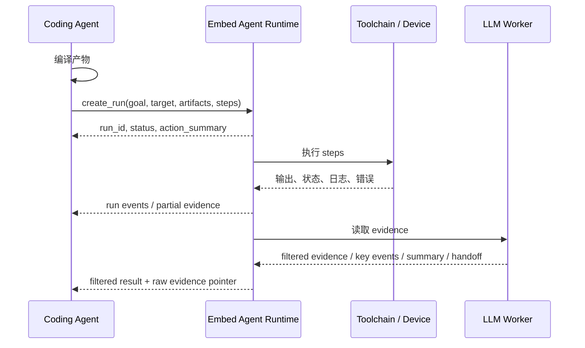
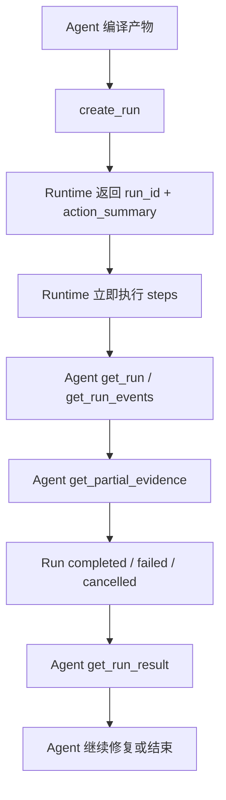
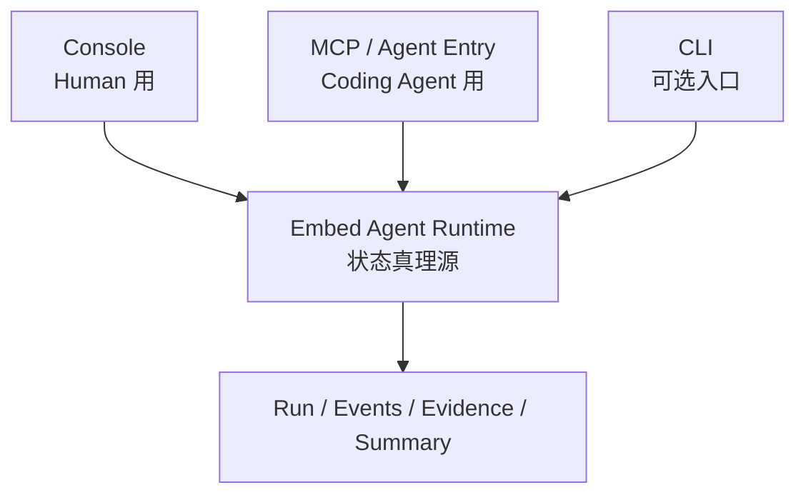

# Embed Agent 场景与调用模型

> 状态：Draft
> 日期：2026-04-28
> 目的：先把外部 agent 怎么调用 `Embed Agent` 讲清楚，再反推功能清单和接口。这里讨论的是产品交互，不是内部实现。

## 1. 先定几条口径

第一版按个人开发和调试现场来设计。

核心原则：

- `Coding Agent` 负责读代码、改代码、编译产物。
- `Embed Agent` 从产物进入真实设备现场开始接管。
- `create_run` 创建后立即执行，不需要 `confirm_run`，也不需要 `start_run` 作为主线。
- 系统要让人和 agent 看得到会做什么、正在做什么、做过什么，但不默认拦路。
- `Evidence` 是事实，`Observation Summary` 是解释，两者必须分开。
- Coding Agent 默认消费过滤后的 evidence；原始 evidence 保留在 Runtime 里，按需深挖。
- `Embed Agent` 不内置固定通过规则。agent 根据目标、事实和摘要决定下一步。

一句话：

```text
Embed Agent 不是审批系统。
它是 agent 进入真实设备现场后的执行、观察和证据 runtime。
```

## 2. 最小调用模型

第一版对外只需要围绕 `Run` 设计。



最小接口：

| 接口 | 作用 | 是否 P0 |
|---|---|---|
| `create_run` | 创建并立即开始执行 run，返回 `run_id` 和动作摘要 | 是 |
| `get_run` | 查询当前状态、当前步骤、最近事件、证据位置 | 是 |
| `get_run_events` | 拉取或订阅 run 事件 | 是，第一版可先轮询 |
| `get_partial_evidence` | 运行中读取已采集事实 | 是 |
| `cancel_run` | 取消长任务，但保留已有证据 | 是 |
| `get_run_result` | 读取过滤后的 evidence、summary、key events、handoff 和原始证据入口 | 是 |
| `list_targets` | 查询可用目标设备 | 是 |
| `get_target` | 查询目标设备状态和能力 | 是 |
| `get_console_view` | 给 Human 读取最小状态视图 | P0 可读最小版 |
| `recover_run` | 人或 agent 显式触发恢复动作 | P1 |

第一版没有这些主线接口：

| 接口 | 为什么不做主线 |
|---|---|
| `confirm_run` | 调试开发场景不需要每次确认，能看见就够了 |
| `start_run` | `create_run` 后立即执行，避免多一步状态协调 |
| `run_recipe` | P0 先让 agent 直接传 steps，recipe 后续再沉淀 |
| `build` | 编译是 Coding Agent 的事情 |

## 3. create_run 最小输入

```json
{
  "goal": "把新固件刷到 board-01，并观察启动是否异常",
  "target": "board-01",
  "artifacts": [
    {
      "id": "firmware",
      "kind": "firmware_image",
      "path": "/path/to/firmware.img",
      "checksum": "optional"
    }
  ],
  "steps": [
    { "type": "flash", "artifact_id": "firmware" },
    { "type": "watch_serial", "duration_sec": 120 },
    { "type": "wait_adb", "timeout_sec": 180 },
    { "type": "adb_shell", "command": "dmesg | tail -100" }
  ],
  "source_ref": {
    "revision": "optional",
    "note": "optional"
  },
  "case_id": "optional"
}
```

信息必要性：

| 信息 | 是否必需 | 来源 | 缺了会怎样 |
|---|---|---|---|
| `goal` | 建议必需 | Coding Agent 用自然语言描述 | 摘要和交接会少上下文，但 run 仍可执行 |
| `target` | 必需 | Agent 指定，或用户预设默认目标 | 不知道操作哪块板 |
| `artifacts` | 对刷机场景必需 | Coding Agent 编译产物 | 不知道刷什么 |
| `steps` | 必需 | Coding Agent 组合 | Runtime 不替 agent 猜完整验证流程 |
| `source_ref` | 可选 | Agent 从 git / PR /任务上下文提供 | Evidence 不能回绑到代码上下文，但不影响执行 |
| `case_id` | 可选 | Agent 或后续系统生成 | 多次 run 暂时不能自动串成问题线索 |
| `recipe_id` | P1 可选 | 用户沉淀的常用流程 | P0 不依赖，agent 可直接传 steps |
| `workspace` | 非 P0 | Coding Agent 自己管理 | Runtime 不需要读代码工作区 |

`create_run` 返回：

```json
{
  "run_id": "run-001",
  "status": "running",
  "current_step": "flash",
  "action_summary": {
    "will_flash": true,
    "will_reboot": "depends_on_flash_tool",
    "will_push": false,
    "will_delete": false,
    "will_power_cycle": false
  },
  "evidence": {
    "partial_available": false
  }
}
```

`action_summary` 只是信息透明，不是审批单。

## 4. 场景 A：普通代码修复闭环

### 4.1 场景故事

```text
Coding Agent 改完代码
-> Coding Agent 自己编译出固件或可刷产物
-> Coding Agent 调用 Embed Agent create_run
-> Embed Agent 立即开始刷机和观察
-> Coding Agent 持续读取 run events
-> run 结束后 Coding Agent 读取 evidence、summary、handoff
-> Coding Agent 决定继续修复或结束
```

### 4.2 调用链



### 4.3 Agent 处理什么信息

Agent 需要处理：

- `run_id`：后续所有查询都靠它。
- `status`：判断 run 是否还在跑。
- `current_step`：知道卡在哪一步。
- `action_summary`：可展示给用户，说明这次会做什么。
- `partial_evidence`：中途判断是否需要继续等或取消。
- `filtered evidence`：默认读取的压缩后事实和关键事件。
- `raw evidence pointer`：原始事实的位置，用于必要时深挖。
- `observation summary`：快速理解现场。
- `handoff`：决定下一轮修复方向。

Agent 不应该处理：

- 设备连接细节。
- 串口打开方式。
- 刷机工具内部命令拼接。
- Evidence 存储路径规则。
- 业务通过规则的硬编码。

## 5. 场景 B：长任务卡死 / 无响应现场抓取

### 5.1 场景故事

```text
Run 正在刷机、启动或观察
-> Runtime 发现串口长时间无输出、ADB 未恢复或步骤超时
-> Runtime 保存 failure snapshot
-> Run 状态变成 failed 或 paused
-> Agent 读取 snapshot 和 partial evidence
-> Human 或 Agent 决定是否显式触发恢复动作
```

第一版重点是留现场，不是自动救设备。

### 5.2 谁检测异常

Runtime 负责检测基础异常：

- step timeout
- ADB 等待超时
- Serial 无输出超过阈值
- 刷机命令失败
- 连接断开

Agent 可以基于日志进一步判断业务异常，但不应该自己实现设备心跳和连接检测。

### 5.3 Failure Snapshot 最小内容

| 内容 | 是否必需 | 理由 |
|---|---|---|
| 最后 N 行串口日志 | 必需 | 最直接的现场 |
| 当前 step | 必需 | 知道卡在哪一步 |
| step 输入参数 | 必需 | 知道当时在执行什么 |
| ADB 状态 | 必需 | 判断设备是否回来 |
| Serial 状态 | 必需 | 判断是设备无输出还是连接断 |
| 时间戳 | 必需 | 后续串时间线 |
| 已采集 evidence 索引 | 必需 | Agent 能继续读取 |
| 建议恢复动作 | 可选 | 只作为提示，不自动执行 |

### 5.4 恢复交互

恢复不作为第一版自动主线。

如果需要恢复，应该是显式动作：

```text
Agent 或 Human 看见 failure snapshot
-> 决定要不要恢复
-> 调 recover_run(run_id, action)
-> Runtime 执行并继续记录 evidence
```

这不是权限审批，而是避免系统在没留够现场前自动把设备状态改掉。

## 6. 场景 C：CI / 非交互验证

CI 是后续场景，不是 P0。

原因：

- CI 需要稳定 target reservation。
- CI 需要非交互策略。
- CI 需要稳定 evidence 存储和结果格式。
- CI 需要清楚地定义 gate 规则，而第一版不内置固定通过规则。

未来调用会像这样：

```json
{
  "goal": "nightly boot smoke",
  "target": "lab-board-01",
  "artifacts": [
    { "id": "firmware", "path": "/ci/artifacts/firmware.img" }
  ],
  "steps": [
    { "type": "flash", "artifact_id": "firmware" },
    { "type": "watch_serial", "duration_sec": 180 },
    { "type": "wait_adb", "timeout_sec": 240 },
    { "type": "adb_shell", "command": "/vendor/bin/smoke_test" }
  ],
  "mode": "ci"
}
```

CI 和个人开发的差异不是“要不要审批”，而是：

- run 不能依赖人当场看着。
- target 必须可预约。
- evidence 必须可归档。
- gate 规则必须由 CI 或 agent 明确提供。

## 7. Console：Human 的直接入口

Human 不应该只能通过 Coding Agent 问“现在跑到哪了”。

第一版需要一个最小 Console 状态视图。它不必先做成完整 UI 平台，但要能让 Human 直接看 Runtime 的事实状态。

Console 和 MCP 的关系：



Console 不单独保存状态。  
它和 MCP 读同一套 Runtime 状态，避免出现“Agent 看到一套，人看到另一套”。

最小 Console 显示：

| 信息 | 用途 |
|---|---|
| 当前 Run 状态 | running / paused / completed / failed / cancelled |
| 当前阶段 | flash / watch_serial / wait_adb / adb_shell / collect_logs |
| 已执行时间 | 判断长任务是否异常 |
| action_summary | 看这次会做什么、已经做了什么 |
| 最近关键事件 | 不需要翻完整日志也能看进展 |
| 最近日志片段 | 需要时快速确认现场 |
| Failure Snapshot | 卡死或超时时先看到现场 |
| Observation Summary | run 结束后看人话摘要 |
| Evidence Package 入口 | 需要深挖时进入原始证据 |

完整 Console 后续再做：

- Run 历史。
- Case 维度聚合。
- 多 target 状态面板。
- Evidence 深度浏览。
- 团队共享和权限治理。

## 8. 信息透明，不挡路

第一版不要做权限系统。

要做的是：

```text
看得到会做什么
看得到正在做什么
看得到做过什么
出了问题能追溯
```

`action_summary` 的作用：

- 告诉 agent 这次会做哪些设备动作。
- 让 Console / CLI 能展示当前 run 的动作范围。
- 写入 audit，方便事后查。

它不做：

- 不阻塞执行。
- 不要求用户逐次确认。
- 不作为审批记录。

Audit 最小内容：

| 内容 | 是否必需 |
|---|---|
| run_id | 必需 |
| target | 必需 |
| artifacts metadata | 必需 |
| steps | 必需 |
| started_by | 必需 |
| started_at / ended_at | 必需 |
| step timeline | 必需 |
| result status | 必需 |

## 9. Evidence 返回方式

不要把所有原始日志直接塞进一次 MCP 响应里。

推荐分四层：

| 返回内容 | 方式 | 用途 |
|---|---|---|
| run 状态 | `get_run` | 快速知道是否还在跑 |
| 最近事件 | `get_run_events` | 长任务观察 |
| 局部证据 | `get_partial_evidence` | 运行中判断 |
| 过滤结果 | `get_run_result` | agent 默认消费 |
| 原始证据包 | 本地路径或 MCP resource | 深挖、归档、复盘 |

`get_run_result` 返回：

```json
{
  "run_id": "run-001",
  "status": "completed",
  "evidence_package": {
    "path": "/path/to/evidence/run-001",
    "items": ["timeline.json", "serial.log", "flash.log", "adb.json"]
  },
  "observation_summary": {
    "summary": "刷机完成，ADB 在 86 秒后恢复，串口未看到 panic。",
    "key_events": [
      { "time": "+00:12", "event": "flash completed" },
      { "time": "+01:26", "event": "adb became ready" },
      { "time": "+01:31", "event": "boot complete marker observed" }
    ],
    "notable_events": [
      "flash completed",
      "adb became ready",
      "serial captured boot complete marker"
    ]
  },
  "handoff": "建议 Coding Agent 继续查看 adb.json 中的 smoke command 输出。"
}
```

默认情况下，Coding Agent 只读过滤结果。  
如果它需要继续定位某个时间点，再通过 evidence package 路径或 resource 读取原始日志。

## 10. 由场景反推 P0

场景跑通需要的 P0 功能：

| 功能 | 为什么必要 |
|---|---|
| Agent Entry | agent 必须能创建和查询 run |
| Async Run | 长任务不能同步阻塞 |
| Target | 必须知道操作哪块设备 |
| Artifact Intake | 编译产物来自 agent |
| Step Plan | agent 决定要做哪些现场动作 |
| Step Executor | runtime 按步骤执行和记录 |
| Flash Step | 第一版从刷机开始 |
| Serial Watch Step | 启动现场必须抓 |
| Wait ADB Step | 刷机后要知道设备是否回来 |
| ADB Shell / Collect Logs | agent 需要主动采集信息 |
| Run Events | agent 需要运行中观察 |
| Partial Evidence | 长任务中途也要能读证据 |
| Evidence Package | 原始事实必须保留 |
| Evidence Filtering | 防止原始日志直接污染 Coding Agent 上下文 |
| Observation Summary | 日志要能被压缩成人话 |
| Agent Handoff | 结果要能接回修复闭环 |
| Audit / Action Visibility | 看得到做了什么，但不挡路 |
| Minimal Console View | Human 需要不经过 Coding Agent 也能看状态 |

不作为 P0：

| 功能 | 原因 |
|---|---|
| Workspace | agent 自己持有代码工作区 |
| Build Adapter | 编译归 agent |
| Case | 多轮聚合，第一次 run 不应强制 |
| Recipe | 常用 steps 的沉淀，不是第一次调用前提 |
| Approval / Permission | 调试开发不需要挡路 |
| 固定 Verdict 规则 | 什么叫通过由 agent 或任务目标决定 |

## 11. 还需要继续讨论的问题

下面这些还没定死：

- `steps` 的 schema 要多严格。
- `flash` step 第一版具体支持哪一种工具。
- `watch_serial` 是否允许和 `flash` 并行，从刷机前就开始抓。
- `get_run_events` 第一版是轮询还是 streaming。
- Evidence package 第一版的目录结构。
- `Observation Summary` 是否由 LLM Worker 必须生成，还是可以先用规则摘要。
- 最小 Console 先做 CLI/TUI/Web 哪种形态。
